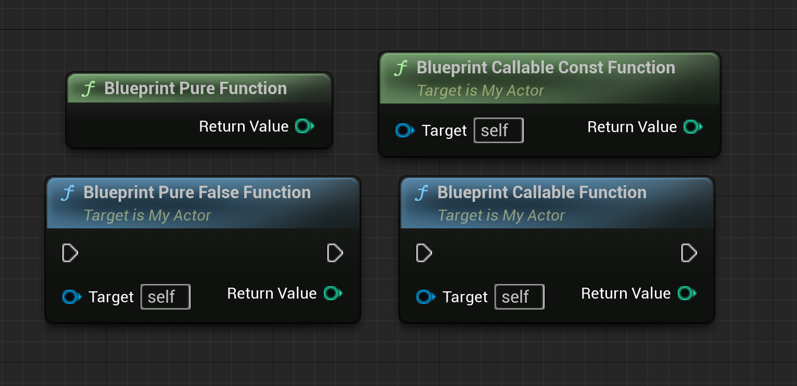

- 此函数不对拥有它的对象产生任何影响，可在蓝图或关卡蓝图图表中执行。默认情况下，带有 `const` 标记的函数将作为 [[pure function]] 公开。要将 [[const function]] 变成非 pure function ，你可以做以下声明：`BlueprintPure=false` ：
  ```cpp
  UFUNCTION(BlueprintPure)
  float  BlueprintPureFunction;
   
  UFUNCTION(BlueprintCallable)
  float BlueprintCallableFunction
   
  UFUNCTION(BlueprintCallable)
  int32 BlueprintCallableConstFunction() const
   
  UFUNCTION(BlueprintPure=fasle)
  Int32 BlueprintPureFalseFunction() const
  ```
  {:height 310, :width 624}
  pure function 不会缓存[[result]]，因此你在对蓝图函数进行任何重大操作时都需要小心。比较好的做法是避免蓝图纯函数输出**数组**。