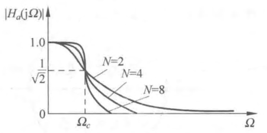

alias:: 巴特沃斯滤波器, 最平幅度特性滤波器

- 巴特沃斯滤波器又称[[最平幅度特性滤波器]]， $N$ 阶巴特沃思模拟低通滤波器的有关特性为
	- ### [[幅度平方函数]] $\left|{H}_{a}(\mathrm{j} {\Omega})\right|^{2}$ 、 $\mathbf{N}$ 及 ${\Omega}_{\mathrm{c}}$ 
	  logseq.order-list-type:: number
	  $$\left|H_{a}(\mathrm{j} \Omega)\right|^{2}=\frac{1}{1+\left(\frac{\Omega}{\Omega_{c}}\right)^{2 N}}$$
		- 其中， $N$ 为正整数，代表[[滤波器阶数]]；
		  logseq.order-list-type:: number
		- $\Omega_{c}$ 称为巴特沃斯低通滤波器的[[通带截止频率]]。
		  logseq.order-list-type:: number
		  所以 $\Omega_{c}$ 一定是[[巴特沃斯低通滤波器]][[频率响应幅度]]衰减到 $3 \mathrm{~dB}$（[[dB]]） 时的带宽。
	- ### 巴特沃斯低通滤波器幅度响应及其特点
	  logseq.order-list-type:: number
	  其[[幅度响应]]为
	  $$\left|H_{a}(\mathrm{j} \Omega)\right|=\frac{1}{\sqrt{1+\left(\frac{\Omega}{\Omega_{c}}\right)^{2 N}}}$$
	  图1 画出了巴特沃思滤波器在不同 $N$（阶数）时的[[幅度响应曲线]]。
	  
		- 当 $\Omega=0$ 时， $\left|H_{a}(\mathrm{j} 0)\right|=1$ ，无衰减。
		  logseq.order-list-type:: number
		- 当 $\Omega=\Omega_{c}$ 时， $\left|H_{a}(\mathrm{j} \Omega)\right|=\frac{1}{\sqrt{2}}=0.707$ ，即幅度衰减到 $0.707$ ，或 $\left|H_{a}(\mathrm{j} \Omega)\right|^{2}=\frac{1}{2}$ ，即[[功率]]衰减到一半，或 $R_{c}=-20 \mathrm{lg}\left|H_{a}\left(\mathrm{j} \Omega_{c}\right)\right|=3 \mathrm{~dB}$ ， $R_{c}$ 称为[[通带最大衰减]]，不管阶数 $N$ 为多少，所有幅度特性曲线都在 $\Omega=\Omega_{c}$ 处交汇于 $3 \mathrm{~dB}$ 衰减处（或说交汇于 $-3 \mathrm{~dB}$ [[增益]]处 $)$ ，这就是[[3 dB 不变性]]。
		  logseq.order-list-type:: number
		- 在 $0 \leqslant \Omega \leqslant \Omega_{c}$ 的通带内， $\left|{H}_{a}(\mathbf{j} {\Omega})\right|$ 有^^最大平坦^^的幅度特性，即 $N$ 阶巴特沃思滤波器 $\left|{H}_{a}(\mathbf{j} {\Omega})\right|^{2}$ 在 ${\Omega}={0}$ 处的前 $(2 {N}-1)$ 阶**导数为零**，故称巴特沃思滤波器为最平幅度特性滤波器。随着 $\Omega$ 由 $0$ 增加到 $\Omega_{c}$ ， $\left|H_{a}(\mathrm{j} \Omega)\right|$ 单调地减小， $N$ 越大，减小得越慢，也就是 \(N\) **越大，通带内幅度特性越平坦**。
		  logseq.order-list-type:: number
		- 当 $\Omega>\Omega_{c}$ 时，即在[[过渡带]]及[[阻带]]中， $\mid {H}_{a} (j \Omega) \mid$ 单调地减小，而且由于 $\Omega / \Omega_{c}>1$ ，故比通带内衰减的速度要快得多， $N$ **越大**， $\left|H_{a}(\mathrm{j} \Omega)\right|$ **特性在这个频率范围衰减得更快**。
		  logseq.order-list-type:: number
		- 当 $\Omega=\Omega_{s t}$ 时，即在[[阻带截止频率]]处衰减为 
		  logseq.order-list-type:: number
		  $$A_{s}=20 \lg \left|\frac{H_{a}(\mathrm{j} 0)}{H_{a}\left(\mathrm{j} \Omega_{s t}\right)}\right|=-20 \lg \left|H_{a}\left(\mathrm{j} \Omega_{s t}\right)\right|,$$ 
		  $A_{s}$ 为[[阻带最小衰减]]，当 $\Omega>\Omega_{s t}$ 时，[[幅度特性衰减值]]会大于 $A_{s}(\mathrm{~dB})$ 。
-