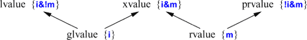

alias:: value category, 值类别

- 在涉及到[[寻址]]、[[复制]]和[[移动]]对象时，有两个属性对于一个对象很重要：
	- 拥有[[identity]]：程序具有对象的[[名称]]、[[指针]]或[[引用]]，因此可以确定两个对象是否相同，对象的值是否发生了变化等。
	  logseq.order-list-type:: number
	  id:: 653231a7-9557-4ce6-9737-30376be2847f
	- [[movable]]：对象可以被[[移动]]（即，我们允许将其值移动到另一个位置，并将对象保留在一个有效但未指定状态，而不是[[复制]]对象）。
	  logseq.order-list-type:: number
- 事实证明，2 种属性的 4 种可能组合中的 3 种在精确描述 C++ 语言规则时是有用的（我们不需要既没有 identity 又不能移动的对象）。使用 "m" 表示可移动（movable），"i" 表示具有身份（has identity），我们可以以图形方式表示表达式的分类：
  id:: 65323569-8c52-4d88-83e0-13e440ef047f
  
- 因此，经典的[[lvalue]]是指具有[[身份]]但**不能**[[移动]]的东西（因为我们可以在移动之后检查它），而经典的[[rvalue]]则是可以[[移动]]的任何东西。
  id:: 653249c9-0af4-4d47-a1a0-ac55cd81db31
  其他替代方案包括 [[prvalue]]（"pure rvalue"，纯粹的 rvalue）、[[glvalue]]（"generalized lvalue"，广义的 lvalue）和[[xvalue]]（"x" 代表 "extraordinary" 或 "expert only"，有关这个 "x" 的含义的建议是非常有创意的）。例如：
- ```C++
  void f(vector<string>& vs)
  {
    vector<string>& v2 = std::move(vs); // 将 vs 移动到 v2
    // ...
  }
  ```
- 在这里，`std::move(vs)` 是一个[[xvalue]]：它明显具有身份（我们可以引用它作为 `vs`），但我们通过调用 `std::move()` 明确地允许它被[[移动]]。
- 对于实际编程来说，通常以[[rvalue]]和[[lvalue]]的术语思考已经足够。
  >请注意，每个表达式要么是[[lvalue]]，要么是[[rvalue]]，而不会同时兼具两者。
  并且每个表达式都属于三种主要[[值类别]]中的一种：[[prvalue]]、[[xvalue]]和[[lvalue]]。