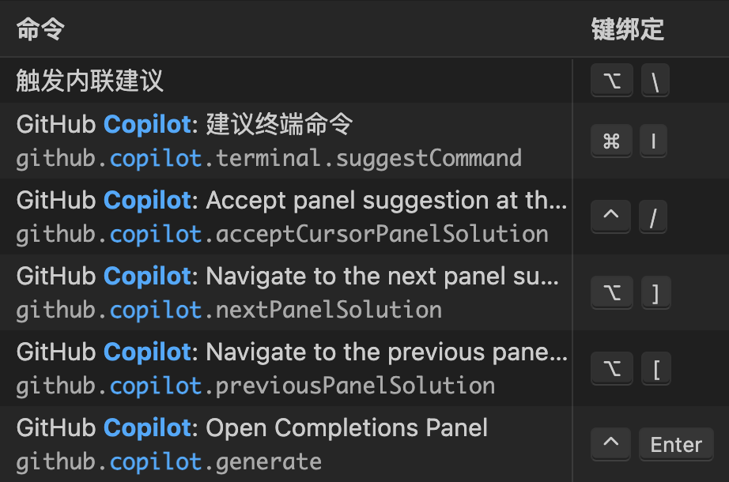
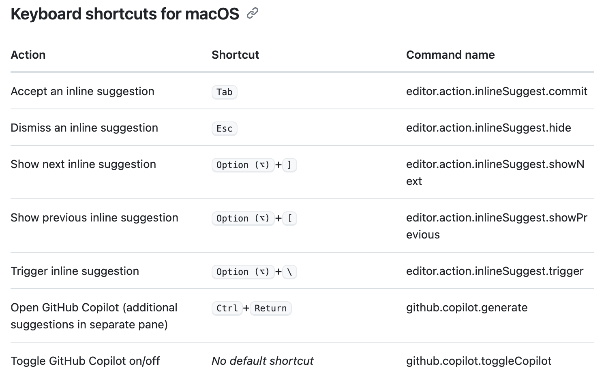
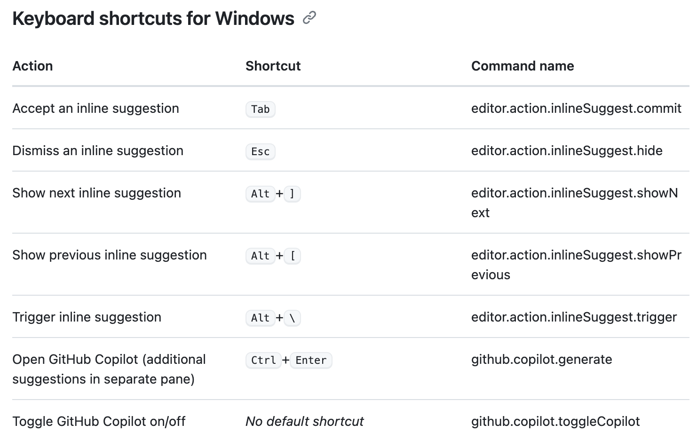

## [[Vscode]]
	- {:height 449, :width 666}
	- 
	- 
	- `Ctrl + Enter`：GitHub Copilot Suggestions
	- `Ctrl + rightarrow`：接受部分生成内容
	- 善用 `explain this`
	- 若要提出与当前在编辑器中可见的代码相关的问题，请在问题之后键入 `#editor`。
	  
	  例如，可以键入 `#editor what does this code do?` 要求 Copilot Chat 描绘代码的用途。
	  
	  在问题任意位置使用 `#editor` 命令，告诉 Copilot Chat 关注于当前在编辑器中可见的代码。
	- 如果单个方法在编辑器中完全可见，可以键入 `Write a unit test for the method in the #editor` 要求 Copilot Chat 为此方法生成单元测试。
	  
	  或者，选择要为其生成单元测试的代码，然后对 Copilot Chat 提问：`#selection write a unit test for this code`。
	  
	  `#selection` 命令可确保 Copilot Chat 在回应问题时关注于所选代码。
	- 若要修复某些代码中的 bug，请在编辑器中选择代码，然后对 Copilot 提问：`#selection fix the bug in this code`。
	  https://docs.github.com/zh/copilot/github-copilot-chat/using-github-copilot-chat-in-your-ide#%E4%BD%BF%E7%94%A8-github-copilot-chat-%E7%9A%84%E4%BB%A3%E7%A0%81%E5%BB%BA%E8%AE%AE
	- DONE 查看如 \fix 的内置命令
	- ### 查找与 GitHub Copilot 建议匹配的公开代码
		- https://docs.github.com/zh/copilot/using-github-copilot/finding-public-code-that-matches-github-copilot-suggestions
	- ### [启用或禁用 GitHub Copilot](https://docs.github.com/zh/copilot/using-github-copilot/getting-started-with-github-copilot#%E5%90%AF%E7%94%A8%E6%88%96%E7%A6%81%E7%94%A8-github-copilot-2)
	-
-