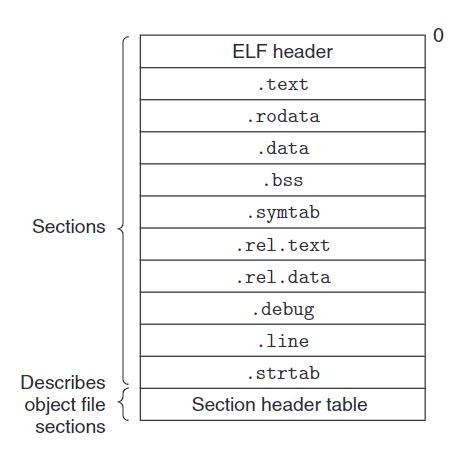

alias:: ELF 可重定位目标文件

- {:height 467/3, :width 466/2}
  上图展示了一个典型的[[ELF 可重定位目标文件]]的格式。
- ## ELF header
  [[ELF header]]以一个 16 字节的序列开始，这个序列描述了生成该文件的系统的[[word size]]和[[字节顺序]]。
  [[ELF]]头剩下的部分包含帮助链接器语法分析和解释目标文件的信息。其中包括[[ELF 头]]的大小、[[目标文件]]的类型（如 可重定位、可执行或者共享的）、 机器类型（如 X86-64)、[[section header table]]的文件偏移，以及[[节头部表]]中[[条目]]的大小和数量。
- ## section header table
  不同[[节]]的位置和大小是由[[节头部表]]描述的，其中[[目标文件]]中每个[[节]]都有一个固定大小的[[条目]]。
- ## Section
  夹在[[ELF 头]]和[[节头部表]]之间的都是[[节]]。一个典型的 [[ELF 可重定位目标文件]]包含下面几个[[节]]：
	- [[.text]]: [[已编译程序]]的[[机器代码]]。
	  logseq.order-list-type:: number
	- [[.rodata]]: [[read-only data]]，比如`printf`语句中的[[format string]]和`switch`语句的[[jump table]]。
	  logseq.order-list-type:: number
	- [[.data]]: [已初始化的]([[已初始化变量]])[[global C variables]] 和[[static C variables]]。
	  logseq.order-list-type:: number
	  > [[local C variables]]在[[运行时]]被保存在[[栈]]中，既不出现在[[.data]]节中，也不出现在[[.bss]]节中。
	- [[.bss]]: [未初始化的]([[未初始化变量]])[[全局 C 变量]]和[[静态 C 变量]]，以及所有被初始化为 0 的[[全局变量]]或[[静态变量]]。
	  logseq.order-list-type:: number
	  在目标文件中这个节不占据实际的空间，它仅仅是一个[[占位符]]。目标文件格式区分已初始化和未初始化变量是为了**空间效率**：
	  在目标文件中，[[未初始化变量]]不需要占据任何实际的磁盘空间。运行时，在内存中分配这些变量，初始值为 0 。
	  .symtab: —个符号表，它存放在程序中定义和引用的函数和全局变量的信息。一些
	  程序员错误地认为必须通过-g 选项来编译一个程序，才能得到符号表信息。实际上，每
	  个可重定位目标文件在 .symtab 中都有一张符号表（除非程序员特意用 STRIP 命令去掉
	  它）。 然而，和编译器中的符号表不同，.symtab 符号表不包含局部变量的条目。
	  .rel.text: —个.text 节中位置的列表，当链接器把这个目标文件和其他文件组合
	  时，需要修改这些位置。一般而言，任何调用外部函数或者引用全局变量的指令都需要修
	  改。另一方面，调用本地函数的指令则不需要修改。注意，可执行目标文件中并不需要重
	  定位信息，因此通常省略，除非用户显式地指示链接器包含这些信息。
	  .rel.data: 被模块引用或定义的所有全局变量的重定位信息。一般而言，任何已初
	  始化的全局变量，如果它的初始值是一个全局变量地址或者外部定义函数的地址，都需要
	  被修改。
	  ELF头
	  .symtab
	  节
	  rel
	  .debug
	  描述目标
	  文件的节{
	  节头部表
	  .debug: —
	  个调试符号表，其条目是程序中定义的局部变量和类型定义，程序中定
	  义和引用的全局变量，以及原始的 C 源文件。只有以-g 选项调用编译器驱动程序时，才
-