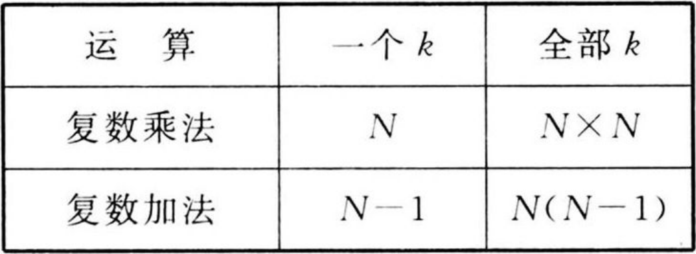
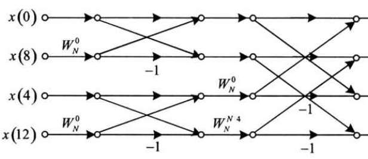

alias:: FFT, 快速傅里叶变换

- 快速傅里叶变换（Fast Fourier Transform，FFT）是离散傅里叶变换（DFT）的一种高效算法，用于将信号从时域转换到频域。FFT大大减少了计算DFT所需的计算量，使得在实时信号处理和大数据分析中的应用成为可能。
- ### 基本原理
- 在[[DFT]]的计算中实际上存在大量的冗余计算, 并且冗余的计算主要来自[[旋转因子]] $$W_{N}^{\text {nk }}$$ 如下的一些特点:
	- 对称性:
	  logseq.order-list-type:: number
	  $$\left(W_{N}^{n k}\right)^{*}=W_{N}^{-n k}=W_{N}^{(N-n) k}$$
	- 周期性:
	  logseq.order-list-type:: number
	  $$W_{N}^{k n}=W_{N}^{k(n+N)}$$
	- 可约性:
	  logseq.order-list-type:: number
	  $$W_{N}^{k n}=W_{m N}^{m k n}=W_{N / m}^{k n / m}$$
	- 特殊值:
	  logseq.order-list-type:: number
	  $$W_{N}^{0}=1, W_{N}^{N / 2}=-1, W_{N}^{N / 4}=-\mathrm{j}, W_{N}^{k+N / 2}=-W_{N}^{k}$$
- 从原始定义出发, DFT 的运算量与 $$N^{2}$$ 成正比, 显然 $N$ 越小越有利, 因此也就很自然地希望能将大点数的 DFT 分解为多个小点数的 DFT 来计算。而在这种分解过程中,充分利用旋转因子的对称性周期性可约性及特殊值等特点, 为降低 DFT 运算量提供了可能性。这是各种提高 DFT 运算效率算法的**基本出发点**。
  collapsed:: true
	- 
- 由于 DFT 快速算法的重要性，用^^快速傅里叶变换^^来表示 DFT 的快速计算。
- ### FFT 的分类
	- FFT 算法主要分为两大类: [[按时间抽取方法]]（Decimation-In-Time, DIT）和[[按频率抽取方法]]（Decimation - In - Frequency, DIF）。
	- 根据[[抽取长度]], FFT 又分为[[基 -2]] 、 [[基 -4]] 等算法, 在一个 DFT 运算中还可同时采用不同基的[[混合基算法]]。
	- ### [[基 -2 FFT]]
	- ### [[基 -4 FFT]]
	- ### [[分裂基 FFT]]
- ## 算法比较
- 可以发现，无论是基 $- 2$ 算法、基 $-4$ 算法还是分裂基算法，[[蝶形运算图]]看起来都差不多，最主要的区别在于[[旋转因子]]的不同。基 $- 2$ 算法规律性最强，运算效率也已经比较高，那么为什么还要引人基 $- 4$ 算法及分裂基算法呢? 为此，我们主要还是要从运算量的角度来比较基 $- 2$ 、基 $- 4$ 及分裂基算法的优缺点。
- ### [[基 -2 FFT 运算量分析]]
- ### [[基- 4 FFT 运算量分析]]
- ### [[分裂基 FFT 运算量分析]]
- 下表中第 $4$ 列给出了 $N$ 为不同取值时分裂算法所需的运算量。对比式可以发现，分裂基算法所需的**复数乘法次数**比基 $- 2$ 算法减少约 $33 \%$ ，比基 $- 4$ 算法减少约 $11 \%$ 。分裂接算法与基 $- 2$ 算法和基 $-4$ 算法所需的复数加法次数完全相同。
- 对比图所示的基 $-2$ 基本蝶形运算
  {{embed ((660e9b3e-2fcb-429a-a13c-3e6a41152ec9))}}
   
  和图所示的基 $-4$ 基本蝶形运算，
  {{embed ((660e9baa-0489-4236-9216-2d2402f34315))}}
  每个基 $-4$ 的基本蝶形运算由两级基 $- 2$ 基本蝶形运算构成，每级都包括 $2$ 个基本的基 $- 2$ 蝶形运算，不同的是，基 $- 4$ 算法更合理地利用了[[旋转因子]]的特性，从而减少 $1$ 次复数乘法。因此，在满足基 $- 4$ 算法运算条件的前提下，基 $- 4$ 算法效率比基 $- 2$ 算法更高。
- {{embed ((660e9a92-1cf7-4ecf-9203-fce2480695a8))}}
  分裂基算法充分利用了基 $- 2$ 算法中每一级的每一组蝶形运算中上半部分均没有旋转因子，而只在下半部分有旋转因子的特点，重新优化了旋转因子的排列结构，同时还用上了基 $-4$ 基本蝶形运算效率高于基 $- 2$ 基本蝶形运算的特点，从而进一步提高了运算效率。
  在已知的 $N=2^{M}$ 的各种算法中，[[分裂基算法]]的**运算效率最高**。
- 基 $-2$ 、基 $-4$ 和分裂基算法都是常用的 FFT 算法。基 $-4$ 算法虽然运算效率高于基 $- 2$ 算法，但其所要求的 $N=4^{M}$ 的条件比基 $- 2$ 算法要苛刻，在不满足条件的情况下，补零的个数过多，反过来降低了运算效率。分裂基算法的运算效率也高于基 $- 2$ 算法，但编程的复杂度也比较高。因此，在实际应用中最常用的还是基 $- 2$ 算法。
  collapsed:: true
	- >最后还要说明的是，基 $-2$ 算法、基 $-4$ 算法和分裂基算法都是同址运算。无论是基 $-2$ 、基 $4$ 还是分裂基算法，按时间抽取与[[按频率抽取]]所需的运算量完全相同。
-