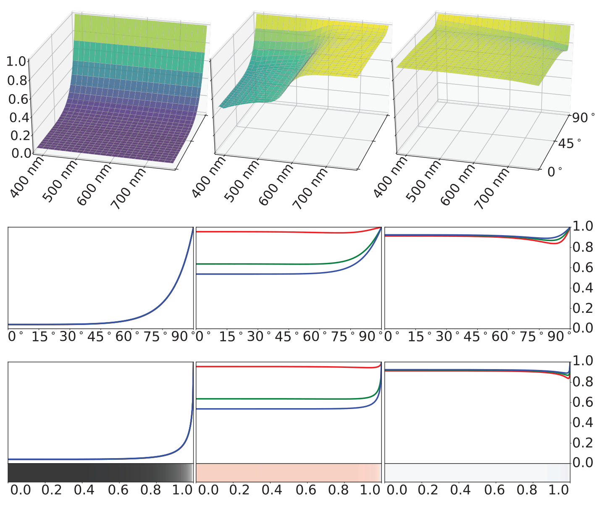
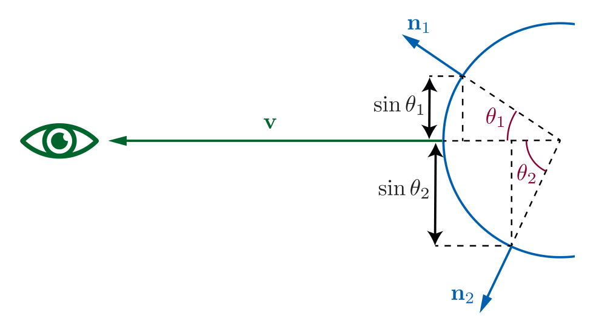
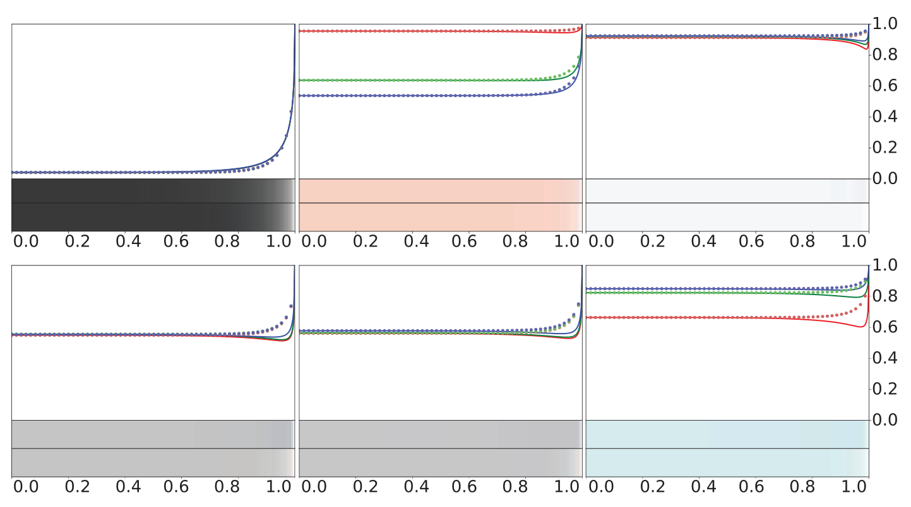
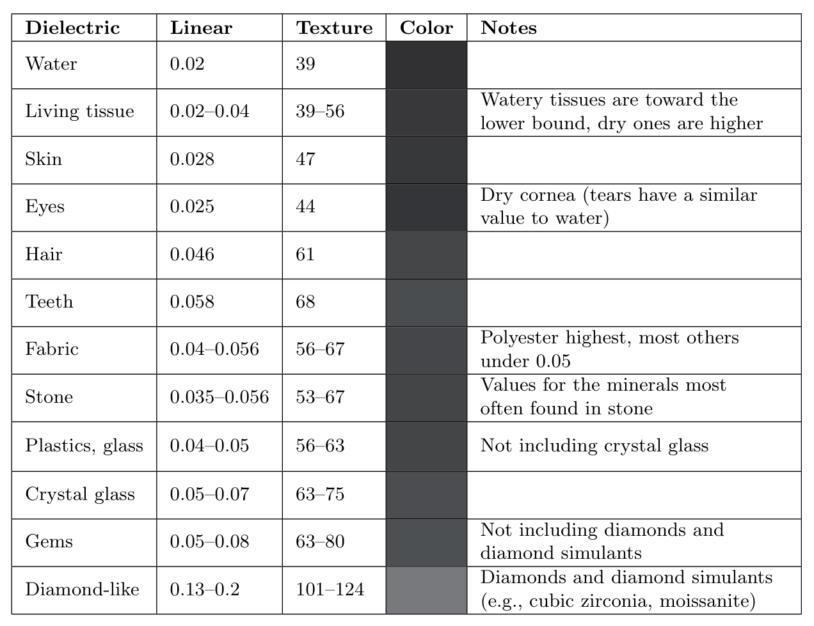
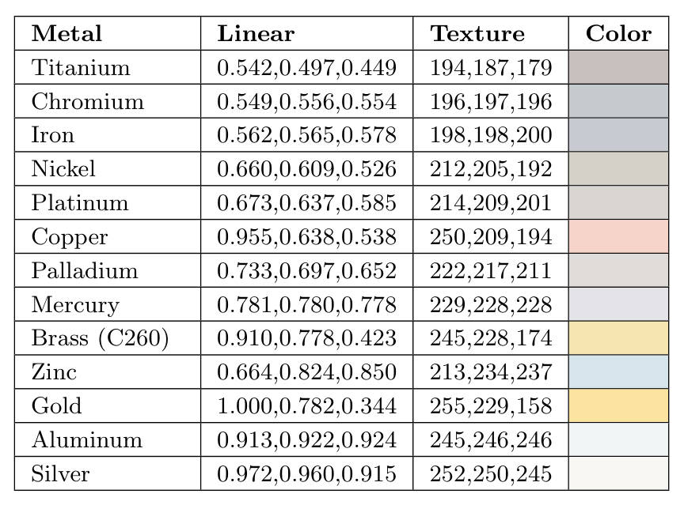
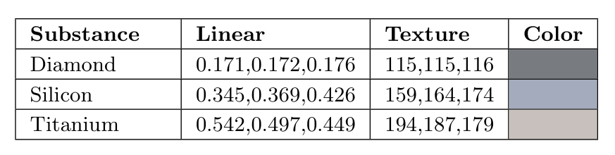
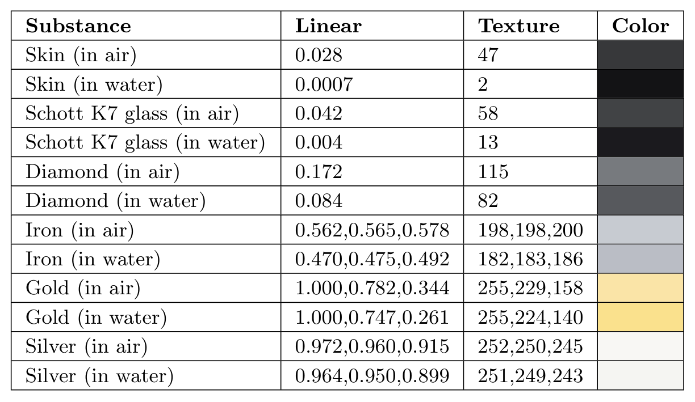

alias:: 菲涅尔反射, Fresnel reflectance, Fresnel function, 菲涅尔反射率, Fresnel, Fresnel 反射率

- # [[平面反射]]
	- 两种[[介质]]之间的[[平面]]界面的与[[光]]的相互作用遵循[[Fresnel equations]].
	- [[平面反射]]中，[[反射光]]和[[入射光]]的比值由[[菲涅尔反射率]] $F$ 描述，它取决于[[入射角]] $θ_i$ 。
- # [[External Reflection]]
	- 对于给定的 *物质*，[[Fresnel function]]可以被解释为定义了一个[[反射率]]函数$F(θ_i)$，仅依赖于[[入射角]] $\theta_i$ 。
	- 原则上，$F(θ_i)$ 的值在 *可见光谱* 范围内连续变化。
	  id:: 65191258-e338-4aa6-8261-8ca547cbae4c
	  collapsed:: true
	  在渲染中，它的值被视为一个 *RGB向量* 。函数 $F(θ_i)$ 具有以下特点：
		- 当入射角 $θ_i = 0\degree$ 时，也就是光线垂直于表面入射的情况（即 $l = n$ ），这时候的函数值通常表示为 $F_0$，可以被看作是物质的[[特征镜面反射颜色]]。
		  logseq.order-list-type:: number
		  id:: 65191901-db7b-4d58-93d0-1fea36618692
		  这种情况被称为[[normal incidence]]。
		- 随着入射角 $θ_i$ 的增加，光线以越来越接近[[glancing angle]]的角度击中表面，$F(θ_i)$ 的值将增加。
		  logseq.order-list-type:: number
		  当 $θ_i = 90\degree$ 时，$F(θ_i)$ 将达到 $1$ 的值，即对所有频率的光反射率为 $1$（[[白色]]）。
	- 
	  collapsed:: true
	  图中展示了[[外部反射]]下的三种物质（玻璃、铜和铝）的[[菲涅尔反射率]] $F$ 。
		- 第一行是 $F$ 作为 *波长* 和 *入射角* *函数* 的三维图。
		- 第二行显示了每个 *入射角* 的 $F$ 的 *光谱值* 转换为 RGB 后的曲线。
		  id:: 65191c2a-a363-42a4-a27d-3784a4f3b861
		  对于玻璃是[[无色]]的，所以三条[[菲涅尔反射率]]曲线重合。
		- 第三行，RGB 曲线相对于 *入射角的正弦值* 进行了绘制，以考虑到[[透视缩短]]。
		  底部一行中的条带使用相同的 $x$ 轴，显示了 RGB 值作为 *颜色* 的表示。
	- ## [[透视缩短]]
	  collapsed:: true
		- 在[[镜面反射]]的情况下，*出射角* 与 *入射角* 相同。所以对于那些相对于 *入射光* 呈[[掠射角]]（入射角 $θ_i$ 接近 $90\degree$ ）的表面，它们对于 *观察者* 也呈[[掠射角]]。因此，[[反射率]]的增加主要在物体的[[边缘]]看到。#DOING
		  此外，表面[[反射率]]增加最明显的部分从 *摄像机视角* 来看是[[透视缩短]]的，因此它们占据了相对较少的 *像素* 。
		  为了按照它们的 *视觉比例* 显示 *Fresnel 曲线* 的不同部分，图中的 *Fresnel 反射率* 是相对于 $\sin θ_i$ 而不是直接相对于 $θ_i$ 来绘制的。
		  {:width 492, :height 282}
		  如图所示这种[[透视缩短]]与 *表面法线* $\bold n$ 和 *视线方向* $\bold v$ 之间的 *夹角的正弦值* 是一致的。
		- 所以下面的内容中，我们用 $F(\bold n,\bold l)$ 来代替 $F(\theta_i)$ 。
		- 在渲染领域，通常将在[[掠射角]]处的反射率增加称为[[Fresnel effect]]。
- # Schlick's Approximation
	- [[Fresnel]] 等式需要对 *可见光谱* 范围内的[[折射率]]值进行采样，而这些值可能是复数。
	- Schlick 提供了一种基于[[特征镜面反射颜色]] $F_0$ 的更简单的 [[Fresnel 反射率]]的[近似公式]([[Schlick's approximation]])：
	  $$
	  F(\mathbf{n},\mathbf{l})\approx F_0+(1-F_0)(1-(\mathbf{n}\cdot\mathbf{l})^+)^5 \tag{1}
	  $$
	  这个函数是 *白色* 和 $F_0$ 之间的 RGB *插值* 。
	- {:height 366, :width 642}
	  上图是[[Schlick's approximation]]与六种物质的[[外部反射]]的 *正确值* 进行了比较。
	  前三种物质：玻璃、铜和铝。后三种物质是铬、铁和锌。
	  其中实线显示完整的Fresnel方程，虚线显示 Schlick's approximation 。
	  在每个曲线图下方的上部颜色条显示完整的Fresnel方程的结果，下部颜色条显示 Schlick's approximation 的结果。
	- 后三种物质之所以被选中是因为它们与 Schlick's approximation 有相对较大的偏差，它们在接近白色之前显示出明显的**下降**。即使对于这些物质，产生的误差也非常微妙。
	- ## 其他方法
		- 在极少数情况下，如果需要精确捕捉这类材质的行为，可以使用[[Gulbrandsen]]提供的另一种近似方法。这种近似可以在金属的情况下与完整的Fresnel方程实现接近匹配，尽管它在计算上相对于[[Schlick近似]]更昂贵。
		  id:: 651a4b07-cb0b-4fdf-af38-0175e9dcf708
		- 更简单的选择是，使用[[Schlick 近似]]的更一般形式：
		  id:: 651a43a9-b899-4438-be96-abbb81b4f373
		  $$F(\bold n, \bold l) ≈ F_0 + (F_{90} − F_0)(1 − (\bold n · \bold l)^+)^\frac{1}{p} \tag{2}$$
		- 公式提供了对 *Fresnel 曲线* 在 $90\degree$ 处过渡的颜色以及过渡的“锐度”的控制。
		  修改幂次可以使某些材质更加贴近。将 $F_{90}$ 设置为除 *白色* 之外的颜色可以帮助匹配不适合 *Fresnel 方程* 描述的材质，例如表面覆盖有细小尘埃颗粒，其大小与单个光波长相当的情况。
		  >使用这种更一般的形式通常是出于希望增加艺术掌控感的动机，但在某些情况下也可以帮助匹配物理现实。
		- >[[Lagarde]]在总结了Fresnel方程以及多种近似方法。
	- ## 使用折射率计算 $F_0$
		- [[折射率]]也可以用于计算[[特征镜面反射颜色]] $F_0$ 。
		  id:: 6519896d-45a0-4fed-afc2-9ef2ece25654
		  通常情况下，我们假设 $n_1 = 1$，然后使用 $n$ 代替 $n_2$ 来表示物体的[[折射率]]。这个简化给出了以下方程：
		  $$F_0=\left(\frac{n-1}{n+1}\right)^2 \tag{3}$$
		  这个方程即使在[[复数折射率]]的情况下（比如[[金属]]的折射率），也可以使用，只需使用（复数）结果的 *大小* 。
		  在[[折射率]]在 *可见光谱* 范围内显著变化的情况下，计算准确的 $F_0$ 的 RGB 值需要首先在[[波长]]的密集采样点上计算 $F_0$，然后将得到的光谱向量转换为 RGB值。
		  > 这个过程允许我们考虑折射率随波长的变化，以获得更准确的颜色表示，特别是在处理不同材质时，其中折射率随波长变化较大。
- # 典型的菲涅尔反射值
	- 物质根据光学特性可以分为三个主要类别。这包括[[绝缘体]]、[[导体]]以及[[半导体]]。
	- ## 绝缘体的菲涅尔反射值
		- [[绝缘体]]在正入射时通常具有相对较低的 $F_0$ ([[特征镜面反射颜色]])，通常为 $0.06$ 或更低。这种在正入射时的低反射使得菲涅尔效应**在绝缘体中特别显著**。
		  id:: 652810d8-34a3-49ee-8045-10856721ff54
		- 绝缘体的光学特性在 *可见光谱* 内很少有明显变化，因此反射值呈 *无色* 。
		- 
		  上表显示了几种常见绝缘体的 $F_0$ 值。这些值是标量值，而不是 RGB 值，因为这些材料的 RGB 通道之间差异不大。为了方便起见，表中还包括线性数值（Linear）以及使用[[sRGB transfer function]]编码的8位值。
		  对于未知绝缘体，$0.04$ 是一个合理的默认值。
		  请注意，这些是[[镜面反射]]的颜色。
		  >例如，宝石通常具有鲜艳的颜色，但这些颜色是由物质内部的 *吸收* 引起的，与它们的菲涅尔反射无关。
		- 一旦光线传入[[绝缘体]]内部，它可能会进一步[[散射]]或被[[吸收]]。
		  如果材料是透明的，光线将继续传播。
	- ## 金属的菲涅尔反射值
		- [[金属]]具有较高的 $F_0$ 值，几乎总是在0.5或更高。一些金属具有在 *可见光谱* 内变化的光学特性，从而产生 *有颜色* 的反射值。
		-  
		  id:: 65281de7-8a73-425f-8c4b-5613f66b1cef
		  上表9.2显示了几种金属的 $F_0$ 值，按照亮度递增的顺序排列。这里给出了 RGB 数值，因为许多金属具有有颜色的菲涅尔反射。这些 RGB 数值是使用[[sRGB]]（和[[Rec. 709]]）的[[原色]]和 *白色* 定义的。黄金具有相对不寻常的 $F_0$ 值。它是最具色彩的金属之一，具有略高于 $1$ 的红色通道数值（它刚好在 sRGB/Rec. 709 色域之外），以及特别低的蓝色通道数值（表中唯一明显低于 $0.5$ 的数值）。黄金也是最明亮的金属之一。
		- 请注意，金属会立即吸收任何[[透射光]]，因此它们不会表现出任何[[次表面散射]]或[[透明性]]。金属的可见颜色**完全**来自 $F_0$ 值。
	- ## 半导体的菲涅尔反射值
		- 半导体的 $F_0$ 值介于**最明亮的**[[绝缘体]]和**最暗的**[[金属]]之间，如表所示。
		   
		  在实际情况下，很少需要渲染这类物质，因为大多数渲染的场景中不会出现大块的晶体硅等材料。出于实际目的，应避免在 $0.2$ 和 $0.45$ 之间的F0值范围，除非您有意地尝试模拟一种外来的或不切实际的材质。
	- ## 水的菲涅尔反射值
		- 在我们讨论[[外部反射]]时，我们假设渲染表面周围是空气。如果不是空气，反射性质会发生变化，因为它取决于界面两侧的[[折射率]]之比。
		- 如果我们不能再假设 $n_1 = 1$，那么我们需要在方程 $(3)$ 中用折射率的相对值，$n_1/n_2$，来替代 $n$，这就产生了以下更一般的方程：
		  $$F_0=\left(\frac{n_1-n_2}{n_1+n_2}\right)^2 \tag{4}$$
		- 最常见的 $n_1$ 不等于 $1$ 的情况，可能出现在渲染 *水下* 场景时。由于水的折射率约比空气高 $1.33$ 倍，因此水下的 $F_0$ 值与空气中的不同。如表9.4所示，折射率接近水的绝缘体受影响最大，所以这种效应在[[绝缘体]]中比在[[金属]]中更明显。
		  
- # 菲涅尔值的参数化
	- 通常使用的[[参数化]]方法结合了[[镜面反射颜色]] $F_0$ 和[[漫反射颜色]] $ρ_{ss}$ 。这种参数化利用了[[金属]]没有[[漫反射颜色]]，以及[[绝缘体]]具有受限的 $F_0$ 可能值集合的观察事实，它包括了 RGB [[表面颜色]] $\bold c_{surf}$ 和一个标量参数 $m$ ，称为[[metallic]]。
	  id:: 65291056-d1ab-45f5-bbce-0fa94b65f728
	  如果 $m = 1$，那么 $F_0$ 设置为 $\bold c_{surf}$，$ρ_{ss}$ 设置为 *黑色* 。
	  如果 $m = 0$，那么 $ρ_{ss}$ 设置为 $\bold c_{surf}$，$F_0$ 设置为 *绝缘体值*（可以是 *常数* 或由额外的参数控制 ）。
	  > 比如[[Burley]]添加了一个额外的标量 *[[specular]]* 参数，以控制[[绝缘体]]的有限范围内的 $F_0$，这种参数化形式也在[[虚幻引擎]]中使用。
	  游戏《使命召唤：无限战争》使用了一种变体，将这些[[metalness]]和[[specular]]参数打包成一个单一的值，以节省内存。
	- 对于那些使用[[金属度]]参数化而不是直接使用 $F_0$ 和 $ρ_{ss}$ 的渲染应用程序，其动机包括用户便利和**节省**[[纹理]]或[[G-buffer]]存储。
	  在游戏《使命召唤：无限战争》中，这种参数化以一种不同寻常的方式使用。艺术家绘制 $F_0$ 和 $ρ_{ss}$ 的纹理，这些纹理会自动转换为金属性参数化作为一种 *压缩* 方法。
	- 使用[[金属度]]也有一些缺点。它不能表达某些类型的材料，比如具有[[有色的]] $F_0$ 值的[[涂层]]绝缘体。在金属和绝缘体之间的边界上可能会出现 artifact 。
	- 一些实时应用程序使用的另一种参数化技巧：$F_0$ 值低于 $0.02$ 的值用于 “关闭”[[菲涅尔边缘增强]]。
	  id:: 6529180c-0069-4d12-8322-5cb6ef6ec454
	  它利用了一个事实，除了特殊的[[抗反射]][[涂层]]外，没有材质的 $F_0$ 值低于 $0.02$。
	  该技巧用于抑制表示[[空腔]]或[[空隙]]的表面区域的[[镜面高光]]。而不是使用单独的[[specular occlusion texture]]。
	  这种技术最初由Schüler提出，在[[虚幻引擎]]和Frostbite引擎中使用。
-
-