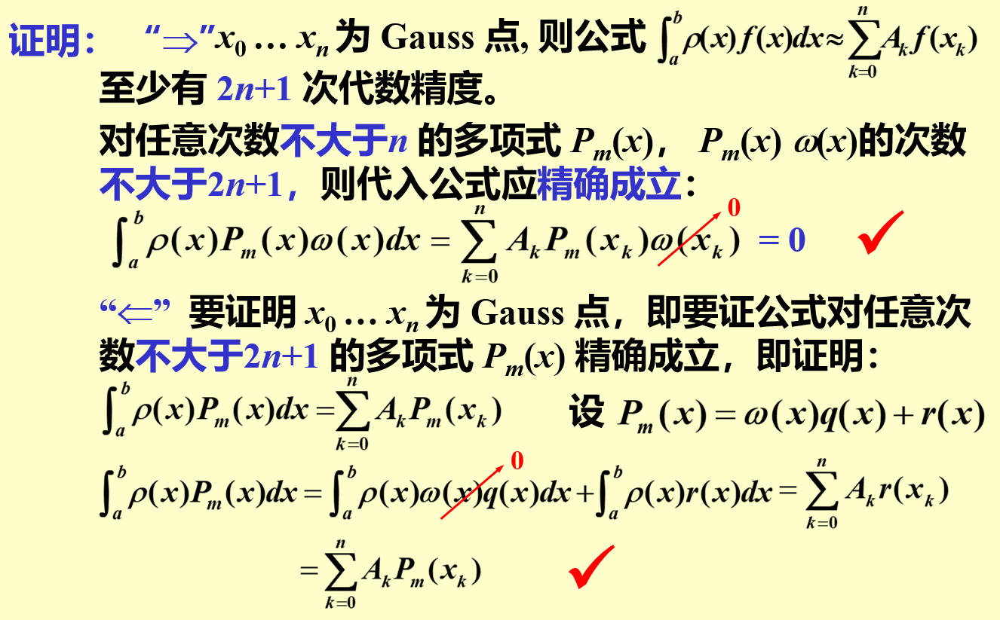
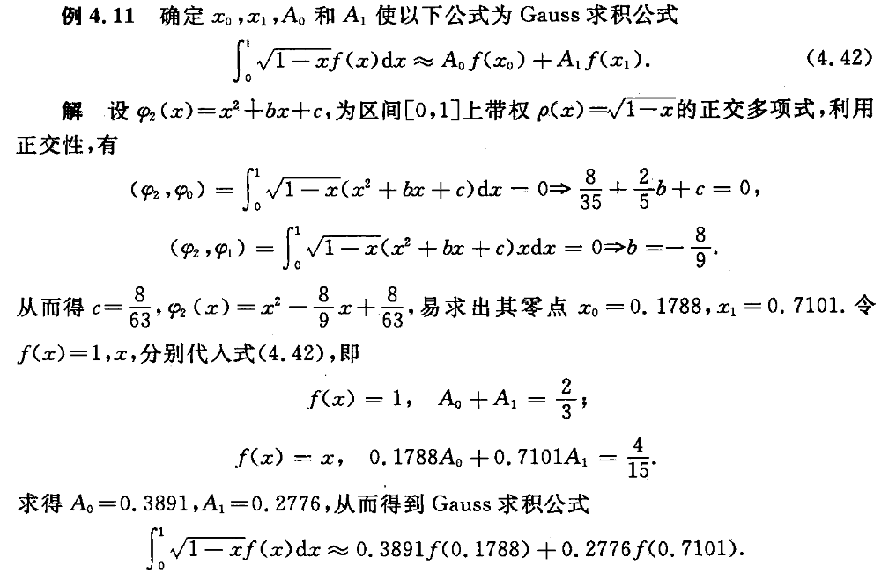

alias:: 高斯型积分

- 在前面构造的[[插值型求积公式]]中, 如梯形公式和 Simpson 公式, 为了简化过程, 任意给定 (不是选定) 了求积节点, 这样做就限定了求积公式的代数精确度. 下面按照以求积公式的[[代数精度]]达到最大的原则去选取[[求积节点]]和求出相应的[[求积系数]].
- ### 例子
  id:: 65a96fc0-4db4-4b58-8902-2f09e050bccb
  collapsed:: true
	- 首先以  $n=1$  为例论证这种想法是可行的,然后给出构造原理.
	- 构造形如  $\int_{-1}^{1} f(x) \mathrm{d} x \approx A_{0} f\left(x_{0}\right)+A_{1} f\left(x_{1}\right)$  的求积公式.
	  解上述公式中, 有 $4$ 个待定参数, 至少要建立 $4$个方程. 按代数精确度, 分别令  $f(x)=1, x, x^{2}, x^{3}$ , 代入上式,有
	  \begin{array}{l}
	  f(x)=1, \quad A_{0}+A_{1}=2 ; \\
	  f(x)=x, \quad A_{0} x_{0}+A_{1} x_{1}=0 ; \\
	  f(x)=x^{2}, \quad A_{0} x_{0}^{2}+A_{1} x_{1}^{2}=\frac{2}{3} ; \\
	  f(x)=x^{3}, \quad A_{0} x_{0}^{3}+A_{1} x_{1}^{3}=0 .
	  \end{array}
	  改写第二式
	  $$\left(A_{0}+A_{1}\right) x_{0}+A_{1}\left(x_{1}-x_{0}\right)=0,$$
	  利用第一式, 则上式简化为
	  $$2 x_{0}+A_{1}\left(x_{1}-x_{0}\right)=0 .$$
	  同样, 利用第二式简化第三式, 利用第三式简化第四式, 分别得
	  $$\left(x_{1}-x_{0}\right) x_{1} A_{1}=\frac{2}{3}, \quad \frac{2}{3} x_{0}+\left(x_{1}-x_{0}\right) x_{1}^{2} A_{1}=0 .$$
	  从前面 3 个式子中, 消去  $A_{1}\left(x_{1}-x_{0}\right)$ , 易求出
	  $$x_{0}=-\frac{1}{\sqrt{3}}, \quad x_{1}=\frac{1}{\sqrt{3}}, \quad A_{0}=A_{1}=1 .$$
	  于是得到求积公式
	  $$\int_{-1}^{1} f(x) \mathrm{d} x \approx f\left(-\frac{1}{\sqrt{3}}\right)+f\left(\frac{1}{\sqrt{3}}\right) .$$
	  它至少有 3 次代数精度, 而以两个端点为节点的梯形公式却只有 1 次代数精度.
- 为了一般性, 考虑带权定积分
  $$I(f)=\int_{a}^{b} \rho(x) f(x) \mathrm{d} x,$$
  其中, $\rho(x) \geqslant 0$  为[[权函数]]. 当  $\rho(x)=1$  时, 即是普通积分.
  若选定  $(n+1)$  个节点, 还需求出  $(n+1)$  个求积系数, 共有  $(2 n+2)$  个未知量. 利用代数精度的概念可建立  $(2 n+2)$  个方程, 即令  $f(x)=1, x, x^{2}, \cdots, x^{2 n+1}$ , 使求积公式
  $$\int_{a}^{b} \rho(x) f(x) \mathrm{d} x=\sum_{k=0}^{n} A_{k} f\left(x_{k}\right)\tag{1}$$ 
  成立. 从而可使求积公式至少达到  $(2 n+1)$  次代数精确度, 与给定  $(n+1)$  个节点的一般插值型求积公式至少达到  $n$  次代数精确度相比, 其代数精度的次数大大提高了.
- ## 定义
	- 选互异节点  $x_{0}, x_{1}, \cdots, x_{n}$ , 使[[插值型求积公式]] $(1)$ 的[[代数精度]]为  $(2 n  +1 )$ 次, 则称该求积公式为[Gauss 型]([[高斯型积分]])的. 称这些[节点]([[求积节点]])为[[高斯点]].
		- >如果像[例子](((65a96fc0-4db4-4b58-8902-2f09e050bccb)))那样, 直接利用代数精确度的概念去求  $(n+1)$  个求积节点和  $(n+1)$ 个求积系数, 则要联立求解  $(2 n+2)$  个方程的[[非线性方程组]]. 方程组是可解的, 但当  $n$  稍大时,解析地求解就很难, 数值求解非线性方程组也不容易.
	- 一般利用[[正交多项式]]来确定[[高斯点]]  $x_{0}, x_{1}, \cdots, x_{n}$ , 然后, 利用[[插值]]原理确定 Gauss 求解系数
	  $$A_{k}=\int_{a}^{b} \rho(x) l_{k}(x) \mathrm{d} x .\tag{2}$$
	  其中,  $l_{k}(x)(k=0,1,2, \cdots, n)$  是关于[[高斯点]]的[[Lagrange 插值基函数]], 从而得到[[插值型求积公式]]
	  $$\int_{a}^{b} \rho(x) f(x) \mathrm{d} x \approx \sum_{k=0}^{n} A_{k} f\left(x_{k}\right),\tag{3}$$
	  它是[Gauss 型]([[高斯型积分]])的.
- ## Gauss 点与正交多项式零点的关系
	- ### 定理
		- 对于插值型求积式 $(3)$ , 其节点  $x_{0}, x_{1}, \cdots, x_{n}$  是[[Gauss 点]]的**充分必要条件**是,  $\omega_{n+1}(x)=\left(x-x_{0}\right)\left(x-x_{1}\right) \cdots\left(x-x_{n}\right)$  与任意不超过  $n$  次的[[多项式]]  $P(x)$  [[带权正交]], 即
		  $$\int_{a}^{b} \rho(x) P(x) \omega_{n+1}(x) \mathrm{d} x=0 .$$
		- #### proof
			- 
		- $n+1$ 个[[求积节点]]的[[插值型求积公式]][[代数精度]]的最低值为 $n$ , 最高值为  $2 \mathrm{n}+1$ , 因而高斯型求积公式常称为[[最高代数精度求积公式]]。
		  >在Gauss型求积公式  $\int_{a}^{b} \rho(x) f(x) d x \approx \sum_{k=0}^{n} A_{k} f\left(x_{k}\right)$  中, 若取  $f(x)=\omega^{2}(x)=\left[\prod_{k=0}^{n}\left(x-x_{k}\right)\right]^{2}$  则公式的左边  $\int_{a}^{b} \rho(x) \omega^{2}(x) d x>0$  而右边  $\sum_{k}^{n} A_{k} \omega^{2}\left(x_{k}\right)=0$  故  $\mathbf{n}+\mathbf{1}$  个节点的Gauss型求积公式的代数精度至多为  $\mathbf{2 n + 1}$  次。
		- #### 推论
		  区间  $[a, b]$  上带权  $\rho(x)$  的[[正交多项式]]  $\varphi_{n+1}(x)$  的[[零点]]就是[[Gauss 点]].
		  因为正交多项式的两个重要的性质是: 其一, 正交多项式  \varphi_{n+1}(x)  与比它次数低的任意多项式  P(x)  均正交, 即  \int_{a}^{b} \rho(x) P(x) \varphi_{n+1}(x) \mathrm{d} x=0 ; 其二,  (n+1)  次正交多项式  \varphi_{n+1}(x)  恰好有  (n+1)  个互异的实单根, 且都在  [a, b]  内. 所以推论成立.
		- 选定了 Gauss 点  x_{0}, x_{1}, \cdots, x_{n}  后, 由式 (4.38) 求得求积系数  A_{k}(k=0,1,2, \cdots, n) ,这样就构成了 Gauss 型求积公式.
		- #### 例子
			- 
- ## 常用的高斯型求积公式
	- 高斯型求积公式是一类在数值积分中常用的方法，用于近似计算定积分。这些方法的关键特点是通过特别选择的节点（积分点）和相应的权重来提高积分的近似精度。以下是几种常见的高斯型求积公式及其公式：
		- 1. **[[高斯-勒让德求积公式]]**：
			- 适用于区间 \([-1, 1]\) 上的积分。
			- 近似公式为：\(\int_{-1}^{1} f(x) \, dx \approx \sum_{i=1}^{n} w_i f(x_i)\)，其中 \(x_i\) 是勒让德多项式的根，\(w_i\) 是相应的权重。
		- 2. **[[高斯-切比雪夫求积公式]]**：
			- 适用于带有加权函数 \(w(x) = \frac{1}{\sqrt{1-x^2}}\) 的区间 \([-1, 1]\) 上的积分。
			- 近似公式为：\(\int_{-1}^{1} \frac{f(x)}{\sqrt{1-x^2}} \, dx \approx \frac{\pi}{n} \sum_{i=1}^{n} f(x_i)\)，其中 \(x_i = \cos\left(\frac{2i-1}{2n}\pi\right)\)。
		- 3. **高斯-拉盖尔求积公式**：
			- 适用于区间 \([0, \infty)\) 上的积分。
			- 近似公式为：\(\int_{0}^{\infty} e^{-x} f(x) \, dx \approx \sum_{i=1}^{n} w_i f(x_i)\)，其中 \(x_i\) 是拉盖尔多项式的根，\(w_i\) 是相应的权重。
		- 4. **高斯-赫米特求积公式**：
			- 适用于整个实数线上的积分。
			- 近似公式为：\(\int_{-\infty}^{\infty} e^{-x^2} f(x) \, dx \approx \sum_{i=1}^{n} w_i f(x_i)\)，其中 \(x_i\) 是赫米特多项式的根，\(w_i\) 是相应的权重。
		- 在这些公式中，\(n\) 表示节点的数量，增加 \(n\) 可以提高近似的精度。不同的高斯求积公式适用于不同类型的积分问题，选择哪一种取决于被积函数的特性和积分区间。
- ### 稳定性
  高斯求积公式的系数具有下列特点:
	- 由求积公式对函数  f(x)=1  准确成立知
	  logseq.order-list-type:: number
	  $$\sum_{k=0}^{n} A_{k}=\int_{a}^{b} \rho(x) d x$$
	- 由[[求积公式]]对  $2 n$  次多项式  f(x)=l_{k}^{2}(x)  也准确成立知
	  logseq.order-list-type:: number
	  $$A_{k}=\sum_{j=0}^{n} A_{j} l_{k}^{2}\left(x_{j}\right)=\int_{a}^{b} \rho(x) l_{k}^{2}(x) d x>0 \quad k=0,1, \cdots, n$$
	  根据[求积公式稳定的充分条件](((65a8126c-9a85-41f3-bf91-108e96213083)))，故知Gauss型求积公式是[稳定]([[求积公式稳定性]])的。
- ### 收敛性
  若  $f(x)$  在区间  $[a, b]$  上连续, 那么当  $n \rightarrow \infty$  时, Gauss型求积公式 $\sum_{k=0}^{n} A_{k} f\left(x_{k}\right)$  [收敛]([[求积公式收敛性]])到积分值  $\int_{a}^{b} \rho(x) f(x) d x$ 。
- ### 余项
	- Gauss 公式的余项:
	- id:: 65a992d1-5ceb-4d34-a954-08324ce9b36b
	  \begin{aligned}
	  R[f] & =\int_{a}^{b} f(x) d x-\sum_{k=0}^{n} A_{k} f\left(x_{k}\right) \quad / * \text { 设 } P \text { 为 } f \text { 的过 } x_{0} \ldots x_{n} \text { 的插值多项式 } * / \\
	  & =\int_{a}^{b} f(x) d x-\sum_{k=0}^{n} A_{k} P\left(x_{k}\right) \quad / * \text { 只要 } P \text { 的阶数不大于 } 2 n+1, \text { 则下一步等式成立 } */ \\
	  & =\int_{a}^{b} f(x) d x-\int_{a}^{b} P(x) d x=\int_{a}^{b}[f(x)-P(x)] d x
	  \end{aligned}
	- Q：什么样的插值多项式在  $x_{0} \ldots x_{n}$  上有  $2 n+1$  阶 ?
	- A: [[Hermite 多项式]]！满足  $\boldsymbol{H}\left(x_{k}\right)=f\left(x_{k}\right), H^{\prime}\left(x_{k}\right)=f^{\prime}\left(x_{k}\right)$
	- \begin{aligned}
	  R[f] & =\int_{a}^{b}[f(x)-H(x)] d x \\
	  & =\int_{a}^{b} \frac{f^{(2 n+2)}\left(\xi_{x}\right)}{(2 n+2) !} w^{2}(x) d x \\
	  & =\frac{f^{(2 n+2)}(\xi)}{(2 n+2) !} \int_{a}^{b} w^{2}(x) d x, \quad \xi \in(a, b)
	  \end{aligned}
- $R[f] =\int_{a}^{b} f(x) d x-\sum_{k=0}^{n} A_{k} f\left(x_{k}\right) \quad / *$  设  $P$  为  $f$  的过  $x_{0} \ldots x_{n}$  的插值多项式  $* / \\$
  $=\int_{a}^{b} f(x) d x-\sum_{k=0}^{n} A_{k} P\left(x_{k}\right) \quad / *$  只要  $P$  的阶数不大于  $2 n+1,$  则下一步等式成立  $*/ \\$
  $$=\int_{a}^{b} f(x) d x-\int_{a}^{b} P(x) d x=\int_{a}^{b}[f(x)-P(x)] d x$$