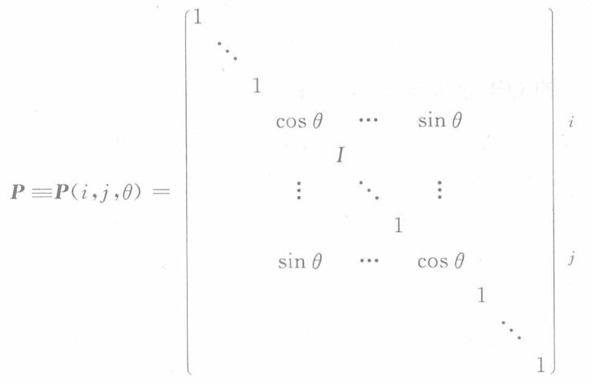

alias:: 吉文斯变换

- 设  $x, y \in \mathbb{R}^{2}$ , 则变换
  $$\left(\begin{array}{l}
  y_{1} \\
  y_{2}
  \end{array}\right)=\left(\begin{array}{cc}
  \cos \theta & \sin \theta \\
  -\sin \theta & \cos \theta
  \end{array}\right)\left(\begin{array}{l}
  x_{1}^{\prime} \\
  x_{2}
  \end{array}\right),$$ 
  或 
  $$\boldsymbol{y}=\boldsymbol{P} \boldsymbol{x}$$
  是平面上向量的一个[[旋转变换]], 其中
  $$\boldsymbol{P}(\theta)=\left(\begin{array}{cc}
  \cos \theta & \sin \theta \\
  -\sin \theta & \cos \theta
  \end{array}\right)$$
  为正交矩阵.
- $\mathbb{R}^{n}$  中变换
  $$\boldsymbol y=\boldsymbol P \boldsymbol x,$$
  其中  $x=\left(x_{1}, x_{2}, \cdots, x_{n}\right)^{\mathrm{T}}, \boldsymbol{y}=\left(y_{1}, y_{2}, \cdots, y_{n}\right)^{\mathrm{T}}$ , 而
   
  称为  $\mathbb{R}^{n}$  中平面  $\left\{x_{i}, x_{j}\right\}$  的旋转变换, 也称**吉文斯变换**.  $\boldsymbol{P}=\boldsymbol{P}(i, j, \theta)=\boldsymbol{P}(i, j)$  称为平面旋转矩阵.
  显然,  $\boldsymbol{P}(i, j, \theta)$  具有性质:
	- $\boldsymbol{P}$  与单位阵  $\boldsymbol{I}$  只是在  $(i, i),(i, j),(j, i),(j, j)$  位置元素不一样, 其他相同.
	  logseq.order-list-type:: number
	- $\boldsymbol{P}$  为[[正交矩阵]]  $\left(\boldsymbol{P}^{-1}=\boldsymbol{P}^{\mathrm{T}}\right)$ .
	  logseq.order-list-type:: number
	- $\boldsymbol{P}(i, j) \boldsymbol{A}$  (左乘) 只需计算第  $i$  行与第  $j$  行元素, 即对  $\boldsymbol{A}=\left(a_{i j}\right)_{m \times n}$  有
	  logseq.order-list-type:: number
	  $$\left(\begin{array}{l}
	  a_{i l}^{\prime} \\
	  a_{j l}^{\prime}
	  \end{array}\right)=\left(\begin{array}{cc}
	  c & s \\
	  -s & c
	  \end{array}\right)\left(\begin{array}{l}
	  a_{i l} \\
	  a_{j l}
	  \end{array}\right), \quad l=1,2, \cdots, n,$$
	  其中  $c=\cos \theta, s=\sin \theta$ .
	- $\boldsymbol{A P}(i, j)$  (右乘) 只需计算第  $i$  列与第  $j$  列元素
	  logseq.order-list-type:: number
	  $$\left(a_{l i}^{\prime}, a_{l j}^{\prime}\right)=\left(a_{l i}, a_{l j}\right)\left(\begin{array}{cc}
	  c & s \\
	  -s & c
	  \end{array}\right), \quad l=1,2, \cdots, m .$$
	  利用平面旋转变换, 可使向量  $\boldsymbol{x}$  中的指定元素变为零.
- ## 定理
	- ### 约化定理 
	  设  $x=\left(x_{1}, \cdots, x_{i}, \cdots, x_{j}, \cdots, x_{n}\right)^{\mathrm{T}}$ , 其中  $x_{i}, x_{j}$  不全为零, 则可选择平面旋转阵  $\boldsymbol{P}(i, j, \theta)$ , 使
	  $$\boldsymbol{P x}=\left(x_{1}, \cdots, x_{i}^{\prime}, \cdots, 0, \cdots, x_{n}\right)^{\mathrm{T}},$$
	  其中 $x_{i}^{\prime}=\sqrt{x_{i}^{2}+x_{j}^{2}}, \theta=\arctan \left(x_{j} / x_{i}\right)$ .
	-