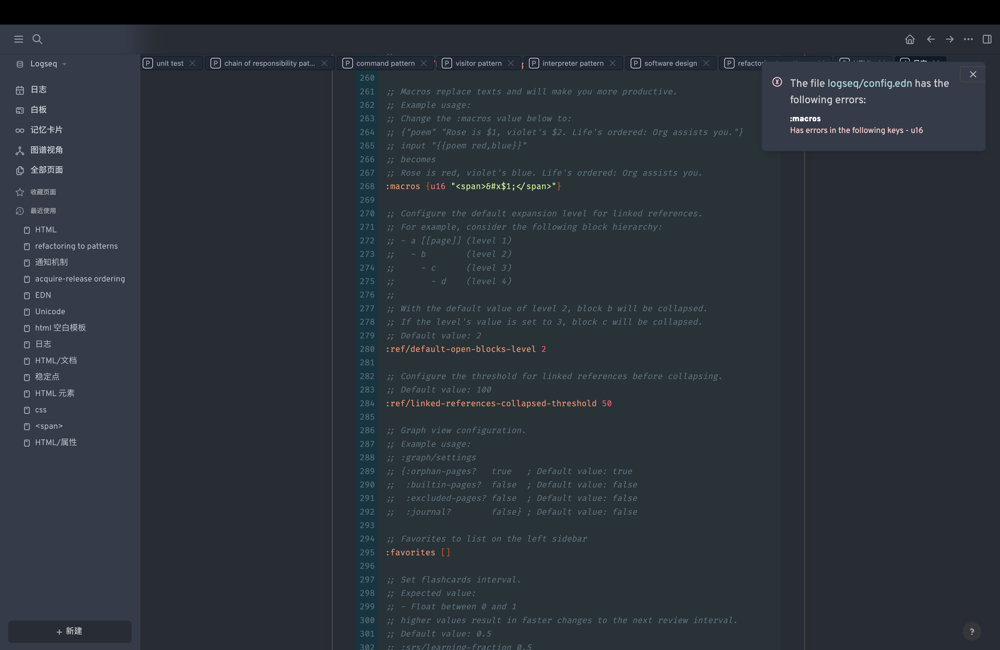

alias:: HyperText Markup Language

- ^^HTML^^（HyperText Markup Language）是用来创建网页和网页应用的[[标记语言]]。它是互联网的基本构建块之一，定义了网页的结构和内容。
  HTML文件包含[[HTML/标签]]和[[HTML/属性]]，标签用于定义文档的不同部分，而属性用于提供额外的细节或样式。
- ### HTML的基本结构
  id:: 66263867-4e5a-411a-9e17-cfe705b3d038
  一个典型的HTML文档由以下部分组成：
	- **DOCTYPE声明**：
	  logseq.order-list-type:: number
	  标记HTML文档的类型和版本。例如：
	  ```html
	  <!DOCTYPE html>
	  ```
	- **`<html>` 标签**：
	  logseq.order-list-type:: number
	  整个HTML文档的根标签。
	- **[[<head>]] 部分**：
	  logseq.order-list-type:: number
	  包含有关文档的元信息，例如页面标题、样式、脚本等。
	  ```html
	  <head>
	     <title>My Web Page</title>
	     <link rel="stylesheet" href="style.css">
	     <script src="script.js"></script>
	  </head>
	  ```
	- **[[<body>]]`部分**：
	  logseq.order-list-type:: number
	  包含网页的主要内容，如文本、图像、链接、表格等。
	  ```html
	  <body>
	     <h1>Welcome to My Web Page</h1>
	     <p>This is a paragraph of text.</p>
	  </body>
	  ```
- ### HTML的常用标签
	- **文本和格式**：
	  logseq.order-list-type:: number
		- `<h1>` 至 `<h6>`：标题标签。
		- `<p>`：段落。
		- `<b>`, `<i>`, `<u>`：粗体、斜体、下划线。
		- `<strong>`, `<em>`：语义上的强调。
	- **列表**：
	  logseq.order-list-type:: number
		- `<ul>`, `<ol>`：无序和有序列表。
		- `<li>`：列表项。
	- **链接和导航**：
	  logseq.order-list-type:: number
		- `<a>`：超链接。
		- `<nav>`：导航区域。
	- **图像和多媒体**：
	  logseq.order-list-type:: number
		- ``：图像。
		- `<video>`, `<audio>`：视频和音频。
		- `<figure>`, `<figcaption>`：用于标记图像或媒体的容器。
	- **表格**：
	  logseq.order-list-type:: number
		- `<table>`, `<tr>`, `<td>`, `<th>`：表格、行、单元格和表头。
	- **表单**：
	  logseq.order-list-type:: number
		- `<form>`：表单。
		- `<input>`, `<textarea>`, `<button>`：输入、文本区域、按钮。
	- **布局**：
	  logseq.order-list-type:: number
		- [[<div>]]：块级容器。
		- [[<span>]]：内联容器。
	- **语义标签**：
	  logseq.order-list-type:: number
		- `<article>`, `<section>`, `<aside>`, `<header>`, `<footer>`：用于提供语义结构的标签。
- ### HTML的功能与特点
	- **超链接**：HTML的核心功能之一是超链接，使得网页能够通过链接进行导航。
	- **结构化文档**：通过使用标签来组织和描述内容。
	- **多媒体支持**：支持图像、音频、视频等多媒体内容。
	- **可扩展性**：通过JavaScript和CSS，HTML可以与其他技术结合，实现交互和样式。
	  HTML是Web开发的基础，它的语法简单易学，同时又足够强大，能够构建复杂的网页和应用。通过学习HTML，你可以理解网页是如何工作的，并开始构建自己的Web内容。
	  <!--Converted by ToLogseq-->
- ### [[HTML 空白模板]]
- {{u16 2467}}
- <span>&#x2460;</span>
-
- 
- <span>&#x2460;</span>