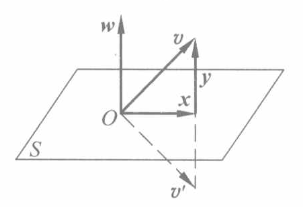

alias:: 豪斯霍尔德变换, 初等反射矩阵

- ## 定义
	- 设向量  $w \in \mathbb{R}^{n}$ , 且  $w^{\mathrm{T}} w=1$ , 称矩阵
	  $$\boldsymbol{H}(\boldsymbol{w})=\boldsymbol{I}-2 \boldsymbol{w} \boldsymbol{w}^{\mathrm{T}}$$
	  为[[初等反射矩阵]], 也称为**豪斯霍尔德变换**. 如果记  $\boldsymbol{w}=\left(w_{1}, w_{2}, \cdots, w_{n}\right)^{\mathrm{T}}$ , 则
	  $$\boldsymbol{H}(\boldsymbol{w})=\left(\begin{array}{cccc}
	  1-2 w_{1}^{2} & -2 w_{1} w_{2} & \cdots & -2 w_{1} w_{n} \\
	  -2 w_{2} w_{1} & 1-2 w_{2}^{2} & \cdots & -2 w_{2} w_{n} \\
	  \vdots & \vdots & & \vdots \\
	  -2 w_{n} w_{1} & -2 w_{n} w_{2} & \cdots & 1-2 w_{n}^{2}
	  \end{array}\right) .$$
- ## 定理
	- 设有 初等反射矩阵  $\boldsymbol{H}=\boldsymbol{I}-2 \boldsymbol{w} \boldsymbol{w}^{\mathrm{T}}$ , 其中  $\boldsymbol{w}^{\mathrm{T}} \boldsymbol{w}=1$ , 则 :
		- $\boldsymbol{H}$  是[[对称矩阵]], 即  $\boldsymbol{H}^{\mathrm{T}}=\boldsymbol{H}$ .
		  logseq.order-list-type:: number
		- $\boldsymbol{H}$  是[[正交矩阵]], 即  $\boldsymbol{H}^{-1}=\boldsymbol{H}$ .
		  logseq.order-list-type:: number
		- 设  $\boldsymbol{A}$  为对称矩阵,那么  $\boldsymbol{A}_{1}=\boldsymbol{H}^{-1} \boldsymbol{A H}=\boldsymbol{H} \boldsymbol{A} \boldsymbol{H}$  亦是[[对称矩阵]].
		  logseq.order-list-type:: number
		- ### 证明 
		  只证  $\boldsymbol{H}$  的正交性, 其他显然.
			- \begin{aligned}
			  \boldsymbol{H}^{\mathrm{T}} \boldsymbol{H} & =\boldsymbol{H}^{2}=\left(\boldsymbol{I}-2 \boldsymbol{w} \boldsymbol{w}^{\mathrm{T}}\right)\left(\boldsymbol{I}-2 \boldsymbol{w} \boldsymbol{w}^{\mathrm{T}}\right) \\
			  & =\boldsymbol{I}-4 \boldsymbol{w} \boldsymbol{w}^{\mathrm{T}}+4 \boldsymbol{w}\left(\boldsymbol{w}^{\mathrm{T}} \boldsymbol{w}\right) \boldsymbol{w}^{\mathrm{T}}=\boldsymbol{I} .
			  \end{aligned}
- 设向量  $\boldsymbol{u} \neq \mathbf{0}$ , 则显然
  $$\boldsymbol{H}=\boldsymbol{I}-2 \frac{\boldsymbol{u} \boldsymbol{u}^{\mathrm{T}}}{\|\boldsymbol{u}\|_{2}^{2}}$$
  是一个初等反射矩阵.
- 下面考察初等反射矩阵的几何意义. 参见下图, 
   
  考虑以  $\boldsymbol w$  为[[法向量]]且过原点  $O$  的[[超平面]]  $S: \boldsymbol w^{\mathrm{T}}\boldsymbol  x=0$  ：
  设任意向量  $\boldsymbol v \in \mathbb{R}^{n}$ , 则  $\boldsymbol v=\boldsymbol{x}+\boldsymbol{y}$ , 其中  $\boldsymbol{x} \in S, \boldsymbol{y} \in S^{\perp}$ . 于是
  $$\boldsymbol{H} \boldsymbol{x}=\left(\boldsymbol{I}-2 \boldsymbol{w} \boldsymbol{w}^{\mathrm{T}}\right) \boldsymbol{x}=\boldsymbol{x}-2 \boldsymbol{w} \boldsymbol{w}^{\mathrm{T}}\boldsymbol  x=\boldsymbol{x} .$$
  对于  $\boldsymbol y \in S^{\perp}$ , 易知  $\boldsymbol{H} \boldsymbol{y}=-\boldsymbol{y}$（ $\boldsymbol y$ 与 $\boldsymbol w$ 共线）, 从而对任意向量  $\boldsymbol v \in \mathbb{R}^{n}$ , 总有
  $$\boldsymbol{H} \boldsymbol{v}=\boldsymbol{x}-\boldsymbol{y}=\boldsymbol{v}^{\prime},$$
  其中  $\boldsymbol v^{\prime}$  为  $\boldsymbol v$  关于平面  $S$  的[[镜面反射]].
- ## 定理
	- 设  $\boldsymbol{x}, \boldsymbol{y}$  为两个不相等的  $n$  维向量,  $\|x\|_{2}=\|y\|_{2}$ , 则存在一个初等反射矩阵  $\boldsymbol{H}$ ,使  $\boldsymbol{H x}=\boldsymbol{y}$ .
	- ### [[约化定理]]
	  设  $\boldsymbol{x}=\left(x_{1}, x_{2}, \cdots, x_{n}\right)^{\mathrm{T}} \neq \mathbf{0}$ , 则存在初等反射矩阵  $\boldsymbol{H}$  使  $\boldsymbol{H} \boldsymbol{x}=   -\sigma e_{1}$（$e_{1}=\{1, 0,\cdots, 0\}^\mathrm{T}$）, 其中
	  $$\left\{\begin{array}{l}
	  \boldsymbol{H}=\boldsymbol{I}-\beta^{-1} \boldsymbol{u}^{\mathrm{T}}, \\
	  \sigma=\operatorname{sgn}\left(x_{1}\right)\|\boldsymbol{x}\|_{2}, \\
	  \boldsymbol{u}=\boldsymbol{x}+\sigma \boldsymbol{e}_{1}, \\
	  \beta=\frac{1}{2}\|\boldsymbol{u}\|_{2}^{2}=\sigma\left(\sigma+x_{1}\right) .
	  \end{array}\right.$$
-