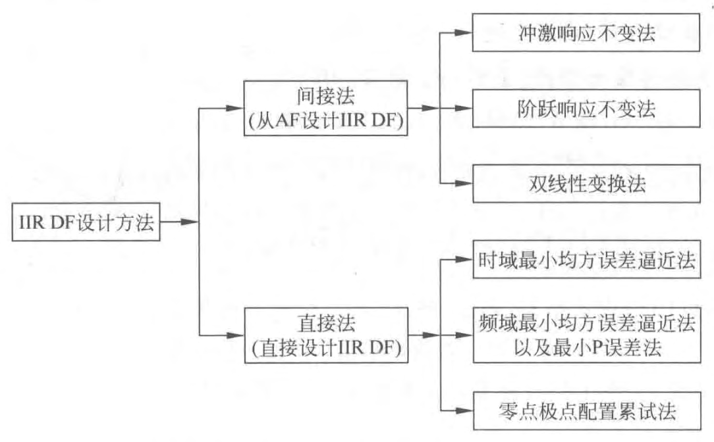

## IIR 数字滤波器的设计方法分类
以下讨论用一个因果稳定的离散线性移不变系统的系统函数（有理函数）去逼近给定的性能要求。IIR 滤波器的[[系统函数]]为 $z^{-1}$ 的有理分式，即
$$H(z)=\frac{\sum_{k=0}^{M} b_{k} z^{-k}}{1-\sum_{k=1}^{N} a_{k} z^{-k}}$$
一般满足 $M \leqslant N$ ，这类系统称为[[N 阶系统]]，当 $M>N$ 时， $H(z)$ 可看成是一个 $N$ 阶 IIR 子系统与一个（ $M-N$ ）阶的 [FIR]([[FIR 数字滤波器]]) 子系统（多项式）的级联。以下讨论都假定 $M \leqslant N$ 。
- IIR 滤波器的逼近问题就是去求出滤波器的各系数 $a_{k}$ 和 $b_{k}$ ，使得在规定的意义上，例如通带起伏及阻带衰减满足给定的要求，或采用最优化准则（最小均方误差要求或最大误差最小要求）[[逼近]]所要求的特性。
- > 由于是在 $z$ 平面上去逼近，故得到的是数字滤波器。
- IIR 数字滤波器设计有[[IIR 数字滤波器设计的间接法]]与^^直接法^^两大类，见图 1 。
  
- 本章只讨论间接法，而且着重于[[脉冲响应不变法]]及[[双线性变换法]]。这是因为[[模拟滤波器]]（AF）有成熟的设计方法、完整的设计公式及实用表格可资利用，使得数字滤波器（DF）的设计更为简便迅速。
- 直接法要求解联立方程组，必须利用计算机辅助设计 。
- ## [[IIR 数字滤波器的网络结构]]
-