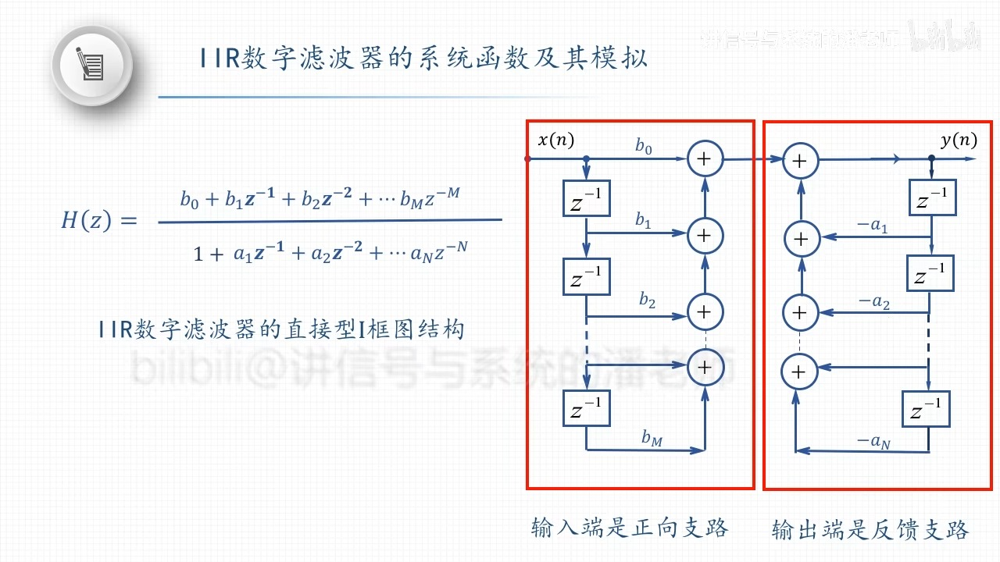
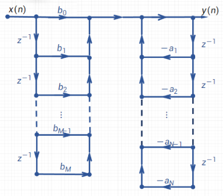
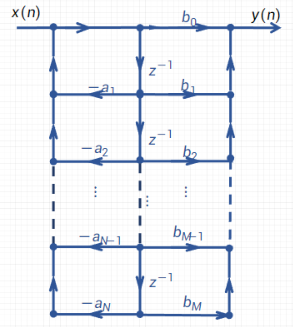

### IIR数字滤波器的直接型 $\mathrm{I}$ [框图结构]([[系统框图]])

- ### IIR数字滤波 器的直接型 $\mathrm{I}$ [[信号流图]]
  {:height 387, :width 377}
- ## IIR数字滤波 器的直接型 $\mathrm{II}$ 信号流图
  
- ## 例子
	- ((6616b5ec-d011-4de0-9977-d1fcada0105f))
- > 级联和并联行一般最多由二阶子系统组成，称为二阶结。