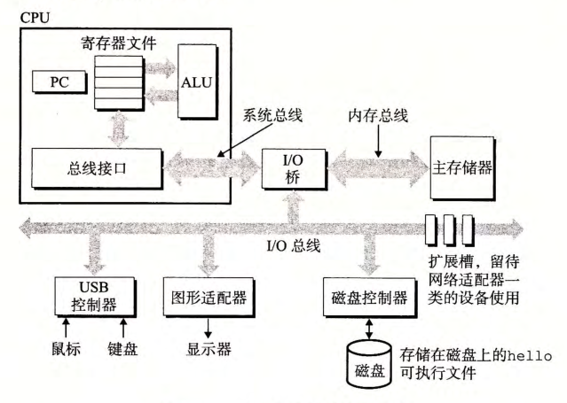

alias:: 输入/输出设备, I/O, 输入/输出

- [[I/O 设备]]是系统与外部世界的联系通道。
- 每个[[I/O 设备]]都通过一个[[控制器]]或[[适配器]]与[[I/O 总线]]相连。他们之间的区别主要在于它们的 *封装方式* 。
	- [[控制器]]是[[I/O 设备]]本身或者系统的[[主印制电路板]]（通常称作主板）上的[[芯片组]]。
	- 而[[适配器]]则是一块**插在**主板插槽上的卡。
- #+BEGIN_PINNED
   
  我们的示例系统包括四个 I/O 设备：作为[[用户输入]]的键盘和鼠标，作为[[用户输出]]的显示器，以及用于长期存储数据和程序的[[磁盘驱动器]]。
  #+END_PINNED
-