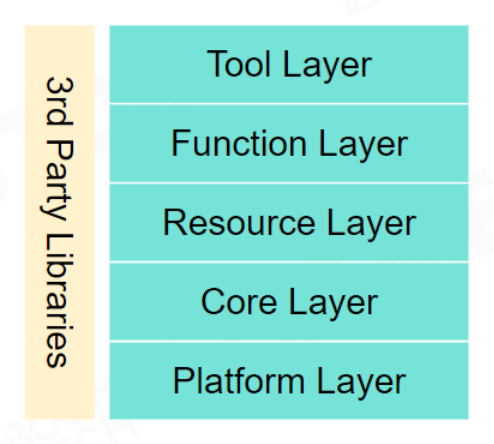

- {:width 494/2, :height 444/2}
- ## [[Tool Layer]]
	- Chain of Editors
- ## [[Function Layer]]
	- [[rendering]]
	- [[Animation]]
	- [[Physics]]
	- [[Camera]]
	- [[HUD]]
	- [[Input]]
	- [[Script]]
	- [[FSM]]
	- [[AI]]
- ## [[Resource Layer]]
	- [[Data and Files]]
		- [[Scene]] and [[Level]]
		- [[Script]] and [[Graph]]
		- Game Logic Data
- ## [[Core Layer]]
  Swiss Knife of Game Engine
	- [[Data Structure]]
	- [[Garbage Collection]]
	- [[Math]]
	- [[Thread Pool]]
- ## [[Platform Layer]]
	- Launch on Different Platforms
	- [[Operation Systems]]
	- [[Platform File Systems]]
	- [[Graphics API]]
	- [[Platform SDK]]
	- [[Consoles]]
	- [[Input Devices]]
	- [[Publishing Platforms]]
- [[3rd Party Libraries]]
	- [[Middleware]] and 3rd Party Libraries
-