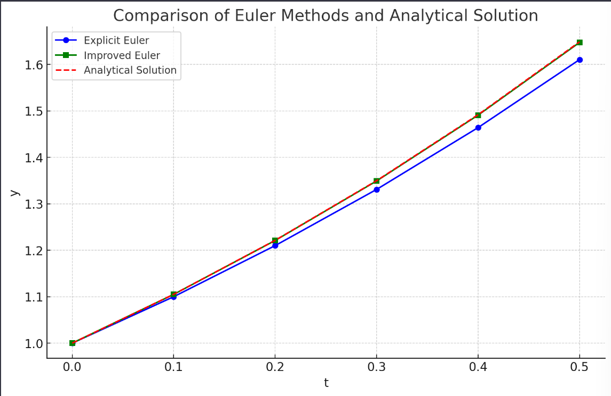

alias:: 改进欧拉法, predictor-corrector method, 两步欧拉法

- 梯形法虽提高了精度, 但它是一种隐式算法, 需要借助于迭代过程求解, 计算量大,而 Euler 法虽精度低,但它是一种显示算法,其计算量小.
- 综合使用这两种方法, 先用[[显式欧拉公式]]求得一个初步的近似值, 记为  $\bar{y}_{n+1}$ , 称之为[[预报值]], 预报值  $\bar{y}_{n+1}$  的精度不高, 用它替代[[梯形欧拉公式]]右端的  $y_{n+1}$  再直接计算, 得到[[校正值]]  $y_{n+1}$ , 这样建立[[预测-校正系统]].
  预报
  $$\bar{y}_{n+1}=y_{n}+h f\left(x_{n}, y_{n}\right),$$
  校正
  $$y_{n+1}=y_{n}+\frac{h}{2}\left[f\left(x_{n}, y_{n}\right)+f\left(x_{n+1}, \bar{y}_{n+1}\right)\right]$$
  称作[[改进欧拉法]]. 这是一种一步显式公式,它可表为嵌套形式
  $$y_{n+1}=y_{n}+\frac{h}{2}\left[f\left(x_{n}, y_{n}\right)+f\left(x_{n+1}, y_{n}+h f\left(x_{n}, y_{n}\right)\right)\right], \tag{1}$$
  或表为平均化形式
  $$\left\{\begin{array}{l}
  y_{p}=y_{n}+h f\left(x_{n}, y_{n}\right), \\
  y_{c}=y_{n}+h f\left(x_{n+1}, y_{p}\right), \\
  y_{n+1}=\frac{1}{2}\left(y_{p}+y_{c}\right) .
  \end{array}\right.$$
  改进的 Euler 法的优点是实现了隐式显算的目的, 且减少了计算量, 式 $(1)$ 还可写成
  $$\left\{\begin{array}{l}
  y_{n+1}=y_{n}+h\left(\frac{1}{2} k_{1}+\frac{1}{2} k_{2}\right), \\
  k_{1}=f\left(x_{n}, y_{n}\right), \\
  k_{2}=f\left(x_{n+1}, y_{n}+h k_{1}\right) .
  \end{array}\right.$$
  >公式中用到的斜率是两个点的[[斜率]]的[[加权平均]]，它为构造新的计算法提供了新的途径, [[R-K 方法]]就是这种思想的体现和发展.
- 可以证明该算法具有 $2$ 阶[[精度]]。
- ## 例子
	- 改进欧拉法（也称为修正欧拉法或半隐式欧拉法）是一种更精确的数值方法，用于求解常微分方程。这种方法相比于显式欧拉法，通过一个额外的步骤来增强精度。改进欧拉法的基本步骤如下：
	- 1. 从初始点 \( (t_0, y_0) \) 开始。
	  2. 使用显式欧拉法计算一个预估值：\( \tilde{y}_{n+1} = y_n + h \cdot f(t_n, y_n) \)。
	  3. 然后使用这个预估值来计算一个更精确的 \( y_{n+1} \) 值：\( y_{n+1} = y_n + \frac{h}{2} \left( f(t_n, y_n) + f(t_{n+1}, \tilde{y}_{n+1}) \right) \)。
	- 我们依然使用前面的例子（微分方程 \(\frac{dy}{dt} = y\)）来演示这种方法。我将首先用代码来实现改进欧拉法，然后在图示中展示其结果与显式欧拉法和解析解的比较。
	  
	- 在这个图示中，我们可以看到三种不同方法的结果：
	- 1. **显式欧拉方法**（蓝色圆点）：这是最简单的方法，但也最不精确。
	  2. **改进欧拉方法**（绿色方块）：这种方法通过在每一步使用一个预估值来提高精度。
	  3. **解析解**（红色叉号和虚线）：这是微分方程的真实解，用于比较。
	- 从图中可以明显看出，改进欧拉方法比显式欧拉方法更接近真实的解析解，显示了改进方法在精度上的优势。尽管如此，改进欧拉方法依然是一种近似方法，对于更复杂的微分方程，可能需要更高级的数值方法来获得更精确的结果。