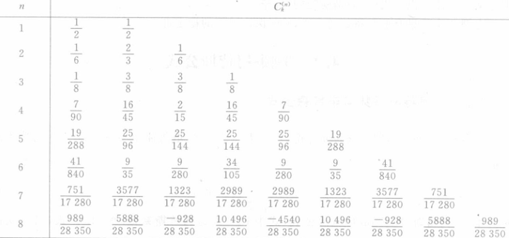
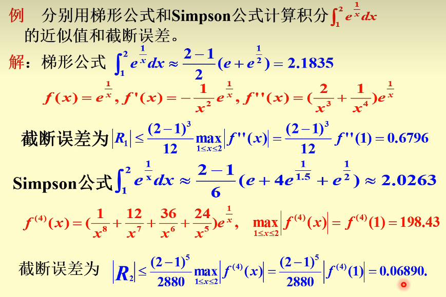

alias:: 牛顿-柯特斯公式

- [[插值型求积公式]]中，当节点[[等距分布]]时$:x_{k}=\alpha+kh,\quad h=\frac{b-a}{n},\quad k=0,1,...,n$ 
  令 $x=\boldsymbol{a}+\boldsymbol{t}\boldsymbol{h}$，
  \begin{aligned}
  A_k &=\int_{x_0}^{x_n}\prod_{j\neq k}\frac{(x-x_j)}{(x_k-x_j)}\mathrm dx \\
  &= \int_0^n\prod_{k\ne j} \frac{(t-j)h}{(k-j)h}\times h\mathrm dt \\ 
  &= \frac{(b-a)(-1)^{n-k}}{nk!(n-k)!}\int_{0}^{n}\prod_{t\ne j}(t-j)\mathrm dt
  \end{aligned}
  称为 [[牛顿-柯特斯公式]]。 
  $\frac{(-1)^{n-k}}{nk!(n-k)!}\int_{0}^{n}\prod_{t\ne j}(t-j)\mathrm dt$ 称为[[Cotes 系数]] $C_k^{(n)}$ 。
	- Cotes 系数 仅取决于 $n$ 和 $k$ ，可查下表得到。与 $f\left(x\right)$  及区间 $[a,b]$ 均无关。
	  {:height 323, :width 671}
		- 由表可以看出，当$n\geq8$时，柯特斯系数有正有负，这时[[稳定性]]得不到保证。
		  id:: 65a54455-eae6-45fe-b1ce-08f86f711f9d
		- 当 $n=4$ 时称为[[柯特斯公式]]。
- ## 定理
	- 当阶 $n$ 为偶数时，Newton-Cotes 式 至少有 $(n+1)$ 次[[代数精度]].
	  logseq.order-list-type:: number
	- 若 $f(x)$ 在 $[a,b]$ 上具有二阶连续导数，则[[梯形式]]的[截断误差]([[求积公式截断误差]])为
	  logseq.order-list-type:: number
	  \begin{aligned}
	  R[f] &=\int_{a}^{b}f(x)\:\mathrm{d}x-(b-a)\Big[\frac{1}{2}f(a)+\frac{1}{2}f(b)\:\Big]\\
	  &=-\frac{(b-a)^{3}}{12}f^{\prime\prime}(\eta)\quad(a\leqslant\eta\leqslant b).
	  \end{aligned}
	- 若 $f(x)$在$[a,b]$上有 4 阶连续导数，则[[辛普森法]]的[截断误差]([[求积公式截断误差]])为
	  logseq.order-list-type:: number
	  id:: 65a5331f-979f-41be-9f75-45d9e5a43489
	  $$
	  R[f]=-\frac{(b-a)^{5}}{2880}f^{(4)}(\eta)\quad(a\leqslant\eta\leqslant b).
	  $$
		- > 证明可通过[式](((65a4eea9-fd53-411d-8505-5347f4555aa0)))计算。
- ## 例子
	- 