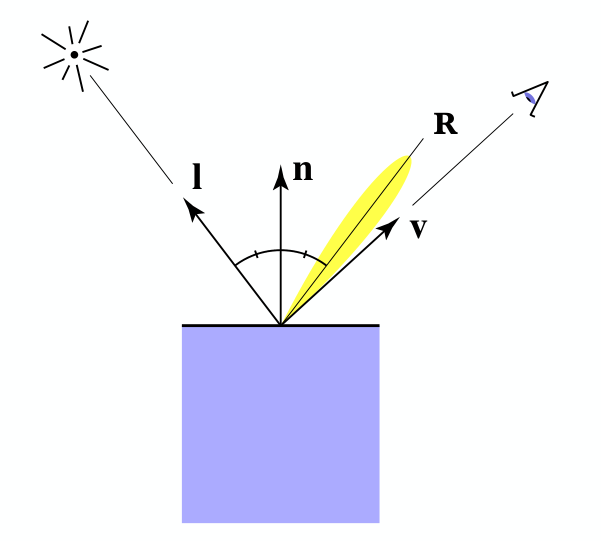

# Shading point
	- |Name|Symbol|
	  |--|--|
	  |[[viewer direction]]|$\bold{v}$|
	  |[[surface narmal]]|$\bold{n}$|
	  |[[light direction]]|$\bold{l}$|
	  |[[reflection direction]]|$\bold{r}$|
	- {:height 528/2, :width 578/2}
-