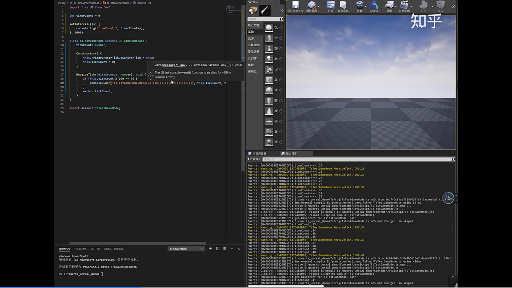
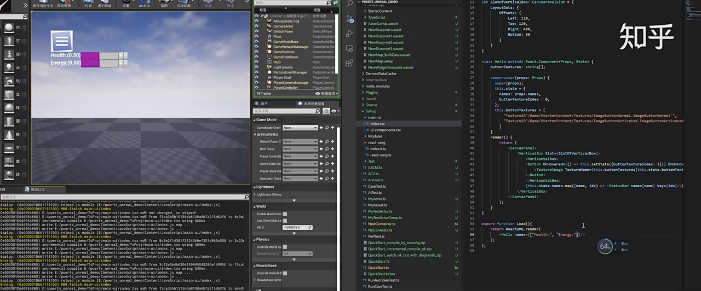
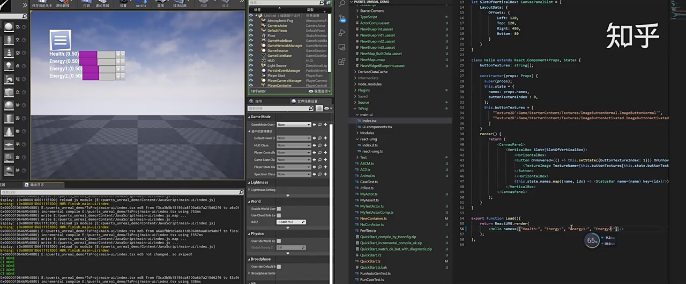
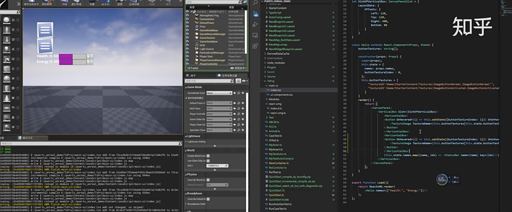

- [[V8]]已经内置了刷代码的功能：[[Inspector]] 的`Debugger.setScriptSource` 命令。我们只要监听文件的变化，用url和新代码即可刷新指定代码。
- 虽说提供了这么个功能，但用起来其实也并不简单，因为“Debugger.setScriptSource”并不是一个C++函数，而是一个RPC消息，而且调用这个RPC之前，还要做一些交互
- ### Unreal 例子
  collapsed:: true
	- 
	- 
	  运行时更改后
	  
	  
- ``` bash 
  npm run build:dev
  ```
-