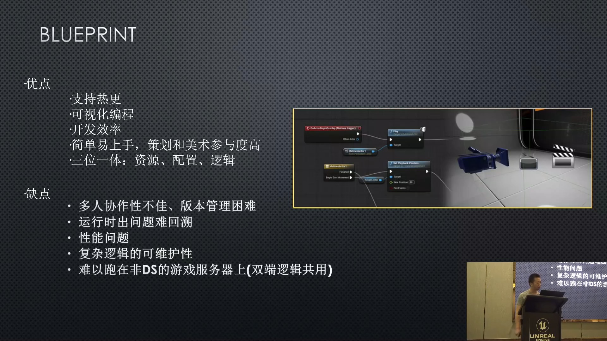
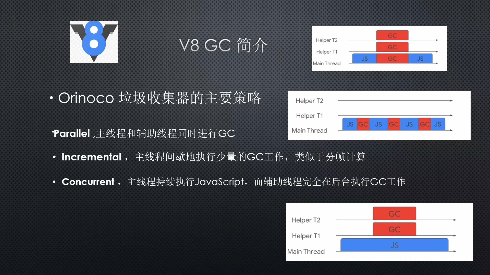

## Reference
	- https://github.com/Tencent/puerts?tab=readme-ov-file#what---%E6%99%AE%E6%B4%B1ts%E6%98%AF%E4%BB%80%E4%B9%88
	- https://puerts.github.io/docs/puerts/unreal/install/
	- https://github.com/chexiongsheng/puerts_unreal_demo
- 
- 
- 
- 
- {:height 347, :width 603}
- Mark-Sweep
  
- 
- {:height 446, :width 778}
- /Users/Shared/Epic\ Games/UE_5.3/Engine/Build/BatchFiles/Mac/GenerateProjectFiles.sh -game -project="/Users/libo/Documents/Unreal Projects/puerts_unreal_demo/puerts_unreal_demo.uproject"
- /Users/libo/Documents/Unreal Projects/TPTest/TPTest.uproject
- /Users/Shared/Epic\ Games/UE_5.3/Engine/Build/BatchFiles/Mac/GenerateProjectFiles.sh -game -project="/Users/libo/Documents/Unreal Projects/TPTest/TPTest.uproject"
- ## [mac下提示“无法打开libv8.dylib，因为无法验证开发者”](https://github.com/Tencent/puerts/blob/master/doc/unreal/zhcn/faq.md#mac%E4%B8%8B%E6%8F%90%E7%A4%BA%E6%97%A0%E6%B3%95%E6%89%93%E5%BC%80libv8dylib%E5%9B%A0%E4%B8%BA%E6%97%A0%E6%B3%95%E9%AA%8C%E8%AF%81%E5%BC%80%E5%8F%91%E8%80%85)
  进入该dylib文件所在目录（通常是：youproject/Plugins/Puerts/ThirdParty/v8/Lib/macOSdylib），执行如下命令：
  ```
  sudo xattr -r -d com.apple.quarantine *.dylib
  ```
  添加 xcode 的执行权限
- ## 步骤
	- 参考 https://zhuanlan.zhihu.com/p/632862773
	- 完成后在 YourProject.Build.cs 中添加相关的依赖模块：
	  ```
	  PrivateDependencyModuleNames.AddRange(new string[] { "Puerts", "JsEnv" });
	  ```
	-