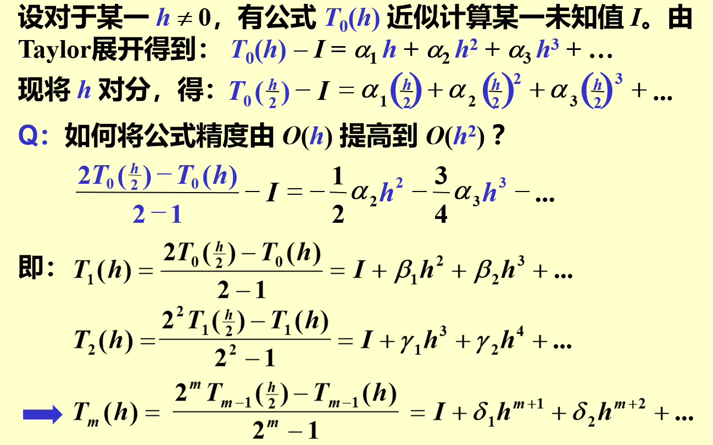

alias:: 理查森外推法, 理查森外推加速方法, 理查德森外推法

- 利用低阶公式产生高精度的结果
- {:height 479, :width 754}
- 理查森外推法（Richardson Extrapolation）是一种用于提高数值近似精度的技术，它基于这样一个观察：数值解的误差往往与步长的某个幂次成正比。通过比较不同步长下的近似解，理查森外推法可以提高数值计算的精度。
- **理查森外推法的基本原理**：
- 假设有[[数值解]] \( A(h) \)，它是关于步长 \( h \) 的函数，且有
  $$A(h) = A + C h^n + O(h^{n+1}),$$ 
  其中 \( A \) 是真实值，\( C \) 是与步长相关的误差系数，\( n \) 是误差的阶数。
  为了提高精度，可以计算两个不同步长（例如，\( h \) 和 \( h/2 \)）下的数值解 \( A(h) \) 和 \( A(h/2) \)，然后利用下面的公式进行外推：
  $$A_{\text{extrapolated}} = \frac{2^n A(h/2) - A(h)}{2^n - 1}.$$
- 这个外推值 \( A_{\text{extrapolated}} \) 通常比任何单独的近似值 \( A(h) \) 或 \( A(h/2) \) 都要准确。
- **应用示例**：
- 让我们通过一个具体的例子来更详细地解释理查森外推法，并展示其如何应用于数值近似问题。
  
  **例子**：数值积分
  
  考虑计算定积分 \( \int_{a}^{b} f(x) dx \) 的数值近似。我们将使用梯形法作为基本的数值积分方法，并应用理查森外推法来提高精度。
  
  **梯形法**：给定一个函数 \( f(x) \)，在区间 \([a, b]\) 上的梯形法近似为：
  \[ T(h) = \frac{h}{2}[f(a) + 2\sum_{i=1}^{n-1} f(a + ih) + f(b)], \]
  其中 \( h = \frac{b - a}{n} \) 是步长，\( n \) 是子区间的数量。
  
  **理查森外推法的步骤**：
	- 1. **计算两个不同步长的近似值**：
		- 使用步长 \( h \) 计算 \( T(h) \)。
		- 将步长减半，使用 \( h/2 \) 计算 \( T(h/2) \)。
	- 2. **应用理查森外推公式**：对于梯形法，误差项大约与 \( h^2 \) 成正比，所以 \( n = 2 \)。应用理查森外推公式：
	  \[ R = \frac{4T(h/2) - T(h)}{4 - 1}. \]
	  这里，\( R \) 是通过理查森外推得到的更精确的近似值。
- **举例说明**：
	- 假设我们要计算定积分 \( \int_{0}^{1} e^x dx \)，真实值为 \( e - 1 \)。
		- 1. 使用步长 \( h = 0.5 \)（即 \( n = 2 \)），计算 \( T(h) \)。
		- 2. 使用步长 \( h/2 = 0.25 \)（即 \( n = 4 \)），计算 \( T(h/2) \)。
		- 3. 应用理查森外推公式计算 \( R \)。
	- **计算**：
		- 1. \( T(0.5) = \frac{0.5}{2}[e^0 + 2e^{0.5} + e^1] \approx 1.85914 \)
		- 2. \( T(0.25) = \frac{0.25}{2}[e^0 + 2(e^{0.25} + e^{0.5} + e^{0.75}) + e^1] \approx 1.83553 \)
		- 3. \( R = \frac{4 \times 1.83553 - 1.85914}{3} \approx 1.71828 \)
	- **结论**：
	  
	  通过应用理查森外推法，我们获得的积分近似值 \( R \approx 1.71828 \)，这比单独使用梯形法得到的结果更接近真实值 \( e - 1 \approx 1.71828 \)。这展示了理查森外推法在提高数值近似精度方面的有效性。