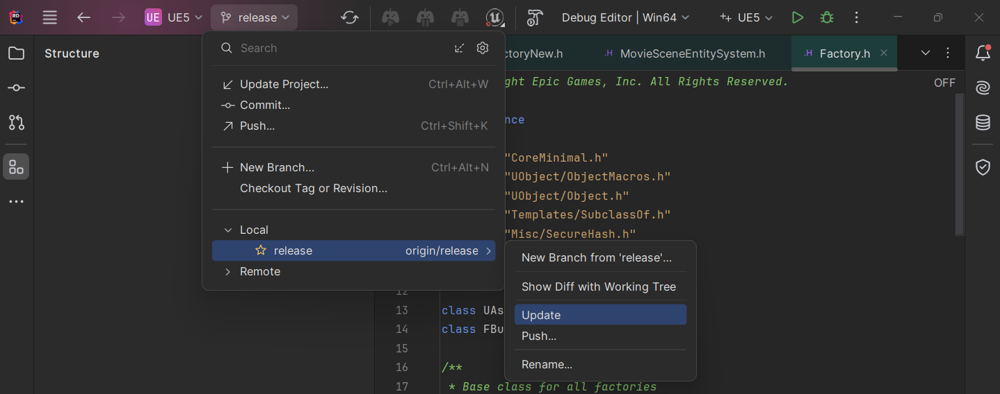

- 在使用虚幻引擎时，选择正确的IDE对于高效的编程工作至关重要。JetBrains提供的Rider IDE有两个与虚幻引擎相关的版本：Rider for Unreal Engine（常简称为Rider）和RiderLink（与虚幻引擎项目相关联的插件，有时称为Rider Uproject）。下面是这两者的区别：
- ### Rider for Unreal Engine
  Rider for Unreal Engine是JetBrains开发的一款针对虚幻引擎项目优化的IDE。这个版本的Rider包含了许多专门为虚幻引擎设计的功能，如：
	- **增强的C++支持**：包括对虚幻引擎API的深度集成和代码智能提示。
	- **虚幻引擎专用工作流**：如蓝图调试和反射系统支持。
	- **高效的代码导航和搜索**：针对虚幻引擎项目的代码结构优化。
	- **直接集成虚幻编辑器的功能**：可以直接从IDE启动和停止虚幻引擎编辑器。
- ### RiderLink (Rider Uproject)
  RiderLink不是一个独立的IDE，而是一个为Rider for Unreal Engine设计的插件，它允许Rider IDE与虚幻引擎的编辑器直接交互。这个插件是通过虚幻引擎的插件系统安装到虚幻引擎项目中的（即Uproject），具体包括：
	- **改进的调试体验**：允许从Rider IDE中直接启动和调试虚幻引擎项目。
	- **实时的代码同步**：编辑C++代码时，更改可以即时反映在虚幻引擎编辑器中。
	- **更强大的代码分析**：提供实时的代码质量检查和改进建议。
- 总的来说，Rider for Unreal Engine是一个完整的IDE，专为虚幻引擎开发者设计，而RiderLink是一个插件，用于增强Rider与虚幻引擎之间的集成和交互。如果你在使用Rider进行虚幻引擎开发，通常需要同时使用Rider IDE和RiderLink插件来获得最佳的开发体验。
  <!--Converted by ToLogseq-->
- Git pull
	- 
-