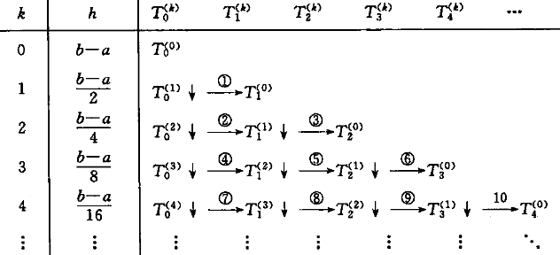
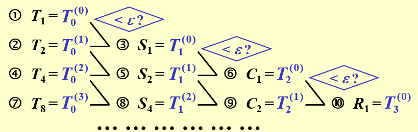
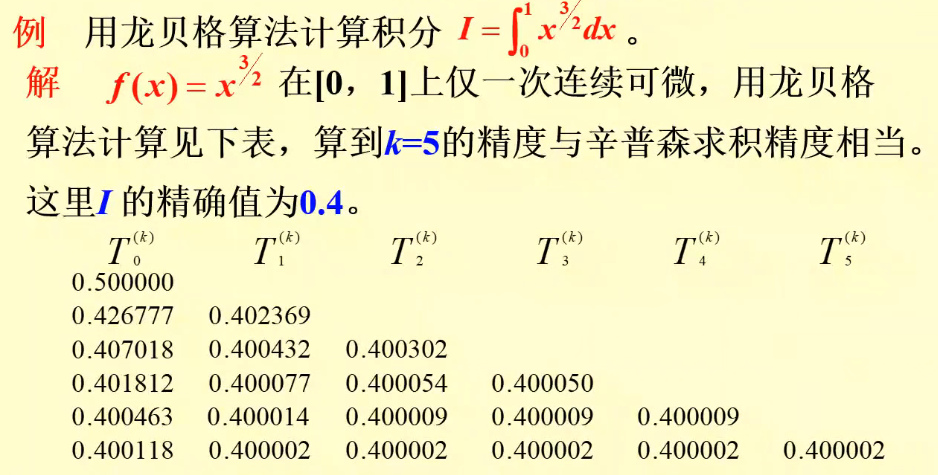

alias:: 龙贝格积分, 龙贝格算法

- > [梯形法]([[梯形法的递推化]])计算简单但收敛慢，如何提高[[收敛速度]]是本节讨论的中心问题.
- 按[式](((65a7a3c7-fb4f-4846-9091-6597c2aba092))), 积分近似值 $T_{2n}$ 的误差大致等于 $\frac13(T_{2n}-T_n)$ , 因此如果用这个误差值作为 $T_{2n}$ 的一种补偿, 可以期望所得到的  
  $$I \approx \tilde{T}=T_{2 n}+\frac{1}{3}\left(T_{2 n}-T_{n}\right)=\frac{4}{3} T_{2 n}-\frac{1}{3} T_{n}$$  
  可能是更好的结果, 这是因为
  $$S_{n}=\frac{4}{3} T_{2 n}-\frac{1}{3} T_{n},\tag{1}$$
  即用 梯形法 二分前后的两个积分值  $T_{n}$  与  $T_{2 n}$ , 按[式](((65a7a3c7-fb4f-4846-9091-6597c2aba092)))做线性组合, 结果得到较梯形公式精度高的[[复合辛普森公式]]的积分值  $S_{n}$ .
  >$$\frac{2^{2} T_{2 n}-T_{n}}{2^{2}-1}=S_{n}, \quad \frac{2^{4} S_{2 n}-S_{n}}{2^{4}-1}=C_{n}, \frac{2^{6} C_{2 n}-C_{n}}{2^{6}-1}=R_{n}$$
	- >这说明从梯形公式出发, 将区间  $[a, b]$  逐次二分可提高求积公式的精度, 上述加速过程还可继续下去, 其理论依据是梯形公式的余项展开. 设
	  $$I-T_{n}=-\frac{b-a}{12} h^{2} f^{\prime \prime}(\eta) \quad\left(\eta \in[a, b], h=\frac{b-a}{n}\right) .$$
	- >若记  $T_{n}=T(h)$ , 当区间  $[a, b]$  分为  $2 n$  等分时, 则有  $T_{2 n}=T\left(\frac{h}{2}\right)$ , 并且有
	  $$T(h)=I+\frac{b-a}{12} h^{2} f^{\prime \prime}(\eta), \quad \lim _{h \rightarrow 0} T(h) =T(0)=I,$$
	  可证明[梯形公式余项]([[求积公式余项]])可展开为**级数形式**.
- ### 定理
  设  $f(x) \in C^{\infty}[a, b]$ , 则有 
  $$
  T(h)=I+\alpha_{1} h^{2}+\alpha_{2} h^{4}+\cdots+\alpha_{l} h^{2 l}+\cdots \tag{2}$$ 
  其中, 系数  $\alpha_{l}(l=1,2, \cdots)$ 与  $h$  无关.
	- ### 理查森外推法
	  上述定理表明  $T(h) \approx I$ 是  $O\left(h^{2}\right)$  阶, 在式 $(2)$ 中, 若用  $h / 2$  代替  $h$ , 则有
	  $$T\left(\frac{h}{2}\right)=I+\alpha_{1} \frac{h^{2}}{4}+\alpha_{2} \frac{h^{4}}{16}+\cdots+\alpha_{t}\left(\frac{h}{2}\right)^{2 l}+\cdots .\tag{3}$$
	  若用 $4$ 乘式 $(3)$ , 减去式 $(2)$ 再除 $3$ , 记之为  $T_{1}(h)$ , 则得
	  $$T_{1}(h)=\frac{4 T\left(\frac{h}{2}\right)-T(h)}{3}=I+\beta_{1} h^{4}+\beta_{2} h^{6}+\cdots .\tag{4}$$
	  这里 $\beta_{1}, \beta_{2}, \cdots$  以及后面将要出现的  $r_{k}, \delta_{k}$  均为与  $h$  无关的系数, 这样构造的  $T_{1}(h)$  与积分值  $I$  近似的阶为  $O\left(h^{4}\right)$ . 比较式 $(2)$ 与式  $(1)$ 可知, 这样构造的序列  $T_{1}(h) ,  T_{1}\left(\frac{h}{2}\right), \cdots$ , 就是 Simpson 公式序列  $S_{n}, S_{2 n}, \cdots$ .
	  又根据式 $(4)$ , 有
	  $$T_{1}\left(\frac{h}{2}\right)=I+\beta_{1} \frac{h^{4}}{16}+\beta_{2} \frac{h^{6}}{64}+\beta_{3} \frac{h^{8}}{256}+\cdots,$$
	  若令
	  $$T_{2}(h)=\frac{16}{15} T_{1}\left(\frac{h}{2}\right)-\frac{1}{15} T_{1}(h),$$
	  则又可进一步从余项展开式中消去  $h^{4}$  项, 而有
	  $$T_{2}(h)=I+\gamma_{1} h^{6}+\gamma_{2} h^{8}+\cdots .$$
	  这样构造出的  $\left\{T_{2}(h)\right\}$ , 其实就是[[复合柯特斯公式]]序列, 它与积分值  $I$  的逼近阶为  $O\left(h^{6}\right)$ . 如此继续下去, 每加速一次, 误差的量级便提高 $2$ 阶, 一般地, 若记  $T_{0}(h)=T(h)$ , 则有
	  $$T_{m}(h)=\frac{4^{m}}{4^{m}-1} T_{m-1}\left(\frac{h}{2}\right)-\frac{1}{4^{m}-1} T_{m-1}(h) .\tag{5}$$ 
	  经过  $m(m=1,2, \cdots)$  次加速后, 余项便取下列形式:
	  $$T_{m}(h)=I+\delta_{1} h^{2(m+1)}+\delta_{2} h^{2(m+2)}+\cdots .\tag{6}$$
	  上述处理方法通常称为[[理查森外推加速方法]].
- ### 龙贝格算法
  设以  $T_{0}^{(k)}$  表示**二分**  $k$  次后求得的梯形值, 且以  $T_{m}^{(k)}$  表示序列  $\left\{T_{0}^{(k)}\right\}$  的  $m$  次加速值, 则依递推式 $(5)$, 可得
  $$T_{m}^{(k)}=\frac{4^{m}}{4^{m}-1} T_{m-1}^{(k+1)}-\left(\frac{1}{4^{m}-1}\right) T_{m-1}^{(k)}, \quad k=1,2, \cdots .\tag{7}$$
- 式 $(5)$ 也称为[[龙贝格算法]], 计算过程如下.
	- 取  $k=0$ , $h=b-a$ , 求  $T_{0}(h)=\frac{h}{2}[f(a)+f(b)]$ ,
	  logseq.order-list-type:: number
	  令  $1 \rightarrow k$  (  $k$  记区间  $[a, b]$  的二分次数).
	- 求梯形值  $T_{0}\left(\frac{b-a}{2^{k}}\right)$ , 即按[递推式]([[梯形法的递推化]])计算  $T_{0}^{(k)}$ .
	  logseq.order-list-type:: number
	- 求加速值, 按式 $(7)$ 逐个求出如下  $T$  表的第  $k$  行其余各元素  $T_{j}^{(k-j)}   (j=1,2, \cdots, k) .$
	  logseq.order-list-type:: number
	- 若  $\left|T_{k}^{(0)}-T_{k-1}^{(0)}\right|<\varepsilon$  (预先给定的[精度]([[求积公式截断误差]]), 则**终止计算**, 并取  $T^{(0)}(k) \approx I$ ; 
	  logseq.order-list-type:: number
	  否则令  $k+1 \rightarrow k$  转 $(2)$ 继续计算.
	- 
		- 第 $2$ 列  $h=\frac{b-a}{2^{k}}$  给出了子区间长度, $\textcircled{i}$ 表示第  $i$  步外推.
		- {:height 228, :width 692}
- 可以证明,如果  f(x)  充分[[光滑]], 那么  $T$  表每一列的元素及对角线元素均收敛到所求的积分值  $I$ , 即
  $$\lim _{k \rightarrow \infty} T_{m}^{(k)}=I$$
  其中 $m$ 固定。
  $$\lim _{m \rightarrow \infty} T_{m}^{(0)}=I$$
- 对于不充分光滑的函数  $f(x)$  也可用 Romberg 算法计算, 只是收敛慢一些, 这时也可以直接使用[[复合辛普森公式]]计算.
	- 
- ### 龙贝格算法和复合辛普森公式比较
	- **精度**：
		- **龙贝格算法**：通常能够提供非常高的精度，特别适用于光滑函数的积分。理查森外推的使用使得它在相同的网格点数下通常比基本的梯形规则或辛普森规则更精确。
		- **复合辛普森公式**：精度也很高，特别是当函数比较光滑时。误差通常与步长的四次方成正比，但在有奇点或不连续点的函数上可能不够精确。
	- **计算复杂性**：
		- **龙贝格算法**：需要多次计算并逐步更新理查森外推表，计算过程比较复杂，但可以利用之前的计算结果。
		- **复合辛普森公式**：计算过程相对简单直接，但在达到类似的精度时可能需要更多的子区间。
	- **适用性**：
		- **龙贝格算法**：对于光滑函数特别有效，但其性能依赖于理查森外推的有效性。
		- **复合辛普森公式**：对于大多数光滑函数也非常有效，尤其是当被积函数的高阶导数存在且连续时。
	- **易用性**：
		- **龙贝格算法**：实现相对复杂，需要维护一个外推表，并从中选取最佳估计值。
		- **复合辛普森公式**：实现更直接，易于编程和理解。