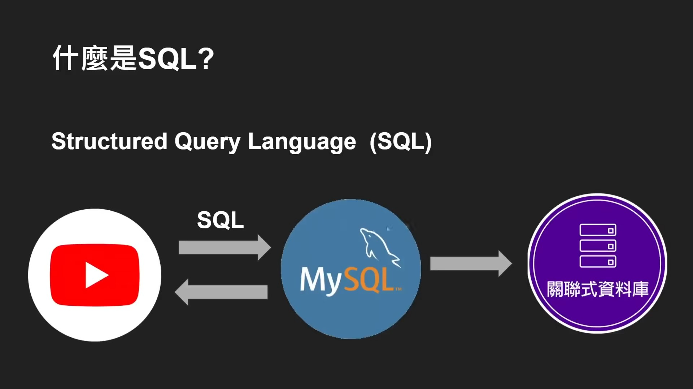

alias:: Structured Query Language

- ^^SQL^^（Structured Query Language）是一种标准的[[数据库查询语言]]，用于访问和操作[[关系数据库系统]]。它提供了一种方法来进行数据查询、数据库更新、管理和数据访问控制。SQL 是由 ANSI（American National Standards Institute）标准化的，因此在大多数数据库系统中都有广泛的支持和实现。
  
- ### SQL 主要功能
	- **数据查询**（Data Querying）
	  logseq.order-list-type:: number
		- 使用 `SELECT` 语句从一个或多个表中检索数据。
		- 支持复杂的查询，如连接（JOIN）、排序（ORDER BY）、分组（GROUP BY）和聚合（如 COUNT, SUM, AVG）。
	- **数据操作**（Data Manipulation）
	  logseq.order-list-type:: number
		- `INSERT` 用于向表中添加新记录。
		- `UPDATE` 用于修改已存在的数据记录。
		- `DELETE` 用于从表中删除数据记录。
	- **数据定义**（Data Definition）
	  logseq.order-list-type:: number
		- `CREATE` 用于创建新的数据库、表、视图等。
		- `ALTER` 用于修改数据库结构，如添加或删除表中的列。
		- `DROP` 用于删除整个表、数据库或视图。
	- **数据控制**（Data Control）
	  logseq.order-list-type:: number
		- `GRANT` 和 `REVOKE` 语句用于控制不同用户和角色对数据库对象的访问权限。
	- **事务管理**（Transaction Management）
	  logseq.order-list-type:: number
		- 通过 `BEGIN TRANSACTION`, `COMMIT`, 和 `ROLLBACK` 语句来管理事务，保证数据库的完整性和一致性。
- ### SQL 代码示例
  假设我们有一个名为 `Students` 的表，其中包含学生的 ID、姓名和年龄：
  ```sql
  -- 查询所有学生的信息
  SELECT * FROM Students;
  -- 添加新的学生记录
  INSERT INTO Students (ID, Name, Age) VALUES (1, 'Alice', 21);
  -- 更新某个学生的年龄
  UPDATE Students SET Age = 22 WHERE ID = 1;
  -- 删除一个学生记录
  DELETE FROM Students WHERE ID = 1;
  -- 创建新表
  CREATE TABLE Teachers (
    ID INT,
    Name VARCHAR(100),
    Dept VARCHAR(50)
  );
  -- 修改表结构，添加一列
  ALTER TABLE Teachers ADD COLUMN Salary DECIMAL;
  -- 删除表
  DROP TABLE Teachers;
  ```
- SQL 是一种非常强大且灵活的工具，适用于从简单的数据检索到复杂的数据库交互和管理任务。
  <!--Converted by ToLogseq-->