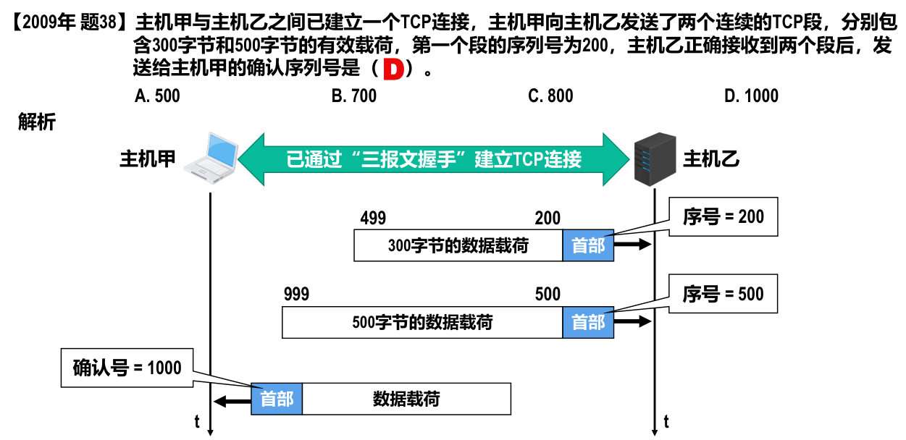

alias:: TCP segment

- 
- # 首部格式
  组成部分：
	- [[端口号]]：[[源端口]]和[[目的端口]]。
	  logseq.order-list-type:: number
	- TCP 实现 *可靠传输* 的相关字段
	  logseq.order-list-type:: number
		- [[序号]]
		  logseq.order-list-type:: number
		  占 32 比特，取值范围 0~2^{32}-1。当序号增加到最后一个时，下一个序号又回到 0 。
		  用来指出本TCP报文段**[[数据载荷]]的第一个字节的序号**。
		- [[确认号]]
		  logseq.order-list-type:: number
		  占 32 比特，取值范围 0~2^{32}-1。当确认号增加到最后一个时，下一个确认号又回到 0 。
		  用来指出**期望收到对方下一个TCP报文段的[[数据载荷]]的第一个字节的序号**，同时也是对之前收到的所有数据的**确认**。
		- [[确认标志位]] ACK 
		  logseq.order-list-type:: number
		  只有当 ACK 取值为 1 时，确认号字段才**有效**。ACK取值为 0 时，确认号字段**无效**。
		  TCP规定：在 TCP **连接建立后**，所有传送的TCP报文段都必须把 ACK 置 1 。
		- {:height 303, :width 608}
	- [[数据偏移]]
	  logseq.order-list-type:: number
	  占 4 比特，该字段的取值**以 4 字节为单位**。
	  指出TCP报文段的数据载荷部分的起始处距离 TCP 报文段的起始处有多远，这实际上指出了TCP报文段的首部长度。
	  
	- [[保留]]
	  logseq.order-list-type:: number
	  占 6 比特。保留为今后使用。目前应置为 0 。
	- [[窗口]]
	  logseq.order-list-type:: number
		- 占 16 比特，该字段的取值以[[字节]]为单位。
		- 指出**发送本报文段的一方的[[接收窗口]]的大小**，即[[接收缓存]]的 *可用空间* 大小，这用来表征接收方的接收能力。
		- 在计算机网络中，经常用接收方的接收能力的大小来控制发送方的数据发送量，这就是所谓的[[流量控制]]。
	- [[检验和]]
	  logseq.order-list-type:: number
	  占 16 比特。用来检查**整个**TCP报文段在传输过程中是否出现了[[误码]]。
	- [[同步标志位]] SYN
	  logseq.order-list-type:: number
		- 用于TCP“三报文握手”建立连接。
		- 当 SYN=1 且[[ACK]]=0 时，表明这是一个[[TCP 连接请求报文段]]。
		- 对方若同意建立连接，则应在响应的[[TCP连接响应报文段]]的首部
		  中使 SYN=1 且[[ACK]]=1 。
		- 综上所述，[[SYN]]为 1 的 TCP 报文段要么是一个连接请求报文段，要么是一个连接响应报文段。
	- [[终止标志位]] FIN
	  logseq.order-list-type:: number
		- 用于TCP“四报文挥手”释放连接。
		- 当 FIN=1 时，表明此TCP报文段的发送方已经将全部数据发送完毕，现在要求**释放TCP连接**。
	- [[复位标志位]] RST
	  logseq.order-list-type:: number
		- 用于**复位TCP连接**。
		- 当 RST=1 时，表明TCP连接中出现严重差错，必须**释放连接**，然后再**重新建立连接**。
		- RST 置 1 还用来拒绝一个 *非法的TCP报文段* 或 **拒绝打开**一个TCP连接。
	- [[推送标志位]] PSH
	  logseq.order-list-type:: number
		- 发送方TCP把PSH置1，并立即创建一个TCP报文段发送出去，而
		  **不需要积累到足够多的数据再发送**。
		- 接收方TCP收到PSH为1的TCP报文段，就尽快地交付给 *应用进程* ，
		  而**不再等到接收到足够多的数据才向上交付**。
	- [[紧急标志位]] URG
	  logseq.order-list-type:: number
		- 当URG=1时，[[紧急指针]]字段有效。
		- 当URG=0时，紧急指针字段无效。
	- [[紧急指针]]
	  logseq.order-list-type:: number
		- 占16比特，以字节为单位，用来指明[[紧急数据]]的**长度**。
		- 当发送方有 *紧急数据* 时，可将紧急数据“插队”到发送缓存的最前面，并立刻封装到一个TCP报文段中进行发送。紧急指针会指出本报文段[[数据载荷]]部分包含了多长的紧急数据，紧急数据之后是 *普通数据* 。
		- 接收方收到紧急标志位为 1 的TCP报文段，会按照紧急指针字段的值从报文段数据载荷中取出紧急数据并**直接上交[[应用进程]]**，而**不必在[[接收缓存]]中排队**。
	- [[选项]]
	  logseq.order-list-type:: number
	  长度可变，最大 40 字节。可选如下内容：
		- [[最大报文段长度选项]]：指出TCP报文段**[[数据载荷]]部分的最大长度**，而**不是整个TCP报文段的长度**。
		  logseq.order-list-type:: number
		- [[窗口扩大选项]]：用来扩大窗口，提高吞吐率。
		  logseq.order-list-type:: number
		- [[时间戳选项]]：
		  logseq.order-list-type:: number
			- 用于计算[[往返时间]] RTT•
			- 用于处理[[序号]]超范围的情况，又称为防止序号绕回[[PAWS]]。
		- [[选择确认选项]]：用来实现选择[[确认]]功能。
		  logseq.order-list-type:: number
	- [[填充]]
	  logseq.order-list-type:: number
	  若选项字段的长度加上20字节固定首部的长度**不能被4字节整除**时，需要填充相应数量的比特 0，以确保 *首部长度* 能被4字节整除。