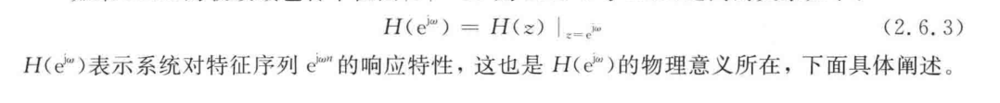

## Latex 脚本
	- ~~输人 改 输入~~
	- ~~靠回车分割这种情况~~
	  {:height 40, :width 305}
	- ~~。没了~~
	- ~~单个字母的情况~~
	- ~~括号处理，如里边只有英文字母~~
	- ~~除号~~
	- ~~\text 的情况 let result = str.replace(/\{([^{}]*)\}/, '$1');~~
	- 添加 替换字符串对 的 UI 工能
	- ~~公式前后的空格~~
	- ~~bRadical , . 等标点符号的处理~~
	  collapsed:: true
		- ``1 ,`
		- 标点符号后空格
		- 4N 属于公式
	- ~~"不同 $N ($ 阶数 $)$ 时" 情况 判断前后是否是中文~~
	- ~~结尾非标点 或替换中文标点 ；~~
	- ~~\mathbf~~
	- ~~器 $(DF)$ 的 一块替换~~
	- ~~都是用来 $“$ 滤波 $”$ 的~~
	- ~~模 $-$ 数转换器 $(A/D$ 转换器）~~
	- ~~\mathscr~~
	- ~~自动部署 发布 问GPT~~
	- 单词空格
	- ~~汉字范围~~
	- . 先不管
	- TODO , 处理
	- $2)$ 、按巴特沃
	- TODO 支持kimi
	-