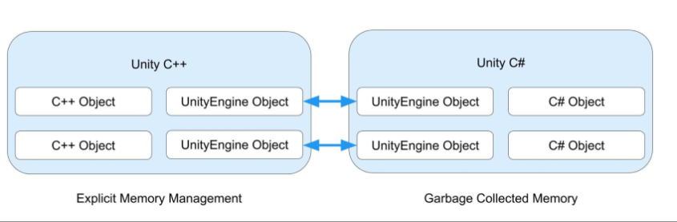

### Unity 中的 .NET 概述
Unity 使用开源的 .NET 平台，确保你用 Unity 创建的应用程序能够在各种硬件配置上运行。 .NET 平台支持多种语言和 API 库。
- ### 脚本后台
	- Unity 有两个脚本后台：Mono 和 IL2CPP（Intermediate Language To C++），它们使用不同的编译技术：
		- **Mono** 使用即时（JIT）编译，在运行时按需编译代码。
		- **IL2CPP** 使用预编译（AOT）编译，在运行前编译整个应用程序。
	- 使用基于 JIT 的脚本后台的好处是编译时间通常比 AOT 更快。
	  默认情况下，Unity 在支持 Mono 的平台上使用 Mono 后台。当你为应用程序构建播放器时，可以选择使用哪个脚本后台。通过编辑器设置，可以进入 Edit > Project Settings > Player，打开 Other Settings 面板，点击 Scripting Backend 下拉菜单并选择所需的后台。详细信息见 [Scripting backends](https://docs.unity3d.com/Manual/ScriptingBackends.html)。
- ### 托管代码剥离
	- 构建应用程序时，Unity 会编译并搜索项目中的程序集（.DLL），以检测并移除未使用的代码。这个剥离过程可以减少最终构建的二进制文件大小，但会增加构建时间。
	  使用 Mono 时，代码剥离默认是禁用的，但对于 IL2CPP，代码剥离不能禁用。可以通过 Managed Stripping Level 属性控制 Unity 剥离多少代码。
	  要更改此属性，请进入 Edit > Project Settings > Player，打开 Other Settings 面板，点击 Managed Stripping Level 下拉菜单并选择剥离级别。
	  随着 Managed Stripping Level 的增加，Unity 会移除更多代码。这增加了 Unity 可能移除应用程序所依赖代码的风险，特别是如果你使用反射或在运行时生成代码。
	  你可以对代码的某些元素使用注解，以防止 Unity 剥离它们。详细信息见 [Managed Code Stripping](https://docs.unity3d.com/Manual/ManagedCodeStripping.html)。
- ### 垃圾回收
	- Unity 对 Mono 和 IL2CPP 后台都使用 [[Boehm]] 垃圾回收器。默认情况下，Unity 使用增量模式。可以禁用增量模式以使用停止世界（stop-the-world）垃圾回收，尽管 Unity 推荐使用增量模式。
	  要在增量模式和停止世界模式之间切换，请进入 Edit > Project Settings > Player，打开 Other Settings 面板，点击 Use incremental GC 复选框。在增量模式下，Unity 的垃圾回收器只运行有限时间，并不一定在一次运行中收集所有对象。这将收集对象的时间分布在多个帧上，减少卡顿和 CPU 峰值。详细信息见 [Managed memory](https://docs.unity3d.com/Manual/ProfilerMemory.html)。
	  要检查应用程序中的分配数量和可能的 CPU 峰值，可以使用 Unity Profiler。还可以使用 GarbageCollector API 完全禁用 Player 中的垃圾回收。禁用回收器时，请注意避免分配过多内存。
- ### .NET 系统库
	- Unity 支持多种平台，并可能根据平台使用不同的脚本后台。 .NET 系统库在某些情况下需要特定于平台的实现才能正常工作。虽然 Unity 尽量支持尽可能多的 .NET 生态系统，但有些 .NET 系统库部分是不支持的。
	  Unity 不对 .NET 系统库在不同 Unity 版本中的性能或分配做任何保证。通常，Unity 不会修复 .NET 系统库中的性能退化问题。
	  Unity 不支持 System.Drawing 库，并且不能保证它在所有平台上都能正常工作。
	  Mono 脚本后台使用的 JIT 编译允许在应用程序运行期间生成动态 C\#.NET 中间语言（IL）代码。而 IL2CPP 脚本后台使用的 AOT 编译不支持动态代码生成。
	  使用第三方库时需要注意这一点，因为它们可能对 JIT 和 AOT 使用不同的代码路径，或者依赖动态生成的代码。详细信息见 [Microsoft 的 ModuleBuilder 文档](https://docs.microsoft.com/en-us/dotnet/api/system.reflection.emit.modulebuilder)。
- ### .NET Stanard
	- 尽管 Unity 支持多种 .NET API 配置文件，但对于所有新项目，你应该使用 .NET Standard API 兼容性级别，原因如下：
		- .NET Standard 是较小的 API 表面，具有较小的实现。这减少了最终可执行文件的大小。
		- .NET Standard 具有更好的跨平台支持，因此你的代码更有可能在所有平台上运行。
		- 所有 .NET 运行时都支持 .NET Standard，因此使用 .NET Standard 时，你的代码可以在更多的虚拟机/运行时环境中运行（例如 .NET Framework、.NET Core、Xamarin、Unity）。
		- .NET Standard 将更多错误移至编译时。在某些平台上，.NET Framework 中的一些 API 在编译时可用，但在运行时会抛出异常。
	- 如果你需要支持旧有的应用程序，其他配置文件可能会有用。要更改 API 兼容性级别设置，请进入 Edit > Project Settings > Player。在 Other Settings 标题下，将 Api Compatibility Level 设置为所需设置。详细信息见 [.NET Profile Support](https://docs.unity3d.com/Manual/dotnetProfileSupport.html)。
- ### 使用第三方 .NET 库
	- 你应该只使用在广泛的 Unity 配置和平台上经过大量测试的第三方 .NET 库。
	  第三方库中 JIT 和 AOT 代码路径的性能特性可能有显著差异。AOT 通常减少启动时间，适合较大的应用程序，但增加了二进制文件大小以容纳编译代码。AOT 在开发过程中也需要更长的构建时间。
	  JIT 在运行时根据运行的平台进行调整，这可以提高运行性能，但可能导致较长的应用程序启动时间。因此，你应该在编辑器和目标平台上对应用程序进行分析。详细信息见 [Profiler 概述](https://docs.unity3d.com/Manual/Profiler.html)。
	  你应该在所有目标平台上分析 .NET 系统库的使用情况，因为它们的性能特性可能因脚本后台、.NET 版本和配置文件而异。
	  在评审第三方库时，考虑以下方面：
	- **兼容性**：第三方库可能与某些 Unity 平台和脚本后台不兼容。
	- **性能**：第三方库在 Unity 中的性能特性可能与其他 .NET 运行时中的性能特性有很大不同。
	- **AOT 二进制大小**：由于依赖项的数量，第三方库可能会显著增加 AOT 二进制大小。
- ### C# 反射开销
	- Mono 和 IL2CPP 内部缓存所有 C# 反射（System.Reflection）对象，并且设计上 Unity 不会对它们进行垃圾回收。这种行为的结果是垃圾回收器在应用程序的生命周期中持续扫描缓存的 C# 反射对象，导致不必要且可能显著的垃圾回收器开销。
	- 为了尽量减少垃圾回收器开销，在应用程序中避免使用 Assembly.GetTypes 和 Type.GetMethods() 等方法，这些方法在运行时创建大量 C# 反射对象。相反，应该在编辑器中扫描程序集以获取所需数据，并将其序列化和/或代码生成以在运行时使用。
- ### UnityEngine.Object 特殊行为
	- UnityEngine.Object 是 Unity 中的一种特殊类型的 C# 对象，因为它与 native C++ 对象相关联。例如，当你使用 Camera 组件时，Unity 将对象状态存储在对象的 native C++ 对象上，而不是在 C# 对象本身。
	   
	  Unity 当前不支持使用 C# WeakReference 类来引用 UnityEngine.Object 实例。因此，不应该使用 WeakReference 来引用已加载的资源。详细信息见 [Microsoft 的 WeakReference 文档](https://docs.microsoft.com/en-us/dotnet/api/system.weakreference)。
- ### Unity C# 和 Unity C++ 共享 UnityEngine 对象
	- 当你使用 Object.Destroy 或 Object.DestroyImmediate 方法销毁一个派生自 UnityEngine.Object 的对象时，Unity 会销毁（卸载）native 对应对象。不能通过显式调用销毁 C# 对象，因为垃圾回收器管理内存。一旦不再有对托管对象的引用，垃圾回收器会收集并销毁它。
	  如果应用程序尝试再次访问已销毁的 UnityEngine.Object 对象，Unity 会为大多数类型重新创建 native 对应对象。MonoBehaviour 和 ScriptableObject 是两个例外：一旦它们被销毁，Unity 永远不会重新加载它们。
	  MonoBehaviour 和 ScriptableObject 重载了相等（==）和不等（!=）运算符。如果将已销毁的 MonoBehaviour 或 ScriptableObject 与 null 进行比较，当托管对象仍然存在且尚未被垃圾回收时，运算符会返回 true。
	  由于不能重载 ?? 和 ?. 运算符，它们与派生自 UnityEngine.Object 的对象不兼容。当托管对象仍然存在时，这些运算符在使用已销
	  毁的 MonoBehaviour 或 ScriptableObject 时不会返回与相等和不等运算符相同的结果。
- ### 异步和 await 任务的限制
	- Unity API 不是[[线程安全]]的，因此，应该只在 [[UnitySynchronizationContext]] 内部使用异步和 await 任务。异步任务在调用时通常会分配对象，如果过度使用，可能会导致性能问题。
	  Unity 覆盖了默认的 SynchronizationContext，并使用自定义 UnitySynchronizationContext 在主线程上运行所有任务（包括编辑和播放模式）。要使用异步任务，必须手动创建并处理自己的线程，使用 Task.Run API，并使用默认的 [[SynchronizationContext]] 而不是 Unity 版本。
	  退出播放模式时，Unity 不会自动停止在托管线程上运行的异步任务。要监听进入和退出播放模式事件并手动停止任务，请使用 EditorApplication.playModeStateChanged。如果采用这种方法，大多数 Unity 脚本 API 不可用，除非你将上下文迁移回 UnitySynchronizationContext。
	  在开发构建中，如果尝试在多线程代码中使用 Unity API，Unity 会显示以下错误消息：
	  ```
	  UnityException: Internal_CreateGameObject can only be called from the main thread.
	  
	  Constructors and field initializers will be executed from the loading thread when loading a scene.
	  
	  Don't use this function in the constructor or field initializers, instead move initialization code to the Awake or Start function.
	  ```
	  出于性能原因，Unity 不会在非开发构建中检查多线程行为，也不会在实时构建中显示此错误。这意味着尽管 Unity 不会阻止在实时构建中执行多线程代码，但如果使用多线程，可能会出现随机崩溃和其他不可预测的错误。
	  因此，不应该使用自己的多线程，而应该使用 Unity 的作业系统（[[Job System]]）。作业系统使用多个线程安全地并行执行作业，以实现多线程的性能优势。详细信息见 [Job system overview](https://docs.unity3d.com/Manual/JobSystem.html)。
	  <!--Converted by ToLogseq-->
- ## C# 编译器
  为了在 Unity 项目中编译 C# 源代码，Unity Editor 使用 C# 编译器。
  | **C# 编译器** | **C# 语言版本** |
  | ---- | ---- | ---- |
  | [Roslyn](https://github.com/dotnet/roslyn) | [C# 9.0](https://docs.microsoft.com/en-us/dotnet/csharp/whats-new/csharp-9) |