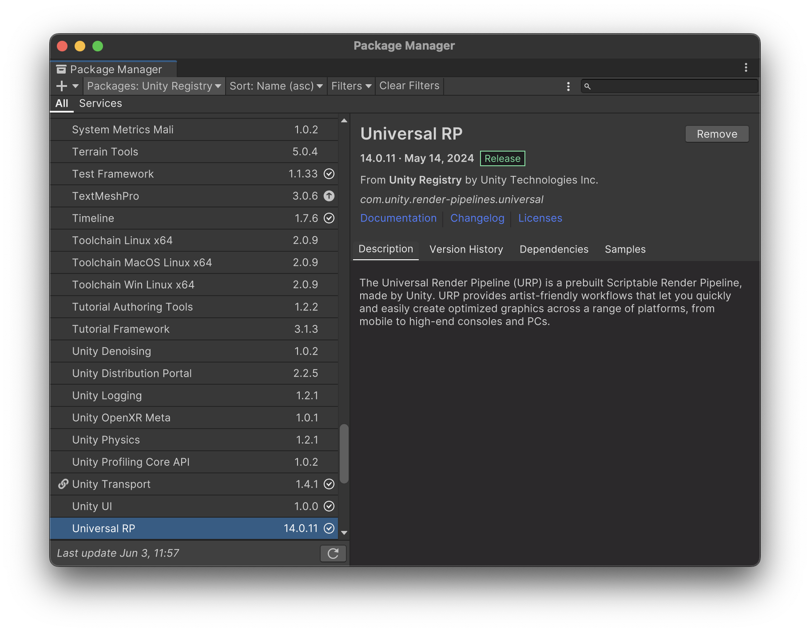

alias:: UPM

- 包是存储各种类型功能或资源的容器，例如：
	- 编辑器工具和库，例如文本编辑器、动画查看器或测试框架。
	- 运行时工具和库，例如物理 API 或图形管道。
	- 资源集合，如纹理或动画。
	- 项目模板，用于与其他人共享常见的项目类型。
- 通过包管理器，包为 Unity 提供了广泛的增强功能。为了帮助查找和使用这些包，包管理器窗口提供了可以一起使用的包集合，称为功能集。
- 在编辑器中，你可以通过以下菜单访问包管理器窗口：Window > Package Manager。
- 包管理器还支持管理你从 Unity 资源商店下载或导入的包。
- Unity 提供了三种包管理器接口：包管理器窗口、脚本 API 和清单文件。下表包含了对每种接口的介绍及更多信息。
- | 主题 | 描述 |
  | --- | --- |
  | Unity 如何与包协同工作 | 概述 Unity 的包管理器。 |
  | 概念 | 学习包管理器的原理和特性，包括版本、清单、注册表、状态、来源、包生命周期以及依赖和解析等概念。 |
  | 包管理器窗口 | 在项目中查找和管理包，并解决包依赖性冲突。包管理器提供了一个用户界面，可以直接对项目清单进行更改。 |
  | 包的脚本 API | 使用脚本 API 通过 C# 脚本与包管理器交互。查看示例以了解如何查询包注册表、安装、嵌入和移除包，以及使用各种标准列出包。 |
  | 项目清单 | 了解 Unity 包管理器读取的文件，以便计算要检索和加载的包列表。另见包清单。 |
  | 检查包 | 使用专用检查器窗口查看任何包清单。使用此窗口可以直接编辑嵌入或本地包的清单。 |
  | 范围注册表 | 学习如何设置或访问自定义注册表服务器。使用此注册表服务器来托管和分发（或消费）自定义包，除了 Unity 提供的注册表之外。 |
  | 配置 | 学习如何配置范围注册表认证、解决网络问题、自定义缓存位置等。 |
  | 解析和冲突 | 学习包管理器如何确定项目的直接和间接依赖项，并在检索最佳版本之前评估所有请求的包版本。 |
  | 故障排除 | 如果项目中的任何包，包括包管理器窗口本身，无法加载，匹配症状以找到可能的解决方案。 |
  <!--Converted by ToLogseq-->
- ### 安装官方 Package
	- 
	-