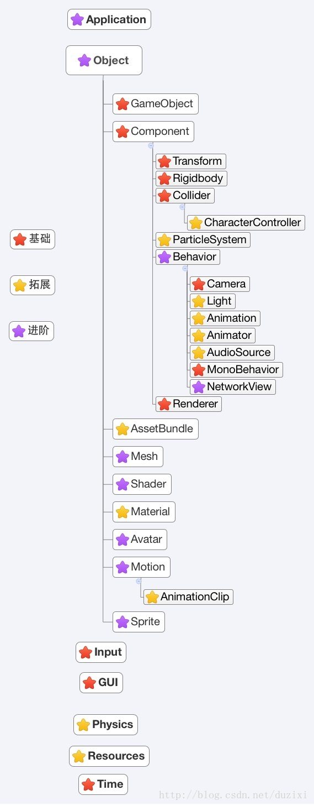

alias:: Unity 脚本

- ## 类继承关系
  collapsed:: true
	- 
- ## 脚本后端
	-
- ## Reference
	- https://docs.unity3d.com/2022.3/Documentation/Manual/ScriptingSection.html
	- https://docs.unity3d.com/cn/current/ScriptReference/index.html