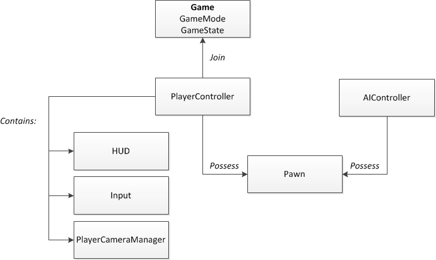

alias:: Gameplay 框架, Gameplay Framework

- 虚幻引擎的^^Gameplay 框架^^是一系列类的集合，它们共同提供了一个构建游戏体验的模块化的基础。
- {:height 384, :width 670}
- 
- ## Reference
	- 官方视频教程 https://dev.epicgames.com/community/learning/tutorials/l21z/unreal-engine-begin-play-gameplay
- |类|描述|
  |--|--|
  |[[Actor]]||
  |||
  |||
  |||
  |||