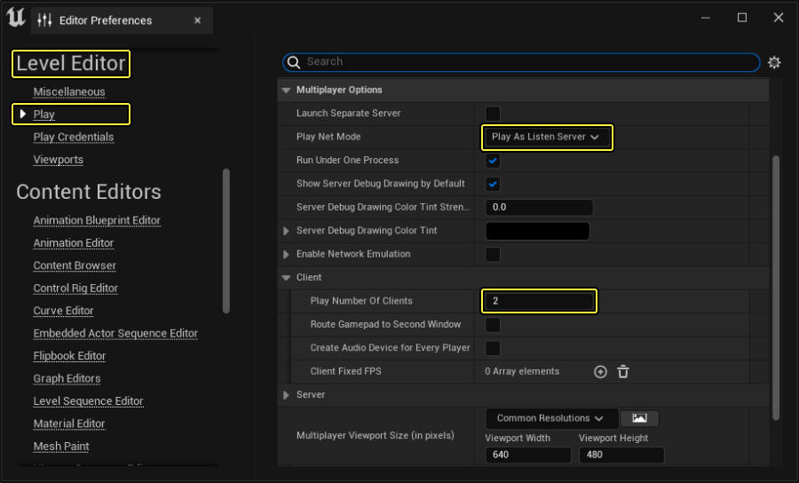

- >[[客户端]]是对[[服务端]]的拙劣模仿。
  这句话的意思是说，客户端自己也同样运行着一个世界，并不断预测服务端的行为。从而不断更新当前世界，以最大程度地接近 服务端的世界。
  这就是说，我们承认“延迟”客观存在，只要我们的客户端模仿得别太差劲，那么玩家是可以接受这样的效果的。客户端可以根据同步数据发送时的当前对象的位置与速度，加上数据发送的时间，猜测出当前对象在服务端的可能位置。并且通过修正当前世界（比如调整当前对象的速度方向，指向新的位置），去模仿服务端位置。如果服务端的位置和客户端差距太大，就强行闪现修正。
- ## 使用建议
	- 尽可能少用[[RPC]]。在合适情况下改用[[RepNotify]]。#why
	  logseq.order-list-type:: number
	- [[Multicast]]函数会导致会话中各连接客户端的额外网络流量，需尤其少用。
	  logseq.order-list-type:: number
	- 若能保证 *非复制函数* 仅在服务器上执行，那么该服务器端逻辑不一定非要包含在 *服务器RPC* 中。
	  logseq.order-list-type:: number
	  id:: 653d2985-a09e-4c5b-9786-b1b490a0359e
	- 将 *可靠RPC* 绑定到 *玩家输入* 时需谨慎。玩家可能会快速反复点击按钮，导致可靠RPC队列溢出。应采取措施限制玩家激活此项的频率。
	  logseq.order-list-type:: number
	- 若游戏频繁调用RPC，如[[tick]]时调用，则应将其设为 *不可靠* 。
	  logseq.order-list-type:: number
	- 部分函数可重复使用，可调用其响应 游戏逻辑，然后调用其响[[RepNotify]]，确保客户端和服务器并列执行即可。
	  logseq.order-list-type:: number
	- 检查Actor的[[Unreal/Network/network role]]可查看其是否为 `ROLE_Authority`。此方法适用于过滤 同时在服务器和客户端上激活的函数 中的执行。
	  logseq.order-list-type:: number
	  id:: 653d2e40-cccd-4cb5-94dc-c077d46d195b
	- 使用 `IsLocallyControlled` 函数可检查[[Pawn]]是否受本地控制。对于根据[[owning client]]的情况来过滤执行非常有用。
	  logseq.order-list-type:: number
	- 构造期间 Pawn 可能未被指定 Controller ，因此避免在构造函数中使用`IsLocallyControlled`。
	  logseq.order-list-type:: number
- ## 网络测试编辑器设置
  