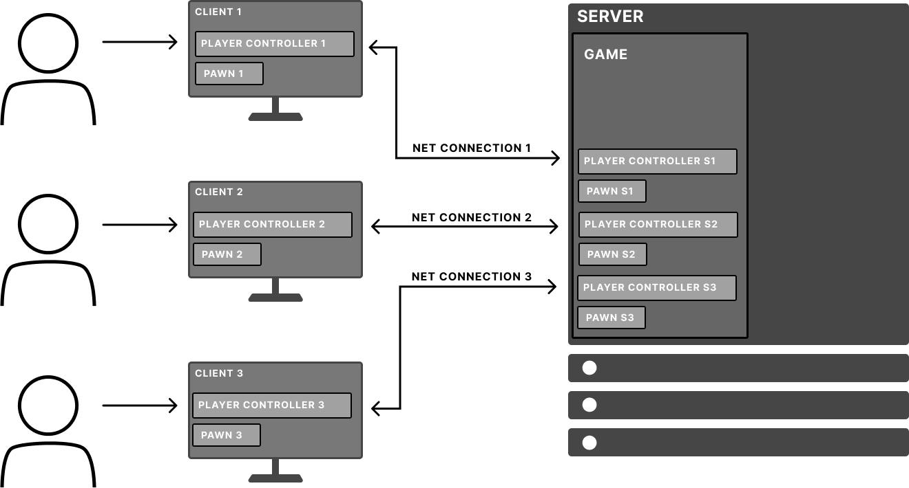

alias:: owning connection, 所属连接, connection ownership, 连接所有权
id:: 66437ec0-5f4f-487f-83a7-294a23e4a3a4

- Actor的 [[owning connection]] 是与 Actor 的所属 [[Player Controller]] 关联的 [[connection]] 。[[owner]] 和 [[owning connection]] 将确定哪个 连接的客户端 有权做出更改和调用远程函数。
- ## 所属连接的用法
	- 连接所有权对于以下情况很重要：
		- ### [[Actor replication]]
		  logseq.order-list-type:: number
		  Actor的 owning connection 在Actor复制期间用于**确定哪些 connection 获得 Actor的更新**，这就是[[Actor Relevancy]]。
		  对于 [[bOnlyRelevantToOwner]] 设置为`true`的Actor，**只有 owning connection** 才会收到该 Actor 的属性更新。
		  默认情况下，所有 [[player controller]] 仅与其 Owner connection [[相关]]。正因为如此，**每个[[客户端]]仅会收到自身 player controller 的更新**。
		- [[Property Replication]]
		  logseq.order-list-type:: number
		  若属性复制期间涉及的[条件]([[复制条件]])会使用 owner ，将使用 Actor 的所属连接。
		- [[RPC]]
		  服务器在 Actor 上调用客户端RPC函数时，除非RPC被标记为 `NetMulticast` ，否则RPC需要知道要在哪些连接上执行RPC。Actor的所属连接将决定要发送和执行RPC的connection。
- ## 确定 Actor 的 Owner 和 Owning Connection
	- 要确定Actor的 owning connection ，需查询Actor的最外层 owner 。如果最外层所有者是 Player Controller，则该Actor的所属连接与 PlayerController 的所属连接相同。
		- 调用 `AActor::GetNetConnection`
	- 
		- > 假设你正在玩一款多人游戏，以客户端的形式连接到了服务器。在你的计算机上，玩家控制器就是你作为玩家的抽象化身。在 *图1* 的环境中，如果你在客户端1上运行，你的输入将在玩家控制器1中处理，然后传达给Pawn 1。如前所述，当你的客户端计算机连接到服务器时，在你的连接关联的服务器上，会建立网络连接1并创建玩家控制器S1。服务器Pawn Actor（即Pawn S1）由玩家控制器S1所有。这意味着，玩家控制器S1拥有Pawn S1。Pawn S1的所属连接是网络连接1，这是玩家控制器S1的所属连接。Pawn S1仅会在它也由玩家控制器S1拥有期间才由此连接拥有。一旦玩家控制器S1不再拥有Pawn S1，网络连接1就不再是Pawn S1的所属连接。
		  你的游戏内角色Pawn放在物品栏中的物品也遵循这个逻辑。物品栏中的物品由可能拥有该Pawn的相同连接拥有。
- 对于Actor组件，你必须首先确定组件的所有者，方法是遍历Actor组件的外部链，直至找到所属Actor，然后确定Actor组件的所属Actor的所属连接。
- ## Reference
	- https://dev.epicgames.com/documentation/zh-cn/unreal-engine/actor-owner-and-owning-connection-in-unreal-engine