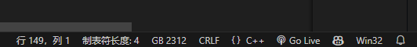

alias:: VSCode

- Visual Studio Code (VSCode) 是一款流行的代码编辑器，它提供了许多快捷键来提高开发效率。以下是一些常用的VSCode快捷键：
- ### 通用快捷键
- `Ctrl + P`：快速打开文件
- `Ctrl + Shift + P`：打开[[VSCode/命令面板]]
- `Ctrl + ,`：打开设置
- `Ctrl + N`：新建文件
- `Ctrl + S`：保存文件
- `Ctrl + Shift + S`：另存为
- `Ctrl + W`：关闭当前编辑器窗口
- `Ctrl + Shift + W`：关闭所有编辑器窗口
- `Ctrl + Shift + T`：重新打开最近关闭的编辑器窗口
- `Ctrl + Tab`：切换编辑器窗口
- `Ctrl + Shift + Tab`：反向切换编辑器窗口
- `Ctrl + /`：切换行注释
- ### 编辑和导航
- `Ctrl + X`：剪切当前行（**无需选择**）
- `Ctrl + C`：复制当前行（**无需选择**）
- `Ctrl + V`：粘贴
- `Ctrl + Z`：撤销
- `Ctrl + Shift + Z` 或 `Ctrl + Y`：重做
- `Ctrl + F`：查找
- `Ctrl + H`：替换
- `Ctrl + G`：跳转到行
- `Ctrl + D`：选择下一个匹配的词
- `Ctrl + Shift + L`：选择所有匹配的词
- `Alt + ↑ / ↓`：上下移动当前行
- `Shift + Alt + ↑ / ↓`：向上/向下复制当前行
- `Ctrl + Shift + K`：^^删除当前行^^
- ### 代码编辑
- `Ctrl + Space`：触发自动完成
- `Ctrl + Shift + Space`：触发参数提示
- `Ctrl + ] / [`：增加/减少缩进
- `Alt + Shift + F`：格式化代码
- `F12`：跳转到定义
- `Alt + F12`：查看定义
- `Shift + F12`：查看引用
- `F2`：重命名符号
- `Ctrl + .`：快速修复/显示可用的重构
- ### 调试
- `F5`：开始/继续调试
- `Shift + F5`：停止调试
- `F9`：切换断点
- `F10`：单步跳过
- `F11`：单步进入
- `Shift + F11`：单步跳出
- ### 终端操作
- `` Ctrl + ` ``：打开/关闭终端
- `Ctrl + Shift + C`：复制选中内容（终端）
- `Ctrl + Shift + V`：粘贴到终端
  
  这些快捷键可以大大提高你在使用VSCode时的工作效率。请注意，快捷键可能会因操作系统（Windows、macOS、Linux）或个人配置的不同而有所变化。在VSCode中，你可以通过`Ctrl + K Ctrl + S`查看和自定义所有快捷键。
- ## [[Copilot]]
- ## 中文乱码
	- 这个问题可能是由于文件的编码格式不正确导致的。你可以尝试在 Visual Studio Code 中更改文件的编码格式。以下是如何在 Visual Studio Code 中更改文件编码的步骤：
		- 打开有问题的文件。
		  logseq.order-list-type:: number
		- 在窗口的右下角，你会看到一个表示当前文件编码的标签，例如 "UTF-8"。点击这个标签。
		  logseq.order-list-type:: number
		  
		- 在弹出的菜单中选择 "通过编码重新打开"。
		  logseq.order-list-type:: number
		- 在列表中选择可能的正确编码，例如 GBK 或 GB2312。
		  logseq.order-list-type:: number
	- 如果你不确定正确的编码是什么，可能需要尝试几种不同的编码，看看哪一种可以正确显示文本。