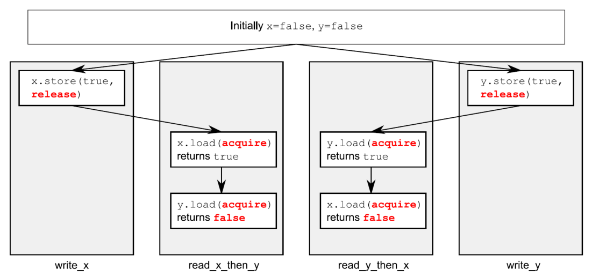

alias:: 获取-释放排序, acquire-release, 获取-释放序

- *获取-释放排序* 是相对于宽松排序的一个提升；操作之间仍然没有总体顺序，但它确实引入了一些同步机制。在这种排序模型下，[[原子加载操作]]是[[获取操作]]（[[memory_order_acquire]]），[[原子存储操作]]是[[释放操作]]（[[memory_order_release]]），而[[原子读-修改-写操作]]（如`fetch_add()`或`exchange()`）可以是[[获取操作]]、[[释放操作]]或两者都是（[[memory_order_acq_rel]]）。
- [[同步]]是在执行[[释放操作]]的线程和执行[[获取操作]]的线程之间成对进行的。一个释放操作与读取了它写入的值的获取操作同步。这意味着不同的线程仍然可以看到不同的顺序，但这些顺序受到限制。
- 下面的代码使用了获取-释放语义的例子。
  ``` cpp
  #include <atomic>
  #include <thread>
  #include <assert.h>
  
  std::atomic<bool> x,y;
  std::atomic<int> z;
  
  void write_x()
  {
  	x.store(true,std::memory_order_release);
  }
  void write_y()
  {
  	y.store(true,std::memory_order_release);
  }
  void read_x_then_y()
  {
    while(!x.load(std::memory_order_acquire));
    if(y.load(std::memory_order_acquire)) // 1
    	++z;	
  }
  void read_y_then_x()
  {
    while(!y.load(std::memory_order_acquire));
    if(x.load(std::memory_order_acquire)) // 2
    	++z;
  }
  int main()
  {
    x=false;
    y=false;
    z=0;
    std::thread a(write_x);
    std::thread b(write_y);
    std::thread c(read_x_then_y);
    std::thread d(read_y_then_x);
    a.join();
    b.join();
    c.join();
    d.join();
    assert(z.load()!=0); // 3
  }
  ```
  在这种情况下，断言 3 可以触发（就像在宽松排序的情况下一样），因为对 x 的加载2 和对 y 的加载1 都可能读到 `false` 。x 和 y 由不同的线程写入，所以在每种情况下**从释放到获取的排序对其他线程中的操作没有影响**。
- 下图展示了代码中的[[happens-before 关系]]，以及一个可能的结果，其中**两个读取线程各自对世界有不同的看法**。这是可能的，因为没有[[happens-before 关系]]来强制排序，正如之前描述的。
  
- 如果你将对y的存储改为使用`memory_order_release`，并将从y的加载改为使用`memory_order_acquire`，就像在下面的代码中一样，那么你就对 x 上的操作施加了一个排序。
  ``` cpp
  #include <atomic>
  #include <thread>
  #include <assert.h>
  
  std::atomic<bool> x,y;
  std::atomic<int> z;
  
  void write_x_then_y()
  {
  	x.store(true,std::memory_order_relaxed); // 1
  	y.store(true,std::memory_order_release); // 2
  }
  
  void read_y_then_x()
  {
  	while(!y.load(std::memory_order_acquire)); // 3 自旋，等待y被设置为true
  	if(x.load(std::memory_order_relaxed)) // 4
  		++z;
  }
  
  int main()
  {
  	x=false;
  	y=false;
      z=0;
      std::thread a(write_x_then_y);
      std::thread b(read_y_then_x);
      a.join();
      b.join();
      assert(z.load()!=0); // 5
  }
  ```
  最终，从y的加载3将会看到由存储2写入的 `true` 。因为存储使用了`memory_order_release`，而加载使用了`memory_order_acquire`，存储与加载同步。存储到x的操作1在存储到y的操作2之前发生，因为它们在同一个线程中。因为存储到y与从y的加载同步，存储到x也在从y的加载之前发生，并且间接地在从x的加载4之前发生。因此，从x的加载必须读取true，断言5不能触发。
  为了提供任何同步，获取和释放操作必须配对使用。释放操作存储的值必须被获取操作看到，任何一个才能有效。如果存储2或加载3是一个宽松操作，对x的访问就没有排序，因此没有保证加载会读取true，断言可能触发。
- 你仍然可以用我们隔间里的人手持记事本的模型来思考获取-释放排序，但你需要在模型中添加更多内容。首先，想象每次完成的存储都是某些 *更新批次* 的一部分，所以当你给一个人打电话告诉他写下一个数字时，你也告诉他这次更新是哪个批次的一部分：“请写下99，作为批次423的一部分。”对于一个批次的最后一个存储，你也告诉这个人：“请写下147，这是批次423的最后一个存储。”隔间里的人将会适当地记下这些信息，以及谁给了他这个值。这模拟了一个存储-释放操作。下次你告诉某人写下一个值时，你会增加批次号：“请写下41，作为批次424的一部分。”
  当你要求一个值时，你现在有一个选择：你可以要求一个值（这是一个宽松加载），在这种情况下，这个人只给你数字，或者你可以要求一个值和关于它是否是一个批次中的最后一个的信息（这模拟了一个加载-获取）。如果你要求批次信息，并且值不是批次中的最后一个，这个人会告诉你类似于“数字是987，这是一个‘普通’值”的话，而如果它是一个批次中的最后一个，他会告诉你类似于“数字是987，这是Anne批次956中的最后一个数字”的话。现在，获取-释放语义在这里发挥作用：如果你在要求一个值时告诉这个人你所知道的所有批次，他会查看他的列表，找到你知道的任何批次中的最后一个值，并给你那个数字或列表上更下面的一个数字。
- 这个模型如何模拟获取-释放语义？让我们看看我们的例子并了解。首先，线程a正在运行 `write_x_then_y` ，并对隔间x里的人说：“请作为来自线程a的批次1的一部分写下true”，他适当地记下了。线程a接着对隔间y里的人说：“请写下true，作为来自线程a的批次1的最后一次写入”，他也适当地记下了。与此同时，线程b正在运行read_y_then_x。线程b不断地向隔间y的人要求带批次信息的值，直到他说“true”。它可能需要问很多次，但最终这个人会说“true”。隔间y里的人不仅仅说“true”；他还说：“这是来自线程a的批次1的最后一次写入。”
- 现在，线程b继续向隔间x的人要求一个值，但这次它说：“请给我一个值，顺便说一下我知道来自线程a的批次1。”现在，隔间x里的人必须查看他的列表，找到来自线程a的批次1的最后一次提及。他唯一的提及是值 `true`，这也是他列表上的最后一个值，所以他必须读出那个值；否则，他就违反了游戏规则。
- 如果你对线程间happens-before的定义，一个重要的属性是它是**传递**的：如果A线程间发生在B之前，且B线程间发生在C之前，那么A线程间发生在C之前。这意味着可以使用获取-释放排序在几个线程间同步数据，即使“中间”线程没有触及数据。
- ## 获取-释放排序传递同步
- 为了思考传递排序，你需要至少三个线程。
  第一个线程修改一些共享变量，并对其中一个执行存储-释放。
  第二个线程随后对受存储-释放影响的变量进行加载-获取，并对第二个共享变量执行存储-释放。
  最后，第三个线程对那第二个共享变量执行加载-获取。
  只要加载-获取操作看到由存储-释放操作写入的值以确保[[synchronizes-with 关系]]，这第三个线程就可以读取第一个线程存储的其他变量的值，即使中间的线程没有触及任何变量。这个场景在下一个清单中展示。
- ``` cpp
  std::atomic<int> data[5];
  std::atomic<bool> sync1(false),sync2(false);
  void thread_1()
  {
    	data[0].store(42,std::memory_order_relaxed);
  	data[1].store(97,std::memory_order_relaxed);
      data[2].store(17,std::memory_order_relaxed);
      data[3].store(-141,std::memory_order_relaxed);
      data[4].store(2003,std::memory_order_relaxed);
      sync1.store(true,std::memory_order_release); // 1.设置sync1
  }
  void thread_2()
  {
      while(!sync1.load(std::memory_order_acquire)); // 2.直到sync1设置后，循环结束
      	sync2.store(true,std::memory_order_release); // 3.设置sync2
      }
  void thread_3()
  {
      while(!sync2.load(std::memory_order_acquire)); // 4.直到sync1设置后，循环结束
      assert(data[0].load(std::memory_order_relaxed)==42);
      assert(data[1].load(std::memory_order_relaxed)==97);
      assert(data[2].load(std::memory_order_relaxed)==17);
      assert(data[3].load(std::memory_order_relaxed)==-141);
      assert(data[4].load(std::memory_order_relaxed)==2003);
  }
  ```
  即使`thread_2`只接触变量`sync1`②和`sync2`③，这足以确保`thread_1`和`thread_3`之间的同步，以确保断言不会触发。首先，来自`thread_1`的对`data`的存储发生在对`sync1`①的存储之前，因为它们在同一个线程中被顺序排列在它之前。因为来自`sync1`①的加载位于while循环中，它最终将看到`thread_1`存储的值并形成释放-获取对的后半部分。因此，对`sync1`的存储发生在while循环中的最后一次从`sync1`加载之前。这次加载在顺序上位于（因此happens-before）对`sync2`③的存储之前，它与`thread_3`中while循环的最后加载形成了一个释放-获取对。因此，对`sync2`③的存储发生在加载4之前，加载4发生在从`data`的加载之前。由于happens-before的传递性，你可以将它们全部串联起来：对`data`的存储发生在对`sync1`①的存储之前，发生在从`sync1`②的加载之前，发生在对`sync2`③的存储之前，发生在从`sync2`④的加载之前，发生在从`data`的加载之前。因此，`thread_1`中对`data`的存储发生在`thread_3`中从`data`的加载之前，断言不能触发。
- 在这种情况下，你可以通过在`thread_2`中使用带有[[memory_order_acq_rel]]的[[读-修改-写操作]]，将`sync1`和`sync2`合并成一个变量。一种选项是使用`compare_exchange_strong()`来确保只有在看到`thread_1`的存储后才更新值：
  ``` cpp
  std::atomic<int> sync(0);
  void thread_1()
  {
    // ...
    sync.store(1,std::memory_order_release);
  }
  void thread_2()
  {
    int expected=1;
    while(!sync.compare_exchange_strong(expected, 2, std::memory_order_acq_rel))
    	expected=1;
  }
  void thread_3()
  {
    while(sync.load(std::memory_order_acquire)<2);
    // ...
  }
  ```