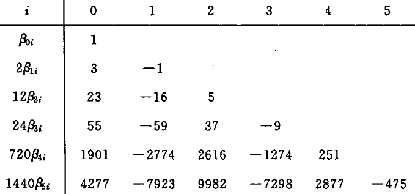
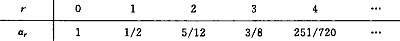

alias:: 亚当姆斯显式公式, 亚当斯显式公式, 亚当斯显式方法

- 利用  $(r+1)$  个 *节点* 上的[[被积函数]]  $f_{n}, f_{n-1}, \cdots, f_{n-r}$  构造  $r$  阶[[牛顿后插多项式]]  $N_{r}\left(x_{n}+t h\right), t \in[0,1]$ , 有
  $$\int_{x_{n}}^{x_{n+1}} f(x, y(x)) \mathrm{d} x=\int_{0}^{1} N_{r}\left(x_{n}+t h\right) h \mathrm{~d} t+\int_{0}^{1} R_{r}\left(x_{n}+t h\right) h \mathrm{~d} t,$$
  （[[牛顿-柯特斯公式]]）
  其中,  $R_{r}\left(x_{n}+t h\right)$  为牛顿后插多项式的[[余项]].
- 于是有
  $$y_{n+1}=y_{n}+h \int_{0}^{1} N_{r}\left(x_{n}+t h\right) \mathrm{d} t=y_{n}+h \sum_{j=0}^{r} \alpha_{j} \nabla^{j} f_{n}, \tag{1}$$
  其中,
  $$\alpha_{j}=(-1)^{j} \int_{0}^{1}\left(\begin{array}{l}
  -t \\
  j
  \end{array}\right) \mathrm{d} t,\left(\begin{array}{l}
  -t \\
  j
  \end{array}\right)=\frac{-t(-t-1) \cdots(-t-\mathrm{j}+1)}{j !} .$$
- 将式 $(1)$ 中的差分用函数值表示, 即  
  $$\nabla^{j} f_{n}=\sum_{i=0}^{j}(-1)^{i}\left(\begin{array}{l}j \\ i\end{array}\right) f_{n-i} .$$ 
  这样  
  $$\sum_{j=0}^{r} \alpha_j\sum_{i=0}^{j}(-1)^{i}   \left(\begin{array}{l}j \\ i\end{array}\right) f_{n-i}=\sum_{i=0}^{r}(-1)^{i} \sum_{j=i}^{r}\left(\begin{array}{l}j \\ i\end{array}\right) \alpha_{j} f_{n-i} ,$$ 
  从而式 $(1)$ 可写成
  $$y_{n+1}=y_{n}+h \sum_{i=0}^{r} \beta_{r i} f_{n-i}, \tag{2}$$
  式中,  $\beta_{r i}=(-1)^{i} \sum_{j=i}^{r}\left(\begin{array}{l}j \\ i\end{array}\right) \alpha_{j}$,  $\beta_{r i}$  与  $r, i$  有关, 列表如下.
  
	- 当  $r=0$  时, 式 $(2)$ 即为[[显式欧拉公式]].
	- 当  $r=1$  时,式 $(2)$ 为
	  $$y_{n+1}=y_{n}+\frac{h}{2}\left(3 f_{n}-f_{n-1}\right) .$$
	- 当  $r=2$  时,式 $(2)$ 为
	  $$y_{n+1}=y_{n}+\frac{h}{12}\left(23 f_{n}-16 f_{n-1}+5 f_{n-2}\right) .$$
	- 当  $r=3$  时,式 $(3)$ 为
	  $$y_{n+1}=y_{n}+\frac{h}{24}\left(55 f_{n}-59 f_{n-1}+37 f_{n-2}-9 f_{n-3}\right) .$$
	  此即常用的[[四阶亚当斯显式方法]]是由前面的 $4$ 个点上数值来计算下一点的值
- 式 $(1)$ 统称为[[亚当斯显式方法]], 其[[局部截断误差]]为
  $$T_{n+1}=h \int_{0}^{1} R_{r}\left(x_{n}+t h\right) \mathrm{d} t=\alpha_{r+1} h^{r+2} y^{(r+2)}\left(\xi_{n}\right),$$其中  $\alpha_{r+1}$  的数值见下表.
  
-
-