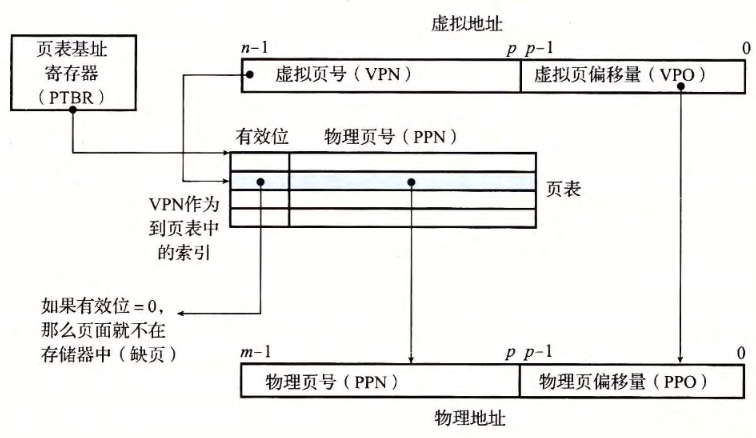
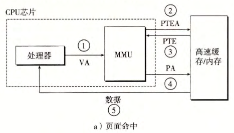
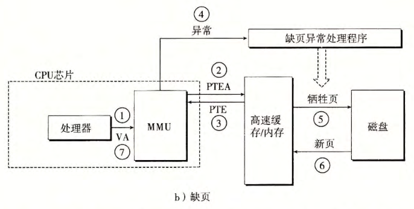
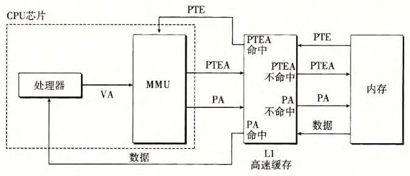
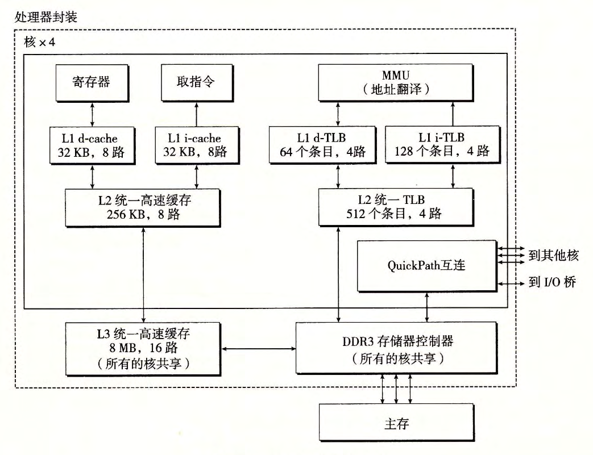
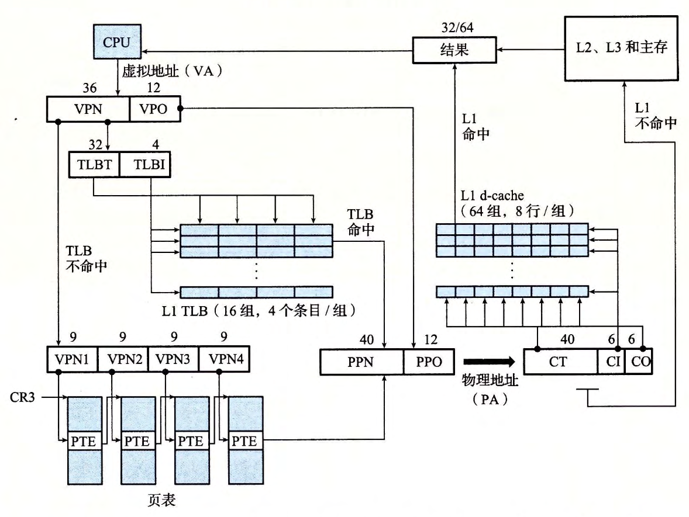

alias:: 地址翻译, 地址翻译硬件

- |符号|描述|
  |--|--|
  |$N=2^n$|[[虚拟地址空间]]中的地址数量|
  |$M=2^m$|[[物理地址空间]]中的地址数量|
  |$P=2^p$|[[页]]的大小（[[字节]]）|
- 形式上来说，[[地址翻译]]是一个 $N$ 元素的[[虚拟地址空间]](VAS)中的元素和一个 $M$ 元素的[[物理地址空间]](PAS)中元素之间的[[映射]]，
  $$\mathrm{MAP}:\text{VAS}\to\text{PAS}\cup\emptyset$$
  这里
  $$\mathrm{MAP}(A)=\left\{\begin{matrix}A^{\prime}\quad \text{如果虚拟地址 $A$ 处的数据在 PAS 的物理地址 $A^{\prime}$ 处}\\
  \emptyset\quad \text{如果虚拟地址 $A$ 处的数据不在物理内存中}
  \end{matrix}\right.$$
- 下图展示了[[MMU]]如何利用[[页表]]来实现这种 *映射* 。
  
- [[CPU]]中的一个 *控制寄存器* ，[[页表基址寄存器]](PTBR)指向当前[[页表]]。
- $n$位的[[虚拟地址]]包含两个部分：一个 $p$ 位的[[虚拟页面偏移]](VPO)和一个 $(n-p)$ 位的[[虚拟页号]](VPN) 。
  [[MMU]]利用[[VPN]]来选择适当的[[PTE]]。
  例如， VPN 0 选择 PTE 0 , VPN 1 选择 PTE 1, 以此类推。
- 将[[页表条目]]中[[物理页号]](PPN)和[[虚拟地址]]中的[[VPO]]串联起来，就得到相应的[[物理地址]]。
  注意，因为物理和虚拟页面都是 $P$ 字节的，所以[[物理页面偏移]](PPO)和[[VPO]]是**相同的**。
- 下图展示了当[[页面命中]]时， CPU 硬件执行的步骤。
	- 第 1 步：处理器生成一个[[虚拟地址]]，并把它传送给[[MMU]]。
	- 第 2 步：[[MMU]]生成[[PTE地址]]，并从[[高速缓存]]／[[主存]]请求得到它。
	- 第 3 步：[[高速缓存]]／[[主存]] 向 [[MMU]] 返回 [[PTE]]。
	- 第 4 步：[[MMU]]构造[[物理地址]]，并把它传送给[[高速缓存]]／[[主存]]。
	- 第 5 步：[[高速缓存]]／[[主存]]返回所请求的 *数据字* 给[[处理器]]。
	- 
	  id:: 656b3125-1f2e-4a0c-ae72-8f49e9840538
- [[页面命中]]**完全是由硬件来处理的**，与之不同的是，处理[[缺页]]要求硬件和[[操作系统内核]]协作完成。如下图所示。
	- 笫 1 步到笫 3 步：和[图](((656b3125-1f2e-4a0c-ae72-8f49e9840538)))中的第1步到第3步相同。
	- 第 4 步：[[PTE]]中的[[有效位]]是 $0$ ，所以[[MMU]]触发了一次[[异常]]，传递 CPU 中的 控制 到[[操作系统内核中]]的[[缺页异常处理程序]]。
	- 笫 5 步：[[缺页处理程序]]确定出[[物理内存]]中的[[牺牲页]]，如果这个页面已经**被修改了**，则把它[[换出]]到[[磁盘]]。
	- 笫 6 步：[[缺页处理程序]][调入新的页面]([[页面调入]])，并**更新**内存中的[[PTE]]。
	- 第 7 步：[[缺页处理程序]]返回到原来的[[进程]]，再次执行 *导致缺页的指令* 。CPU 将 *引起缺页的虚拟地址* 重新发送给[[MMU]]。因为 虚拟页面 现在缓存在 物理内存 中，所以就会 命中 ，在 MMU 执行了[图](((656b3125-1f2e-4a0c-ae72-8f49e9840538)))中的步骤之后，主存 就会将所请求字返回给处理器。
	- 
- # 结合 [[高速缓存]]和虚拟内存
	- 在任何既使用[[虚拟内存]]又使用[[SRAM]]高速缓存的系统中，都有应该使用 虚拟地址 还是使用 物理地址 来访问 SRAM高速缓存 的问题。
	- 大多数系统是选择[[物理寻址]]的。
		- 使用物理寻址，多个[[进程]]同时在高速缓存中有[[存储块]]和**[[共享]]来自相同虚拟页面的块**成为很简单的事情 。
		- 而且，高速缓存无需处理[[保护]]问题，因为访问权限的检查是[[地址翻译]]过程的一部分 。
		- 下图展示了一个物理寻址的高速缓存如何和虚拟内存结合起来 。 主要的思路是**[[地址翻译]]发生在高速缓存[[查找]]之前** 。
		   注意，页表条目可以缓存，就像其他的数据字一样。
		  
- # [利用 TLB 加速地址翻译]([[TLB]])
- # [[多级页表]]
- # 例子
	- ((6570b370-d6a2-4ada-9a42-95582cdb3852))
- # ((6571be71-648c-451e-b6a1-38d22e85525f))
	- 
	- 
	-