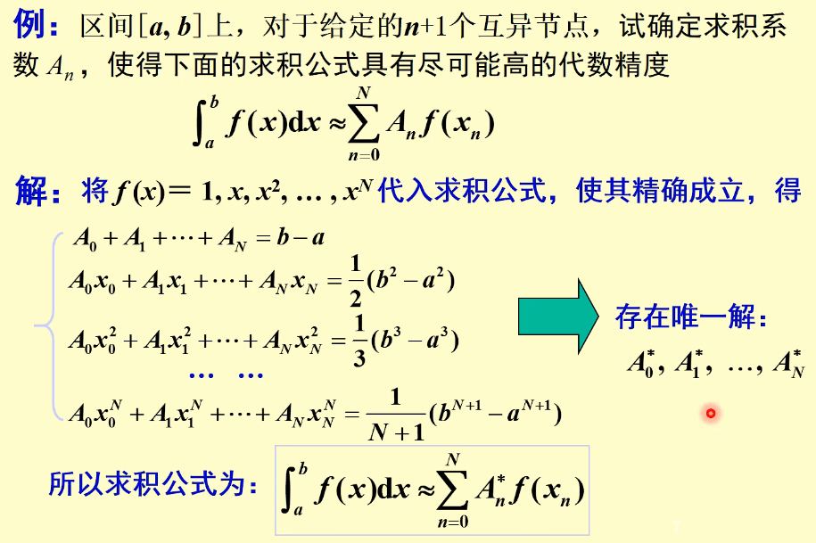

alias:: 代数精度, 代数精度法

- ## 定义
	- 设有[[数值积分公式]]：
	  $$ \int_a^b f(x) dx \approx \sum_{k=0}^n A_k f(x_k) $$
	  其中 \( a, b \) 是积分区间的端点，\( A_k \) 是权重，\( x_k \) 是积分点，\( n \) 是积分点的数量。若这个公式可以精确积分所有次数不超过 \( m \) 的[[多项式]]，但不能精确积分次数为 \( m+1 \) 的某个多项式，那么这个数值积分公式的代数精度就是 \( m \)。
	  > 即若某个求积公式所对应的[[误差]]$R[f]$满足：$R[P_k]=0$ 对任意$k\leq m$ 阶的多项式成立，且$R[P_{m+1}]\neq0$ 对某个$m+1$ 阶多项式成立，则称此求积公式的代数精度为 $m$ 。
- ## 代数精度法
  欲使求积公式至少有 ${m}$ 次代数精度，则令它对 $f(x)=1,x,x^2\cdots,x^m$ 都能准确成立：
  $$
  {\sum_{k=0}^nA_k=b-a}\quad\sum_{k=0}^nA_kx_k=\frac12(b^2-a^2)\quad\cdots\quad\sum_{k=0}^nA_kx_k^m=\frac1{m+1}(b^{m+1}-a^{m+1})
  $$
	- > 特别地，任意具有 $m\left(\geq0\right)$ 次代数精度的求积公式一定满足：
	  $$
	  \begin{aligned}\sum_{n=0}^NA_n=&A_0+A_1+\cdots+A_N=b-a\end{aligned}
	  $$
	- ### 例子
		- {:height 469, :width 692}
- ### 常见公式代数精度
	- 左矩公式 和 右矩公式 具有 0 次代数精度
	  logseq.order-list-type:: number
	- **中矩公式**：这是一种基本的数值积分方法，其代数精度为 \( 1 \)，因为它可以精确积分所有的一次多项式（直线函数）。
	  logseq.order-list-type:: number
	- **梯形法**：梯形法的代数精度也是 \( 1 \)，因为它同样能精确积分所有的一次多项式。
	  logseq.order-list-type:: number
	- **辛普森法**：辛普森法的代数精度为 \( 3 \)。这是因为它能精确积分所有次数不超过 \( 3 \) 的多项式，包括常数、线性、二次和三次多项式。然而，对于更高次数的多项式，辛普森法不能保证精确的积分结果。
	  logseq.order-list-type:: number
	- **高斯积分法**：高斯积分法的代数精度非常高。例如，使用 \( n \) 个点的高斯积分可以精确积分次数高达 \( 2n-1 \) 的多项式。这使得高斯积分在处理复杂函数的积分时非常有效。
	  logseq.order-list-type:: number
- ### 代数精度与数值积分的选择
  collapsed:: true
	- 在选择适合的数值积分方法时，代数精度是一个重要的考虑因素。对于光滑函数，可以用低次多项式有效近似的情况，选择代数精度较高的积分方法是合理的。但是，如果被积函数具有复杂的行为，如高频振荡或不连续点，仅仅依赖于代数精度高的积分方法可能不足以获得准确的结果。在这些情况下，可能需要结合其他数值分析技术，如自适应积分方法，以提高积分的精度和可靠性。
	-