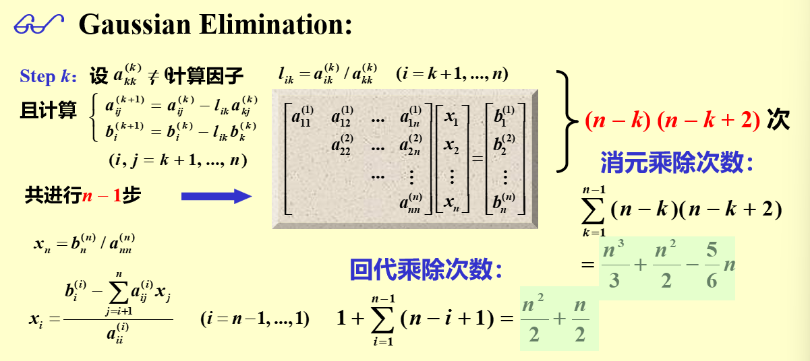

alias:: 运算量, 操作次数

- 7 由于计算机中[[乘除运算]]的时间远远超过[[加减运算]]的时间，故估计某种算法的[[运算量]]时，往往**只**估计乘除的[[次数]]。
  而且通常以乘除次数的[[最高次幂]]为[[运算量]]的[[数量级]]。
- # 高斯消元法运算量
	- 
	- 所以[[高斯消元法]]的总乘除次数为 $\frac{n^3}{3}+n^2-\frac{1}{3}n$ ，[[运算量]]为 $\frac{n^3}{3}$ ，[[数量级]]为 $O(n^3)$ 。
	-