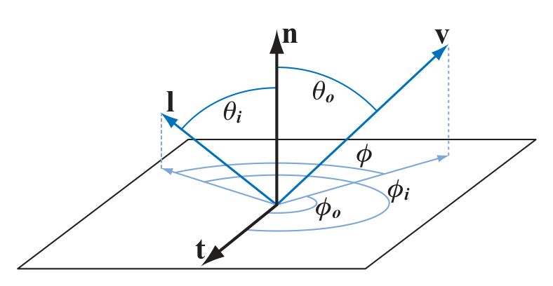
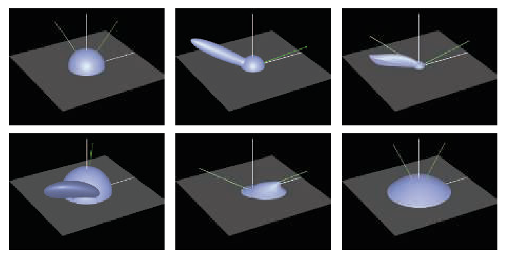

alias:: BRDF, 双向反射分布函数, BRDFs

- for a given [[view ray]] the *quantity* we need to compute is $L_i(\bold{c}, −\bold{v})$([[radiance]]), where $\bold c$ is the [[camera position]] and $−\bold v$ is the direction along the [[view ray]].
  We use $−\bold v$ due to two notation conventions:
	- The direction vector in $L_i()$ always **points away from the given point**, which in this case is the [[camera location]].
	  logseq.order-list-type:: number
	- The [[view vector]] $\bold v$ always points toward the [[camera]].
	  logseq.order-list-type:: number
- We assume that there are no [[participating media]] present, so the [[radiance]] entering the [[camera]] is equal to the radiance leaving the **closest object [[surface]]** in the direction of the camera:
  $$L_i(\bold c, -\bold v)=L_o(\bold p, \bold v) \tag{1}$$
  where $p$ is the intersection of the [[view ray]] with the closest object [[surface]].
- # BRDF
	- We leave aside the cases of [[transparency]] and [[global subsurface scattering]], focus on [[local reflectance]] phenomena. These *phenomena* include [[surface reflection]] as well as [[local subsurface scattering]], and depend on only the incoming [[light direction]] $\bold l$ and the outgoing [[]view direction]] $\bold v$.
	  [[Local reflectance]] is quantified by the [[bidirectional reflectance distribution function]], denoted as $f(\bold l, \bold v)$. In the general case, the [[BRDF]] is a function of $4$ *scalar variables*.
	- The *incoming* and *outgoing directions* each have $2$ degrees of freedom. A frequently used parameterization involves $2$ angles: [[elevation]] $θ$ relative to the [[surface normal]] $\bold n$ and [[azimuth]] $φ$ about $\bold n$.
	  {:width 788/2, :height 408/2}
- ## Isotropic BRDFs
	- [[Isotropic BRDFs]] are an important **special case**. Such BRDFs remain the same when the *incoming* and* outgoing directions* are rotated around the *surface normal*, keeping the **same relative angles** between them.
	- Isotropic BRDFs are functions of $3$ scalar variables, since **only** a single angle $φ$ between the light’s and camera’s rotation.
- Since we ignore phenomena such as [[fluorescence]] and [[phosphorescence]], we can
  assume that incoming light of a given [[wavelength]] is reflected at the **same wavelength** .
- The amount of light reflected can vary based on the [[wavelength]], which can be modeled in one of two ways.
	- The wavelength is treated as an **additional input variable** to the BRDF, or 
	  logseq.order-list-type:: number
	- The BRDF is treated as **returning a spectrally distributed value** .
	  logseq.order-list-type:: number
- While the first approach is sometimes used in [[offline rendering]], in [[real-time
  rendering]] the second approach is always used.
- # [[The Reflectance Equation]]
  id:: 65092e84-dfcb-4bda-be4e-2cad5b026596
- # Constraints on BRDF
  The *laws of physics* impose two constraints on any BRDF.
	- The first constraint is [[Helmholtz reciprocity]], which means that the *input* and *output angles* **can be switched** and the function value will be the same:
	  logseq.order-list-type:: number
	  $$f(\bold l, \bold v) = f(\bold v, \bold l) \tag{6}$$
	  > In practice, BRDFs used in rendering often violate Helmholtz reciprocity without
	  noticeable artifacts, except for [[offline rendering]] algorithms that specifically require *reciprocity* , such as [[bidirectional path tracing]]. However, it is a useful tool to use when determining if a BRDF is **physically plausible**.
	- The second constraint is [[conservation of energy]]—the outgoing energy **cannot be greater** than the incoming energy (not counting [[glowing]] surfaces that *emit light* , which are handled as a special case). 
	  logseq.order-list-type:: number
	  [[Offline rendering]] algorithms such as path tracing require energy conservation to ensure [[convergence]].
	  For [[real-time rendering]], exact energy conservation is not necessary, but **approximate** energy conservation is important. A surface rendered with a BRDF that significantly violates energy conservation would be **too bright**, and so may look **unrealistic**.
- ## [[Directional-Hemispherical Reflectance]]
- # [[Lambertian]]
- For a given [[direction of incoming light]], the BRDF’s values are displayed for **all [[outgoing directions]]** in the figure (Images from [“bv” BRDF browser](http://graphics.stanford.edu/~smr/brdf/bv/) ).
  
- The solid green line coming from the right of each figure is the
  [[incoming light direction]], and the dashed green and white line is the *ideal [[reflection direction]]*.
	- In the top row, the left figure shows a [[Lambertian BRDF]] (a simple hemisphere).
	- The middle figure shows [[Blinn-Phong highlighting]] added to the [[Lambertian term]].
	- The right figure shows the [[Cook-Torrance BRDF]]. Note how the [[specular highlight]] is **not strongest in the [[reflection direction]]**.
	- In the bottom row, the left figure shows a close-up of [[Ward’s anisotropic model]]. In this case, the effect is to **tilt** the [[specular lobe]].
	- The middle figure shows the [[Hapke/Lommel-Seeliger “lunar surface”
	  BRDF]], which has strong [[retroreflection]].
	- The right figure shows [[Lommel-Seeliger scattering]], in which [[dusty surfaces]] [[scatter]] light toward [[grazing angles]].