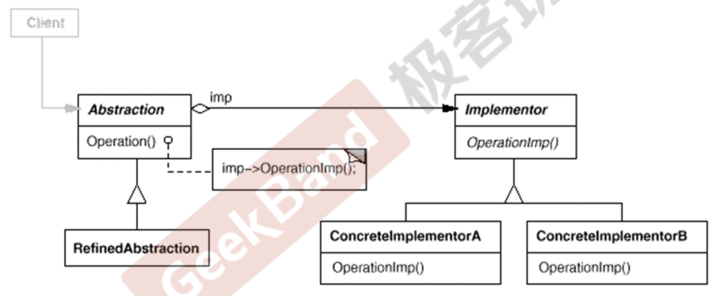

alias:: 桥模式, 桥接模式

- ^^桥接模式^^是一种[[结构型设计模式]]，它的核心目的是将^^抽象部分^^与其^^实现部分^^分离，使得它们可以独立地变化。这种模式通过提供一个桥接结构，使得抽象层和实现层可以通过组合的方式相互独立扩展，而不是通过继承。
- ### 桥接模式的组成：
	- **抽象类（Abstraction）**：
	  logseq.order-list-type:: number
		- 定义抽象类的接口。
		- 维护一个指向实现部分的引用，该引用是接口类型的。
	- **扩展抽象类（Refined Abstraction）**：
	  logseq.order-list-type:: number
		- 扩展抽象类的一种形式，可以改变或扩展抽象类中定义的操作。
	- **实现接口（Implementor）**：
	  logseq.order-list-type:: number
		- 定义实现类的接口，这个接口不一定要与抽象类的接口完全一致。实际上，两者可以完全不同。实现接口提供了基本的操作，而抽象类定义了基于这些操作的高级操作。
	- **具体实现类（Concrete Implementor）**：
	  logseq.order-list-type:: number
		- 实现实现接口的具体类。这些类包含具体的业务逻辑。
	- ((6623a1b6-5de7-4fcf-9b42-9165d50c884a))
	  
- ### 桥接模式的关键特点：
	- **分离抽象与实现**：使抽象部分和实现部分可以独立变化和扩展。
	- **减少子类的数量**：桥接模式将继承关系转换为关联关系，减少了子类的数量。
	- **提高可扩展性**：可以独立地对抽象部分和实现部分进行扩展。
	- **更好的复用性**：抽象层和实现层都可以被独立地复用。
- ### 示例代码：
  以下是使用 C++ 实现桥接模式的简单示例，展示了如何分离设备的抽象控制和具体实现。
  ```cpp
  #include <iostream>
  
  // 实现接口
  class Device {
  public:
    virtual ~Device() {}
    virtual void turnOn() = 0;
    virtual void turnOff() = 0;
  };
  
  // 具体实现类：电视
  class TV : public Device {
  public:
    void turnOn() override {
        std::cout << "TV turned on." << std::endl;
    }
  
    void turnOff() override {
        std::cout << "TV turned off." << std::endl;
    }
  };
  
  // 具体实现类：收音机
  class Radio : public Device {
  public:
    void turnOn() override {
        std::cout << "Radio turned on." << std::endl;
    }
  
    void turnOff() override {
        std::cout << "Radio turned off." << std::endl;
    }
  };
  
  // 抽象类
  class RemoteControl {
  protected:
    Device* device;  // 桥接：抽象的 RemoteControl 不直接操作设备，而是通过 Device 接口
  
  public:
    RemoteControl(Device* dev) : device(dev) {}
    virtual ~RemoteControl() {}
  
    void togglePower() {
        if (device) {
            std::cout << "Toggle power using Remote Control." << std::endl;
            device->turnOn();
            device->turnOff();
        }
    }
  };
  
  // 扩展抽象类
  class AdvancedRemoteControl : public RemoteControl {
  public:
    AdvancedRemoteControl(Device* dev) : RemoteControl(dev) {}
  
    void mute() {
        std::cout << "Mute the device." << std::endl;
        // Assume mute functionality implementation
    }
  };
  
  int main() {
    TV tv;
    Radio radio;
  
    RemoteControl remote(&tv);
    AdvancedRemoteControl advRemote(&radio);
  
    remote.togglePower();
    advRemote.togglePower();
    advRemote.mute();
  
    return 0;
  }
  ```
- ### 使用场景：
	- 当你想避免抽象和实现之间的永久绑定时。例如，当实现必须在运行时进行选择或者需要切换时。
	- 当抽象和实现都可以通过生成子类的方式独立地扩展时。
	- 当对抽象的实现进行修改应对客户端不产生影响，或者客户端代码不应重新编译时。
- 通过使用桥接模式，你可以确保在抽象层和实现层之间的变化不会相互影响，从而提高系统的灵活性和可维护性。
  <!--Converted by ToLogseq-->