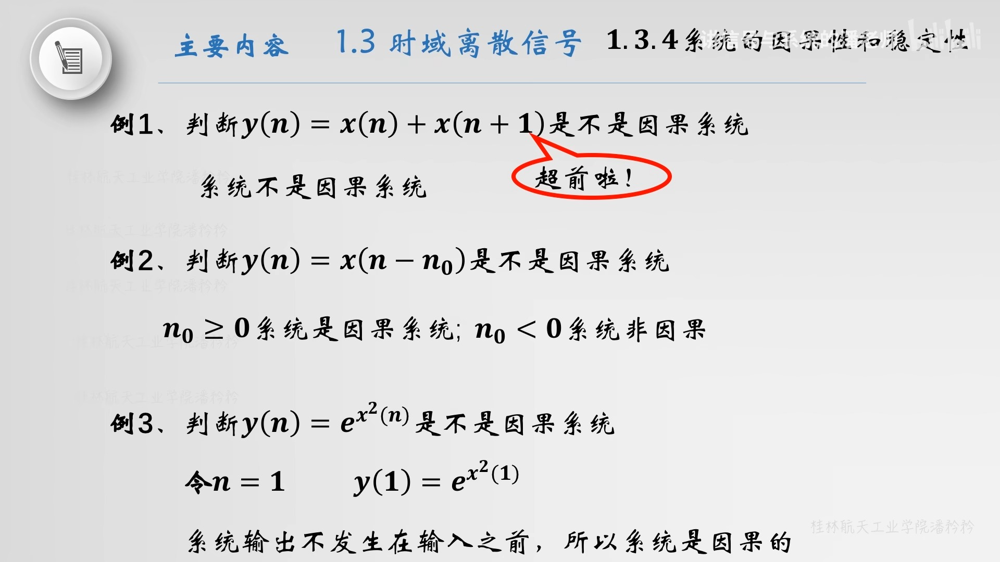
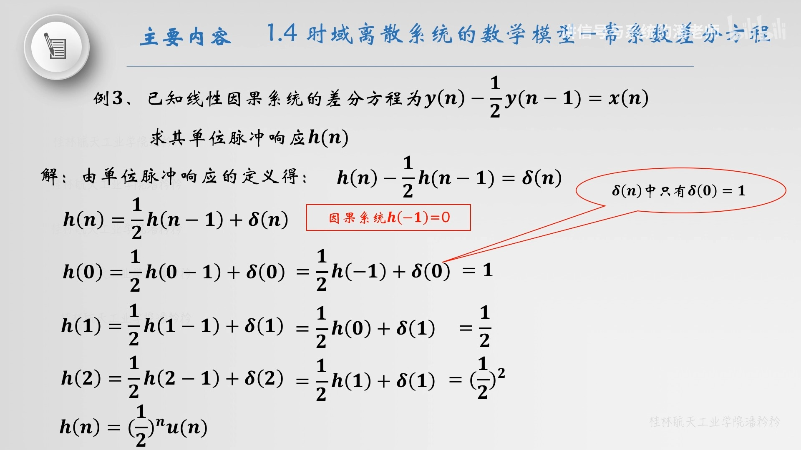

alias:: 因果系统, 系统的因果性, 一般因果系统, 因果性

- 一般因果系统定义：
  如果[[系统]]  $n$  时刻的输出只取决于  $n$  时刻以及  $n$  时刻以前的[[输入序列]], 而和  $n$  时刻以后的输入序列无关, 则称该系统具有[因果性质]([[因果性]]), 或称该系统为^^因果系统^^。
- 如果  $n$  时刻的输出还取决于  $n$  时刻以后的输入序列, 在时间上违背了 因果性 , 系统无法实现,  则系统被称为[[非因果系统]]。因此系统的因果性是指系统的[[可实现性]]。
- [[线性时不变系统]]具有因果性的**充分必要条件**:
  系统的[[单位脉冲响应]]满足下式:
  $$h(n)=0, \quad n<0 \tag{1}$$
	- 满足 $(1)$ 式的序列称为[[因果序列]], 因此 因果系统 的单位脉冲响应必然是因果序列。
	  >因果系统条件 $(1)$ 式从概念上也容易理解, 因为单位脉冲响应是输入为  $\delta(n)$  的[[零状态响应]], 在  $n=0$  时刻以前即  $n<0$  时, 没有加入信号, 输出只能等于零, 因此得到因果性条件 $(1)$ 式。
	- > 对于一个线性系统，其因果性就是在输入序列作用于系统前，[[系统储能]]（初始值）为零
	- >也就是 $n<0$ 的输出没有受属于未来的 $n=0$ 时的当前信号的任何影响，一直为 $0$ 。
- ## 例子
	- {:height 414, :width 722}
	- 
		- 结果中的 $u(n)$ 表示因果性。
- ## 因果性与[[系统函数]]
  考虑离散时间系统的Z域传递函数\(H(z)\)，其极点由分母多项式的根确定。因果性要求系统的冲激响应\(h[n]\)在\(n < 0\)时为零，这**等价于**\(H(z)\)的[[收敛域]]包括无穷远点。
  对于因果系统：
	- 在 Z 域中，系统函数 \( H(z) \) 的[ROC]([[系统函数的收敛域]])应包括无穷远点，即^^ROC应在最外边的[[极点]]外侧^^。
	- #+BEGIN_NOTE
	  收敛域必须包括无穷远点，也就等价于输入序列必须是[[右边序列]]，且收敛域内不能有极点。
	  参考[[系统稳定性]]。
	  #+END_NOTE
	- >在S域中（拉普拉斯变换），系统函数 \( H(s) \) 的ROC应在最右边的极点右侧，即所有极点的右侧。
	- ### 例子
	  如果
	  $$H({z})=\frac{{Y}({z})}{({z}-{0 . 1})({z}+{0 . 2})} \quad|z|>0.2$$
	  则序列是右边序列，即系统是因果的。
- ### 因果性的重要性
	- **物理可实现性**：因果系统符合物理世界的基本规律，即原因发生后果才会出现。非因果系统在实际中是不可实现的，因为它们需要未来信息来产生当前的输出。
	- **稳定性分析**：因果性与[[系统的稳定性]]紧密相关。通常，对于因果系统，稳定性分析更加直接和有意义。
- ### 因果性与非因果性系统
- **因果系统**：输出仅取决于当前和过去的输入。例如，数字滤波器通常设计为因果的，以确保它们可以实时处理信号。
- **非因果系统**：输出依赖于未来的输入。在某些信号处理应用中，如离线处理或分析中，可以设计非因果滤波器，因为在处理信号时可以访问整个信号（包括未来的数据）。
  
  总结来说，系统的因果性是确保系统设计符合物理实现条件和逻辑一致性的基本要求。在系统分析和设计中，考虑因果性是理解和实现有效系统行为的关键因素。