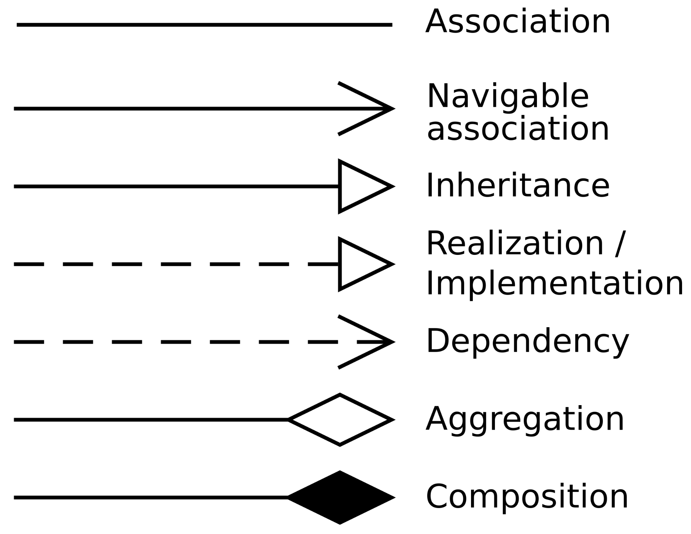
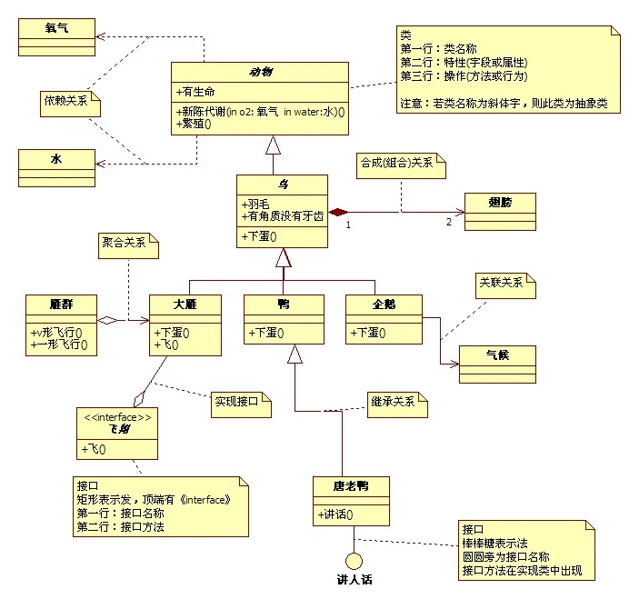

alias:: 类图

- ## 关系
- ### [[泛化关系]]（is a）
	- 表示为[[类]]与类之间的[[继承关系]]，[[接口]]与接口之间的[[继承关系]]，类对接口的[[实现关系]]。
	- 表示方法：
		- 用一个空心箭头+实线，箭头指向父类。
		  
		  或空心箭头+虚线，如果父类是接口。
		  
- ### [[关联关系]]（has a）
	- 类与类之间的联接，它使一个类知道另一个类的属性和方法。
	- 表示方法：用 实线+箭头， 箭头指向被使用的类。
	  
	- ### [[聚合关系]]
		- 是关联关系的一种，是**强的关联关系**。聚合关系是整体和个体的关系。关联关系的两个类处于同一层次上，而聚合关系两个类处于不同的层次，一个是整体，一个是部分。
		- 表示方法：空心菱形+实线+箭头，箭头指向整体。
		  
	- ### [[组合关系]]（contains a）
		- 是关联关系的一种，是**比[[聚合关系]]强的关系**，也称为强聚合；他体现整体与部分间的关系，此时整体与部分是不可分的，整体的生命周期结束也就意味着部分的[[生命周期]]结束。
		- 表示方法：实心菱形+实线+箭头，箭头指向整体。
		  
- ### [[依赖关系]]
	- 是类与类之间的连接，表示一个类依赖于另一个类的定义。例如如果A依赖于B，则B体现为局部变量方法的参数、或静态方法的调用。
	- 表示方法：虚线+箭头 箭头指向被依赖的一方，也就是指向局部变量。
	  
- 
  collapsed:: true
	- 
	- 
	- 
- ## Reference
	- https://baike.baidu.com/item/%E7%B1%BB%E5%9B%BE/4670826
	- https://juejin.cn/post/6844903893327937550
	-