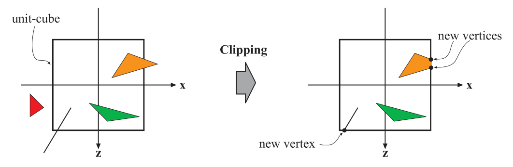
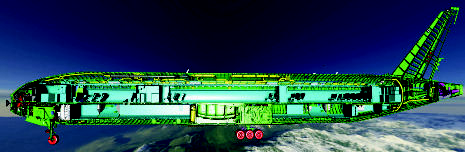

alias:: clipping stage, cliped, clip, clips, 裁剪

- #RenderingPipelineStage
- Only the [[primitives]] wholly or partially inside the [[canonical view volume]] need to be passed on to the [[rasterization stage]]. 
  It is the *primitives* that are **partially inside the view volume that require [[clipping]]**. For example, a line that has one vertex outside and one inside the view volume should be clipped against the view volume, so that the vertex that is outside is replaced by a new vertex that is located at the intersection between the line and the view volume. 
  The use of a [[projection matrix]] means that the *transformed primitives* are **clipped against the [[unit cube]]**.
  {:height 262, :width 778}
- In addition to the $6$ [[clipping planes]] of the *view volume*, the user can define additional *clipping planes* to visibly chop objects. Image below showing this type of visualization, called [[sectioning]].
  {:height 160, :width 465}
- The [[clipping]] step uses the [[4-value homogeneous coordinates]] produced by [projection]([[projection stage]]) to perform *clipping*. 
  Values do not normally [[interpolate linearly]] across a *triangle* in [[perspective space]]. The *fourth coordinate* is needed so that data are properly *interpolated* and *clipped* when a perspective projection is used. 
  Finally, [[perspective division]] is performed, which places the resulting *triangles’ positions* into *three-dimensional* [[normalized device coordinates]].
- [[viewport transformation]]
  The **last step** in the [[geometry stage]] is to convert from this [[NDC]] to [[window coordinates]].
-