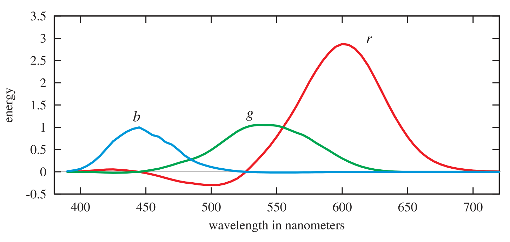
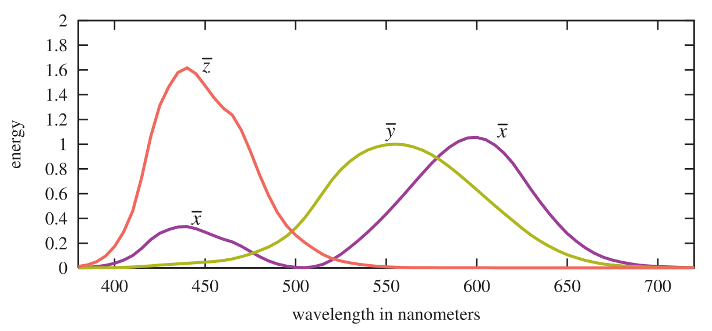

alias:: 色度学

- 我们已经了解到我们对光的颜色的[[感知]]与 [[spectral power distribution]] 强烈相关。
  id:: 651a5c2e-0eff-4abd-8b86-3d31a9b71145
  我们还看到这不是一个简单的一对一对应关系。在[图](650a4d13-4590-42ab-9882-c1623c56a2d3)中，底部和中部的[[SPD]]**完全不同**，但被[[感知]]为[[完全相同]]的颜色。
- # Definition
	- [[色度学]]处理了光的[[光谱能量分布]]与[[颜色感知]]之间的关系。
	- 在[[颜色感知]]中，眼睛通过视网膜上有 $3$ 种不同类型的锥状受体来工作，每一种类型的受体对不同波长的光有不同的响应。因此，对于给定的[[SPD]]，我们的大脑只接收到来自这些受体的 $3$ 个不同信号。这就是为什么只需要 $3$ 个数字就可以精确表示任何颜色刺激。
	- [[国际照明委员会]]提出了一组用于 *测量颜色* 的标准条件，并进行了 *颜色匹配* 实验。在颜色匹配中，$3$ 种彩色光投射到白色屏幕上，使它们的颜色相加并形成一个 *色块* 。*需要匹配的测试颜色* 被投射到这个 *色块* 旁边。*测试颜色块* 是**单一波长**的。*观察者* 可以使用校准到加权范围 $[-1, 1]$ 的旋钮来改变这 $3$ 种彩色光，直到 *测试颜色匹配* 。一些测试颜色需要负权重来匹配，这种权重意味着相应的光被添加到波长的测试颜色块上。
	  id:: 651a5d54-2781-4e25-9954-6592eb1b5cdb
	  {:width 1453,:height 693}
	  在图中显示了一组三种光的测试结果，它们被称为 r 、g 和 b (三种预先选定的彩色光#TODO 为什么选这三种)。这些光几乎是单色的，每种光的能量分布都集中在以下其中一种 *波长* 附近：r 为 $645\mathrm{nm}$，g 为 $526\mathrm{nm}$ ，b 为 $444\mathrm{nm}$ 。将 *每组匹配权重* 与 *测试块[[波长]]* 相关的函数被称为[[色匹配函数]]。
	- 这些函数提供了一种将[[光谱能量分布]]转换为三个值的方法。给定单一波长的光，可以从图表上读取 *三种彩色光* 的设置，设置旋钮，然后创建照明条件，使屏幕上的两个光斑产生相同的感觉。
	  id:: 651a68ad-ac11-425e-acd4-2c3e652b20df
	  对于任意光谱分布，可以将[[色匹配函数]]和[[SPD]]**相乘**，每个结果曲线下的[[面积]]（即[[积分]]）给出了设置 *彩色光* 以匹配 *[[SPD]]对应的[[感知颜色]]* 的 *相对量*。
	  具有明显不同[[SPD]]的光可以解析为**相同**的 $3$ 个权重，即它们在观察者看来是相同的。给出**相同权重**的[[SPD]]被称为[[同色异谱]]。
	- 权重为 $r$ 、$g$ 和 $b$ 的三种光源**不能**直接表示所有可见颜色，因为它们的[[色匹配函数]]在各种波长上具有负权重。
	  [[CIE]]提出了三种不同的假设光源，其[[色匹配函数]]对所有可见波长都是正值。这些曲线是原始的 r 、g 和 b [[色匹配函数]]的线性组合。这需要它们的光源的[[SPD]]在某些波长上为负，因此这些光源是无法实现的数学抽象。#DOING
	  它们的[[色匹配函数]]分别表示为 $x(\lambda)$ 、$y(λ)$ 和 $z(λ)$，如图所示。
	   
	  [[色匹配函数]] $y(λ)$ 与[[光度曲线]]相同，因为这个曲线被用来将[[辐射度]]转换为[[亮度]]。