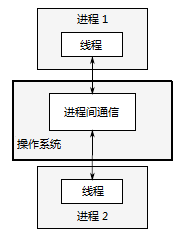
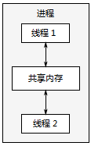

alias:: 并发, 并发性

- # 定义
	- *计算机* 的[[并发]]，指在单个系统里**同时**执行多个独立的任务。
	- ## 任务切换
		- 具有单个处理单元或[[核芯]]的处理器只能在某一时刻执行一个任务，不过可以在单位时间内对任务进行多次切换，因为任务切换得太快，以至于无法感觉到任务会暂时挂起。这种被称为[[任务切换]]，是[[并发]]的一种。
	- ## 硬件并发
		- [[多核处理器]]能够真正的[[并行]]多个任务，我们称其为[[硬件并发]]。
	- 有些处理器可以在一个核心上执行多个[[线程]]，但[[硬件并发]]在 多处理器 上效果更加显著。
	  硬件线程最重要的是**数量**，也就是可以并发运行独立任务的数量。即便是硬件并发的系统，也有比硬件 可并行最大任务数 还要多的任务需要执行，所以任务切换在这些情况下仍然适用。
	  
	- 如何使用并发，很大程度上取决于可用的硬件并发。
- # 并发的方式
	- ## 多进程并发
		- [[多进程并发]]是将[[应用程序]]分为多个独立的[[进程]]同时运行。
		- 如图所示，独立的进程可以通过 *进程间的通信渠道* 传递讯息([[信号]]、[[套接字]]、[[文件]]、[[管道]]等等)。
		  
		- ### 缺点
			- 这种 进程间的通信 通常非常复杂，或是速度很慢。这是因为[[操作系统]]会对进程进行保护，以避免一个进程去修改另一个进程的数据。
			- 运行多个进程会有固定**开销**：需要时间启动进程，操作系统需要资源来管理进程等等。
		- ### 优点
			- 操作系统在进程间提供了 保护 和 更高级别的通信机制，可以更容易编写安全的并发代码。
			- 可以使用[[远程连接]](可能需要联网)的方式，在不同的机器上运行独立的进程。
	- ## 多线程并发
		- [[多线程并发]]是指在单[[进程]]中运行多个[[线程]]。
			- 每个线程相互独立运行，并且可以在不同的[[指令序列]]中运行。
			- 不过，进程中的所有线程都[[共享地址空间]]，并且能访问到大部分数据——[[全局变量]]仍然是全局的，指向对象或数据的[[指针]]或[[引用]]可以在线程之间传递。
			  下图展示了一个进程中的两个线程，正在通过[[共享内存]]进行 通信 。
			  
		- ## 优点
			- [[地址空间共享]]，以及缺少线程间的 *数据保护* ，使得操作系统记录的工作量减小，所以使用多线程的开销**远远小于**多进程。
		- ## 缺点
			- 共享内存的灵活性是有代价的：如果多个线程访问数据，那么必须确保每个线程所访问到的数据一致，这就需要对[[线程通信]]做大量的工作。
	- 多个 单线程/进程间的通信 ，要比单一进程中 多线程通信 的开销大，若不考虑共享内存可能带来的问题，多线程将会成为主流语言更青睐的并发方式。
	  此外，[[C++]]标准并未对[[进程通信]]提供原生支持，所以实现会依赖于平台相关的API。
	  #+BEGIN_CAUTION
	  因此，之后的内容只关注多线程的并发，之后所提到“并发”，均指多线程并发。
	  #+END_CAUTION
- # 并发与并行
	- 对多线程来说，这两个概念大部分是重叠的，用来描述**硬件同时执行多个任务**的方式。
	- 这两个术语存在的目的，就是为了区别多线程中不同的关注点。
		- [[并行]]更加注重性能。使用硬件提高数据处理速度时，会讨论程序的并行性。
		- 当关注重点在于 任务分离 或 任务响应 时，会讨论程序的[[并发性]]。
- # 为什么使用并发
  有两个原因：
	- ## 分离关注点
		- [[分离关注点]]方法通过将相关的代码与无关的代码分离，可以使程序更容易理解和测试，从而减少出错的可能。
		  即使一些操作需要同时进行，依旧可以使用[[并发]]来分离不同的功能区域。
		  若不显式地使用并发，就得编写一个任务切换机制，或者在操作中主动地调用一段不相关的代码。
		  #+BEGIN_EXAMPLE
		  假设有一个用户界面的处理密集型应用——DVD播放程序。这样的应用程序，应具备这两种功能：一，要从光盘中读出数据，对图像和声音进行解码，之后把解码出的信号输出至视频和音频硬件中进行处理，从而实现DVD的播放；二，接收来自用户的输入，当用户单击“暂停”、“返回菜单”或“退出”按键的时候执行对应的操作。当应用是单个线程时，应用需要在回放期间定期检查用户的输入，这就需要把“DVD播放”代码和“用户界面”代码放在一起。如果使用多线程方式来分离这些关注点，“用户界面”代码和“播放DVD”代码不需要放在一起：一个线程可以处理“用户界面”，另一个进行“播放DVD”。它们之间会有交互(用户点击“暂停”)，不过任务需要人为的进行关联。
		  #+END_EXAMPLE
		- 这种情况下，对线程的划分是基于概念上的设计，所以**线程数 不再依赖 CPU[[核芯]]数**。
	- ## 性能
		- [[多处理器系统]]已经存在了几十年，直至现今，它们也只在超级计算机、大型机和大型服务器系统中才能看到。
		  然而，芯片制造商越来越倾向于芯片的多核设计，即在单芯片上集成2、4、16或更多的处理器，从而获取更好的性能。
		- 有两种利用并发来提高性能的方式：
			- 将单个任务分成几部分并行运行，从而降低总运行时间，这就是[[任务并行]]。
			  logseq.order-list-type:: number
			  这是一个相当复杂的过程，因为各个部分之间可能存在着 依赖。
			  区别可能是在过程方面：
				- 一个线程执行算法的一部分，而另一个线程执行算法的另一个部分，或是在处理数据。
				  logseq.order-list-type:: number
				- 每个线程在不同的数据块上执行相同的操作(第二种方式)。这种方法被称为[[数据并行]]。
				  logseq.order-list-type:: number
				- 那些容易并行化的算法通常被称为[[embarrassingly parallel]]。尽管这个说法似乎暗示了你可能会因为代码如此容易并行化而感到尴尬，但实际上这是一件好事。
				  Embarrassingly parallel算法具有良好的可扩展性属性——随着可用[[硬件线程]]数量的增加，算法中的并行性可以相应**增加**。
				- 对于那些不是那么容易并行化的算法部分，您可能能够将算法分为固定（因此不可扩展）数量的并行任务。
			- 利用并行来解决更大的问题：每次处理尽可能多的文件（同时执行相同的操作）。
			  logseq.order-list-type:: number
			  虽然，这是[[数据并行]]的一种应用，但着重点不同。处理等量数据仍然需要同样的时间，但现在在相同的时间内处理了更多的数据。
			  这种方法也有限制，并非所有情况下都是有效的。不过，这种方法所带来的 吞吐量 提升，可以让某些功能成为可能。
			  #+BEGIN_EXAMPLE
			  如果可以并行处理图像的不同区域，程序就可以处理更高分辨率的视频。
			  #+END_EXAMPLE
- # 什么时候不使用并发
  不使用并发的唯一原因就是**收益比不上成本**。
	- 使用并发的代码在很多情况下难以理解，因此编写和维护多线程代码会产生脑力成本，而增加的**复杂性**也可能会引起更多的错误。
	  除非潜在的性能增益足够大或关注点分离地足够清晰，能抵消为确保正确开发所需的额外时间，以及维护代码的额外成本；否则，勿用并发。
	- 同样地，性能增益可能会小于预期。启动 线程 时存在**固有开销**，因为[[操作系统]]需要分配[[内核资源]]和[[堆栈空间]]，才能把新线程加入[[调度器]]中。如果在线程上的任务完成得很快，那么 实际执行任务的时间 要比 启动线程的时间 **小很多**，这会导致应用的整体性能不如直接使用单线程。
	- 此外，线程的**资源有限**。
	  如果太多的线程同时运行，则会消耗很多操作系统资源，从而使得操作系统整体上运行得更加缓慢。
	  不仅如此，因为每个线程都需要一个**独立的堆栈**，所以运行太多的线程也会耗尽进程的 *可用内存空间* 。
	  #+BEGIN_EXAMPLE
	  对于一个可用地址空间为4GB(32bit)的架构来说，这的确是个问题：如果每个线程都有一个1MB的堆栈(很多系统都会这样分配)，那么4096个线程将会用尽所有地址空间(不会给代码、静态数据或者堆数据留有任何空间)。
	  即便是64位(或者更大)的系统，不存在这种地址空间限制，但其他资源也是有限的：如果你运行了太多的线程，也会出问题。尽管[[线程池]]可以用来限制线程的数量，但也并不是什么灵丹妙药。
	  #+END_EXAMPLE
	- 最后，运行越多的线程，操作系统就需要越多的[[上下文切换]]，每一次切换都需要耗费时间。所以在某些时候，增加线程实际上会降低应用的**整体性能**。如果试图得到系统的最佳性能，可以考虑使用[[硬件并发]](或不用)，并调整运行线程的数量。
	- 因此，应用中**只有性能关键部分**，才值得并发化。
	  当然，如果性能收益仅次于设计清晰或[[分离关注点]]，也可以使用多线程。
	-