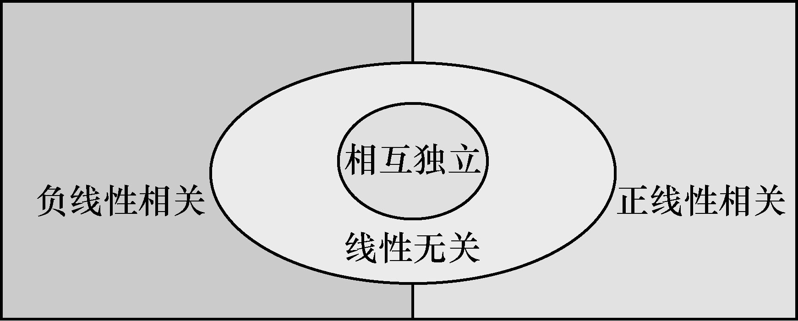

alias:: 相关系数, 标准化协方差

- ## 定义
	- >协方差考察了随机变量之间协同变化的关系，但在使用中存在这样一个问题 $.$ 例如，要讨论新生婴儿的身高 $X$ 和体重 $Y$ 的协方差，若采用两种不同的单位，米和千克或者厘米和克，后者协方差是前者的 $100000$ 倍 $!$
	- 由于量纲的不同导致 $X$ 与 $Y$ 的[[协方差]]前后不同。为避免这样的情形发生，将随机变量标准化， $X^{*}=\frac{X-E(X)}{\sqrt{D(X)}}$ ， $Y^{*}=\frac{Y-E(Y)}{\sqrt{D(Y)}}$ （除以[[标准差]]），再求协方差 $\operatorname{cov}\left(X^{*}, Y^{*}\right)$ ，这就是随机变量 $X$ 和 $Y$ 的^^相关系数^^，又称为标准化协方差 $.$ 因为 $\operatorname{cov}(X^{*}, Y^{*})=E(X^{*} Y^{*})=E\left(\frac{X-E(X)}{\sqrt{D(X)}} \cdot \frac{Y-E(Y)}{\sqrt{D(Y)}}\right)=\frac{\operatorname{cov}(X, Y)}{\sqrt{D(X)} \sqrt{D(Y)}}$ ，所以有相关系数的定义如下 $.$
	  logseq.order-list-type:: number
	  设 $(X, Y)$ 是二维随机变量，如果 $\operatorname{cov}(X, Y)$ 存在，且 $D(X)>0$ ， $D(Y)>0$ ，则称
	  $$\rho(X, Y) \triangleq \frac{\operatorname{cov}(X, Y)}{\sqrt{D(X)} \sqrt{D(Y)}}$$
	  为随机变量 $X$ 和 $Y$ 的^^相关系数^^，也记作 $\rho_{X Y} .$
	- 设（ $X$ ， $Y$ ）是[[二维随机变量]] $.$ 当 $\rho_{X Y}=0$ 时，称 $X$ 与 $Y$ [（线性）无关]([[线性相关]]) 或 [（线性）不相关]([[线性不相关]]) 。 
	  logseq.order-list-type:: number
	  利用相关系数和协方差的定义，可以很容易地证明下面的定理 $.$
	- 设二维随机变量（ $X$ ， $Y$ ）的相关系数 $\rho_{X Y}$ 存在，则
	  logseq.order-list-type:: number
		- 当 $\left|\rho_{X Y}\right|=1$ 时，（ $X$ ， $Y$ ）的取值（ $x$ ， $y$ ）在直线 $y=a x+b$ 上的概率为 $1$ ，称 $X$ 与 $Y$ [[完全线性相关]]；
		  logseq.order-list-type:: number
		- 当 $\rho_{X Y}=1$ 时，（ $X$ ， $Y$ ）的取值（ $x$ ， $y$ ）在[[斜率]]大于 $0$ 的直线 $y=a x+b$ 上的概率为 $1$ ，称 $X$ 与 $Y$ [[完全正线性相关]]；
		  logseq.order-list-type:: number
		- 当 $\rho_{X Y}=-1$ 时，（ $X$ ， $Y$ ）的取值（ $x$ ， $y$ ）在[[斜率]]小于 $0$ 的直线 $y=a x+b$ 上的概率为 $1$ ，称 $X$ 与 $Y$ [[完全负线性相关]]。
		  logseq.order-list-type:: number
		- 当 $\rho_{X Y}>0$ 时，称 $X$ 与 $Y$ [[正线性相关]]；
		  logseq.order-list-type:: number
		- 当 $\rho_{X Y}<0$ 时，称 $X$ 与 $Y$ [[负线性相关]]。
		  logseq.order-list-type:: number
- ## 定理
	- 当 $D(X)>0$ ， $D(Y)>0$ 时，下列 $5$ 个命题是等价的：
	  logseq.order-list-type:: number
		- $\rho_{X Y}=0$ ;
		  logseq.order-list-type:: number
		- $\operatorname{cov}(X, Y)=0$ ;
		  logseq.order-list-type:: number
		- $E(X Y)=E(X) E(Y)$ ;
		  logseq.order-list-type:: number
		- $D(X+Y)=D(X)+D(Y)$ ;
		  logseq.order-list-type:: number
		- $D(X-Y)=D(X)+D(Y)$ 。
		  logseq.order-list-type:: number
	- ### 相关系数的性质
	  logseq.order-list-type:: number
	  设（ $X$ ， $Y$ ）是二维随机变量，当 $\operatorname{cov}(X$ ，$Y)$ 存在且 $D(X)>0$ ， $D(Y)>0$ 时，有
		- logseq.order-list-type:: number
		  $$\left|\rho_{X Y}\right| \leqslant 1$$
		- $\left|\rho_{X Y}\right|=1$ 的充要条件是 $P(Y=a X+b)=1$ ，其中，
		  logseq.order-list-type:: number
		  $$\begin{aligned}
		  \text { 当 } \rho_{X Y}=1 \text { 时 }, a=\sqrt{\frac{D(Y)}{D(X)}}, b=E(Y)-\sqrt{\frac{D(Y)}{D(X)}} E(X), \\
		  \text { 当 } \rho_{X Y}=-1 \text { 时, } a=-\sqrt{\frac{D(Y)}{D(X)}}, b=E(Y)+\sqrt{\frac{D(Y)}{D(X)}} E(X) ;
		  \end{aligned}$$
		- 若随机变量 $X$ 与 $Y$ [[相互独立]]，则 $X$ 与 $Y$ [[线性无关]]，即 $\rho_{X Y}=0 .$ 但由 $\rho_{X Y}=0$ **不能**推断 $X$ 与 $Y$ 相互独立。
		  logseq.order-list-type:: number
			- 图1 给出了两个随机变量[[相互独立]]与[[线性无关]]、 [[线性相关]]之间的关系.
			  
	- 如果二维随机变量（ $X$ ， $Y$ ）服从[[二维正态分布]]，那么， $X$ 与 $Y$ [[相互独立]]等价于 $X$ 与 $Y$ [[线性不相关]] $.$
	  logseq.order-list-type:: number
- ## 例子
	- 例 $2$ 当 $(X$ ， $Y) \sim N\left(\mu_{1}$ ， $\mu_{2}$ ， $\sigma_{1}^{2}$ ， $\sigma_{2}^{2}$ ， $\rho\right)$ 时，计算 $X$ 和 $Y$ 的数字特征 $E(X)$ ， $D(X)$ ， $E(Y)$ ， $D(Y)$ ， $\operatorname{cov}(X$ ， $Y)$ ， $\rho_{X Y} .$
	- 解由第三章第三节定理 $1$ 知 $X \sim N\left(\mu_{1}$ ， $\sigma_{1}^{2}\right)$ ， $Y \sim N\left(\mu_{2}$ ， $\sigma_{2}^{2}\right)$ ，所以 $E(X)=\mu_{1}$ ， $D(X)=\sigma_{1}^{2}$ ， $E(Y)=\mu_{2}$ ， $D(Y)=\sigma_{2}^{2} .$ 由协方差的定义得
	  $$\begin{aligned}
	  \operatorname{cov}(X, Y)= & E\{[X-E(X)][Y-E(Y)]\} \\
	  = & \int_{-\infty}^{+\infty} \int_{-\infty}^{+\infty} \frac{\left(x-\mu_{1}\right)\left(y-\mu_{2}\right)}{2 \pi \sigma_{1} \sigma_{2} \sqrt{1-\rho^{2}}} \cdot \exp \left\{-\frac{1}{2\left(1-\rho^{2}\right)}\left[\frac{\left(x-\mu_{1}\right)^{2}}{\sigma_{1}^{2}}-\right.\right. \\
	  & \left.\left.2 \rho \frac{\left(x-\mu_{1}\right)\left(y-\mu_{2}\right)}{\sigma_{1} \sigma_{2}}+\frac{\left(y-\mu_{2}\right)^{2}}{\sigma_{2}^{2}}\right]\right\} \mathrm{d} x \mathrm{~d} y
	  \end{aligned}$$
	  $$\begin{aligned}
	  \xlongequal{\text { 令 } u=\frac{x-\mu_{1}}{\sigma_{1}}, v=\frac{y-\mu_{2}}{\sigma_{2}}} \sigma_{1} \sigma_{2} \int_{-\infty}^{+\infty} \int_{-\infty}^{+\infty} \frac{u v}{2 \pi \sqrt{1-\rho^{2}}} \cdot \exp \left\{-\frac{1}{2\left(1-\rho^{2}\right)}\left[u^{2}-2 \rho u v+v^{2}\right]\right\} \mathrm{d} u \mathrm{~d} v \\
	  =\sigma_{1} \sigma_{2} \int_{-\infty}^{+\infty} \frac{v}{\sqrt{2 \pi}} \mathrm{e}^{-\frac{v^{2}}{2}} \mathrm{~d} v \int_{-\infty}^{+\infty} \frac{u}{\sqrt{2 \pi} \sqrt{1-\rho^{2}}} \cdot \exp \left\{-\frac{(u-\rho v)^{2}}{2\left(1-\rho^{2}\right)}\right\} \mathrm{d} u \\
	  =\sigma_{1} \sigma_{2} \int_{-\infty}^{+\infty} \frac{v}{\sqrt{2 \pi}} \mathrm{e}^{-\frac{v^{2}}{2}} \cdot \rho v \mathrm{~d} v=\rho \sigma_{1} \sigma_{2} \int_{-\infty}^{+\infty} \frac{v^{2}}{\sqrt{2 \pi}} \mathrm{e}^{-\frac{v^{2}}{2}} \mathrm{~d} v \\
	  =\rho \sigma_{1} \sigma_{2} .
	  \end{aligned}$$
	  上面用到了正态随机变量 $N\left(\rho v$ ， $1-\rho^{2}\right)$ 的期望为 $\rho v$ 及标准正态随机变量平方的期望为 $1$ 的结论 $.$ 所以
	  $$\rho_{X Y}=\frac{\operatorname{cov}(X, Y)}{\sqrt{D(X) D(Y)}}=\rho \text {. }$$
	  我们得到二维正态分布 $(X$ ， $Y) \sim N\left(\mu_{1}$ ， $\mu_{2}$ ， $\sigma_{1}^{2}$ ， $\sigma_{2}^{2}$ ， $\rho\right)$ 的参数 $\rho$ 恰好是 $X$ 和 $Y$ 的相关系数 $.$
-
-