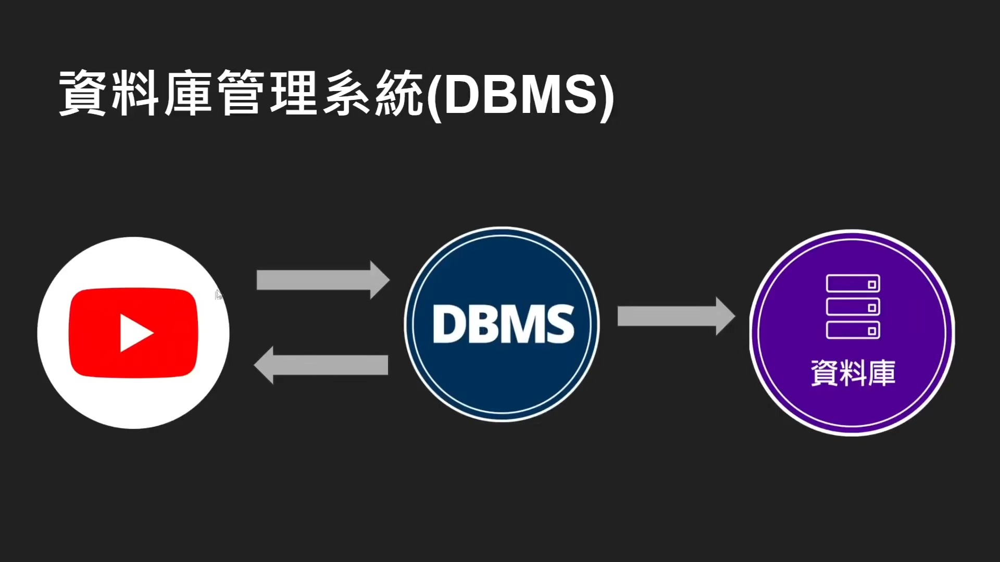

alias:: DBMS, 数据库管理系统

- ^^数据库管理系统^^（Database Management System，简称 DBMS）是一种用于创建和管理[[数据库]]的软件系统。DBMS 提供了一个系统化的方法来存储、管理、检索和操作数据，从而使得用户能够有效地处理大量的数据。DBMS 的主要功能包括：
	- **数据定义**：通过定义模式来创建、修改和删除数据库中的结构，如表、视图和索引。
	  logseq.order-list-type:: number
	- **数据更新**：插入、修改、删除存储在数据库中的数据。
	  logseq.order-list-type:: number
	- **数据检索**：提供查询语言，使用户可以编写查询以选择或修改数据。
	  logseq.order-list-type:: number
	- **用户和权限管理**：控制不同用户对数据库对象的访问权限，确保数据安全。
	  logseq.order-list-type:: number
	- **数据完整性管理**：确保数据库中的数据准确和一致，包括实施数据完整性约束，如主键、外键约束等。
	  logseq.order-list-type:: number
	- **事务管理**：确保数据库的稳定性和一致性，即使在多个用户同时访问数据库时也能保持数据的准确性。
	  logseq.order-list-type:: number
	- **备份和恢复**：提供工具来备份数据，以防数据丢失；提供恢复机制来恢复因系统故障或其他原因损坏的数据。
	  logseq.order-list-type:: number
	  DBMS 可以分为几种类型，包括：
	- 
- **[[关系型数据库管理系统]]（RDBMS）**：使用表格模型，数据以行和列的形式存储。典型的例子包括[[Oracle]], [[MySQL]], Microsoft SQL Server, PostgreSQL 等。
- **[[非关系型数据库管理系统]]（NoSQL）**：适用于处理大型分布式数据集的复杂查询。这类数据库通常不使用固定的表结构，包括键值存储、文档存储、图数据库等。示例包括 [[MongoDB]], [[Radis]], Apache Cassandra, Neo4j 等。
- **对象数据库管理系统（ODBMS 或 ODB）**：以对象的形式存储数据，更适合复杂的数据模型。对象数据库直接支持对象、类和继承等编程概念。
- DBMS 的选择取决于具体的应用需求，包括数据模型的复杂性、预期的事务负载、可扩展性需求和预算等因素。