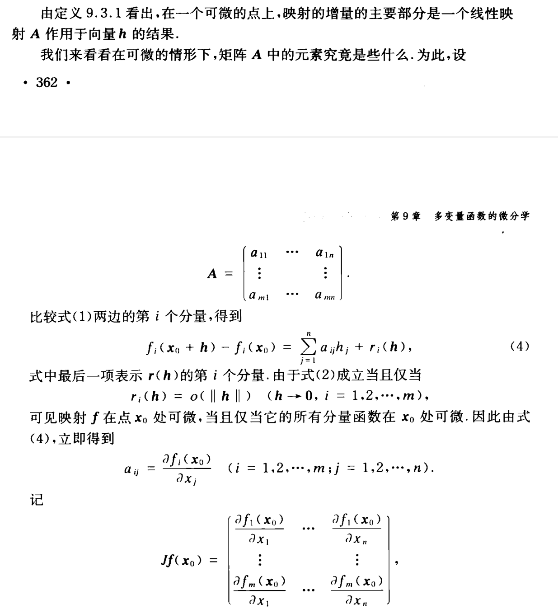
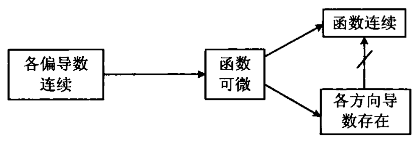

public:: true
id:: 655cdcf1-0ef5-4b88-a1fb-ec3071d5249e
alias:: 向量函数的微分, 向量函数的导数, 多元函数的导数, 多元函数的微分

- # Definition
  id:: 64fa6aa9-55a2-4c1c-a5c7-6d994f8c96b9
	- Let $\mathbf{f}:(a, b) \rightarrow R^{k}$ and $x \in(a, b)$, we say $\mathbf{f}$ is [[differentiable]] at $x$, provided that $\mathbf{f}^{\prime}(x)=\lim _{t \rightarrow x} \frac{\mathbf{f}(t)-\mathbf{f}(x)}{t-x}$ **exists**.
	  logseq.order-list-type:: number
		- >Let $f:(a, b) \rightarrow R$ and $c \in(a, b)$.
		  If $f$ is differentiable at $c$ , then  $\exists \mathrm{g} \cdot(a, b) \rightarrow R^{k}$ which is [[contimnous]] at  $c$  such that
		  $$\mathbf{f}(x)=\mathbf{f}(c)+\mathbf{f}^{\prime}(c)(x-c)+(x-c) \mathbf{h}(x)$$
		  for all $x \in(a, b)$, with $\mathbf{h}(c)=0$.
	- 设 $D\subset\mathbb{R}^{n}$ 为[[开集]], $\bold{x}_0\in D,f:D{\to}\mathbb{R}^m$. 
	  logseq.order-list-type:: number
		- 如果存在某个[[线性变换]] $\cal A$（只依赖于$\bold{x}_0$）, 使得 $\bold{x}\in U(\bold{x}_0)\subset D$（$\bold{x}$ 足够靠近 $\bold{x}_0$）时, 有
		  logseq.order-list-type:: number
		  $$
		  f\left(\bold{x}\right)-f\left(\bold{x}_{0}\right)=\cal{A}\left(\bold{x-x}_{0}\right)+o\left(\parallel \bold{x-x}_{0}\parallel\right) \tag{1}
		  $$
		  ([[向量范数]])或
		  $$
		  \lim_{\bold{x\to x}_0}\frac{f\left(\bold{x}\right)-f\left(\bold{x}_0\right)-\mathcal A\left(\bold{x}-\bold{x}_0\right)}{\left\Vert \bold{x-x}_0\right\Vert}=\bold{0}
		  $$
		  则称[[向量函数]] $f$ 在点 $\bold{x}_0$ [[可微]](或[[可导]]).
		- 若与上述[[线性变换]] $\cal A$ 相联系的[[矩阵]]为 $\boldsymbol{A}_{_{m\times n}}$ , 则称 
		  logseq.order-list-type:: number
		  $$\mathcal{A}\left({\boldsymbol{x}}-{\bold{x}}_{0}\right)=\boldsymbol{A}\left({\bold{x}}-{\bold{x}}_{0}\right)$$ 
		  为 $f$ 在点 $\bold{x}_0$ 的[[微分]], 并称$\boldsymbol{A}$ 为 $f$ 在点 $\bold{x}_0$ 的[[导数]], 记作 $D f(\bold{x}_0)$ 或 $f^{\prime}\left(\bold{x}_{0}\right)$. 
		  因而
		  \begin{aligned}
		  \mathcal{A}\left(\bold{x}-\bold{x}_{0}\right) &=\boldsymbol{A}\left(\bold{x}-\bold{x}_{0}\right)=Df\left(\bold{x}_{0}\right)\left(\bold{x}-\bold{x}_{0}\right) \\
		  &=f^{\prime}(\bold{x}_{0})(\bold{x}-\bold{x}_{0})
		  \end{aligned}
		  同样是 $f\left(\bold{x}\right)-f\left(\bold{x}_{0}\right)$ 的[[最佳线性逼近]].
		- 如果 $f$ 在 $D$ 中**任何点**处[[可微]]，则称 $f$ 为 $D$ 上的[[可微函数]]. 
		  logseq.order-list-type:: number
		- 设
		  logseq.order-list-type:: number
		  $$
		  f=\begin{pmatrix}f_1\\\vdots\\f_m\end{pmatrix},\quad\boldsymbol{A}=\begin{pmatrix}a_{11}&\cdots&a_{1n}\\\vdots&&\vdots\\a_{m1}&\cdots&a_{mn}\end{pmatrix}=\begin{pmatrix}\boldsymbol{A}_1^\mathrm{T}\\\vdots\\\boldsymbol{A}_m^\mathrm{T}\end{pmatrix}
		  $$
		  其中 $\boldsymbol{A}_{i}=(a_{i1},\cdots,a_{in})^{T},i=1,2,\cdots,m$ 此时, [[可微]]条件 $(1)$ **等价于**
		  $$f_{i}(\bold{x})-f_{i}(\bold{x}_{0})=\boldsymbol{A}_{i}^{T}(\bold{x}-\bold{x}_{0})+o(\|\bold{x}-\bold{x}_{0}\|), i=1 ,2,\cdots,m$$
		  则 $f$ 的所有[[坐标函数]] $f_{i}(i=1,2,\cdots,m)$ 在 $\bold{x}_{0}$ [[可微]]. 由[实值函数可微性]([[differentiation of real function]])的结论知道
		  $$
		  a_{ij}=\frac{\partial f_{i}}{\partial x_{j}}\Bigg|_{\mathbf{x}=\mathbf{x}_{0}},\quad j=1,2,\cdots,n; \quad i=1,2\:,\cdots,m
		  $$
		  于是当 $f$ 在 $\bold{x}_0$ [[可微]]时 $f$ 在 $\bold{x}_{0}$ 的[[导数矩阵]]为 [[雅可比矩阵]] $\boldsymbol{J}_f(\bold{x}_0)$:
		  $$
		  \boldsymbol{A}
		  =\begin{pmatrix}\frac{\partial f}{\partial x_1}&\cdots \frac{\partial f}{\partial x_n}\end{pmatrix}\bigg|_{\left\{x_1,\cdots,x_n\right\}=\bold{x}_0}
		  =\begin{pmatrix}\frac{\partial f_1}{\partial x_1}&\cdots&\frac{\partial f_1}{\partial x_n}\\\vdots&&\vdots\\\frac{\partial f_m}{\partial x_1}&\cdots&\frac{\partial f_m}{\partial x_n}\end{pmatrix}\bigg|_{\left\{x_1,\cdots,x_n\right\}=\bold{x}_0}=f'(\bold{x}_0)=D f(\bold{x}_0)
		  $$
		- ## 增量方式定义微分
		  logseq.order-list-type:: number
		  将 $\boldsymbol x$ 的[[改变量]]表示为 $\boldsymbol h=\{h_1, h_2,\cdots, h_n\}$。
		  如果映射 $f$ 满足
		  $$
		  f(\boldsymbol x_0+\boldsymbol h)-f(\boldsymbol x_0)=\boldsymbol A\boldsymbol h+r(\boldsymbol h),
		  $$
		  式中 $\boldsymbol A$ 是一个$m\times n$ 矩阵，它的元素不依赖于 $h$ ,并且
		  $$
		  \lim_{\boldsymbol h\to0}\frac{\parallel r(\boldsymbol h)\parallel}{\parallel \boldsymbol 
		   h\parallel}=0\text{,}
		  $$
		  #+BEGIN_CAUTION
		  左边分子的[[范数]]是 $m$维欧氏空间 中的范数，而分母的范数是 $n$维欧氏空间中的范数.
		  #+END_CAUTION 
		  则称映射$f$在点$\boldsymbol x_{0}$处[[可微]]，并称$\boldsymbol{Ah} 是$f$ 在点 $\boldsymbol  x_{0}$ 处的微分，记作
		  $$\mathrm{d}f(\boldsymbol x_0) = \boldsymbol{Ah}.$$
			- 
			  logseq.order-list-type:: number
			  这样，函数的[[微分]]可以利用[[矩阵乘法]]表示为
			  $$\mathrm{d}f(\boldsymbol x_0) = \boldsymbol Jf(\boldsymbol x_0)\boldsymbol h.$$
		- 函数 $f$ 的[[雅可比矩阵]]也常记为 $\operatorname{grad}f$（或$\nabla f)$, 即
		  logseq.order-list-type:: number
		  $$\operatorname{grad} f(x) = \boldsymbol J f(x)$$
		  称为数量函数 $f$ 的[[梯度]].
- # Theorem
	- Let $\mathbf{f}=\left(f_{1}, \ldots, f_{k}\right)$, then $\mathbf{f}$ is [[differentiable at a point]]  $x$  **if and only if** each of the component functions  $f_{1}, \ldots, f_{k}$ is **differentiable** at $x$, and
	  logseq.order-list-type:: number
	  $$\mathbf{f}^{\prime}=\left(f_{1}^{\prime}, \ldots, f_{k}^{\prime}\right)$$
	- Suppose $\mathbf{f}$ and $\mathbf{g}$ are defined on $[a, b]$ and are [[differentiable]] at a point $x\in [a, b]$. Then $\mathbf{f}+ \mathbf{g}$, $\mathbf{f}\cdot\mathbf{g}$([[inner product]]), and are **differentiable** at $x$, and
	  logseq.order-list-type:: number
		- $(\mathbf{f} + \mathbf{g})'(x) = \mathbf{f}'(x) + \mathbf{g}'(x)$;
		  logseq.order-list-type:: number
		- $(\mathbf{f}\cdot\mathbf{g})'(x) = \mathbf{f}'(x)\cdot\mathbf{g}(x) + \mathbf{f}(x)\cdot\mathbf{g}'(x)$;
		  logseq.order-list-type:: number
	- Suppose $\mathbf{f}$ is a [[continuous]] mapping of $[a, b]$ into $R^k$ and $\mathbf{f}$ is [[differentiable]] in $(a, b)$. Then there exists $x\in(a, b)$ such that 
	  logseq.order-list-type:: number
	  $$|f(b) - f(a)|\le (b - a)|f'(x)|$$
		- logseq.order-list-type:: number
		  >The [[mean value theorem]] fails for [[vector-valued function]].
	- 函数 $f$ 在$x_{0}$ 处[[可微]]当且仅当下面的等式成立：
	  logseq.order-list-type:: number
	  $$f(\boldsymbol x_0+\boldsymbol h)-f(\boldsymbol x_0)=Jf(\boldsymbol x_0)h+\sum\beta_i(\boldsymbol h)h_i.$$
	  当 $\|h\|\to0$ 时，
	  $$\beta_{i}(\boldsymbol{h})\to0\quad(i=1,2,...,n).$$
	- 设 $\boldsymbol f$ 在 $\boldsymbol x_0$ 处[[可微]]，则 $\boldsymbol f$  必在 $\boldsymbol x_0$ 处[[连续]]。
	  logseq.order-list-type:: number
	- 设[[开集]] $D\subset\mathbb{R}^n,f{:}D\to\mathbb{R}, \boldsymbol x_0\in D$.如果 $\mathrm{D}_if(x)(i=1,2,\cdots,n)$ 在 $x_0$ 的一个[[邻域]]中 *存在* 且在点 $x_{0}$ 处[[连续]]，则 $f$ 在点 $x_{0}$ 处[[可微]].
	  logseq.order-list-type:: number
	- ### [[偏导数连续定理]]
	  logseq.order-list-type:: number
	  多元函数[[偏导数]][[连续]]是其[[可微]]的 充分不必要条件 。
		- #+BEGIN_PINNED
		  一个著名的例子是函数 \( f(x, y) = \sqrt{x^2 + y^2} \)。这个函数在整个 \( \mathbb{R}^2 \) 上定义，并且在除了原点 \( (0, 0) \) 以外的所有地方都有连续的偏导数。在原点，偏导数存在并且为零，因为函数在任意方向接近原点时的变化率都是零。
		  但是，当 \( (x, y) \) 接近 \( (0, 0) \) 时，偏导数并不连续，因为它们的值取决于接近原点的路径。例如，如果我们沿着直线 \( y = mx \) 接近原点，函数 \( f(x, y) \) 变成 \( f(x, mx) = \sqrt{1+m^2} |x| \)，其导数随 \( m \) 而变。这意味着，偏导数作为 \( (x, y) \) 的函数在原点附近不连续。
		  然而，这个函数在原点处是可微的。函数的增量 \( \Delta f = f(x, y) - f(0, 0) \) 与线性逼近的增量 \( \sqrt{x^2 + y^2} - 0 \) 相同。
		  #+END_PINNED
		- #+BEGIN_TIP
		  
		  #+END_TIP
	- 若映射 $f$ 在 $\boldsymbol x_{0}$ 的某一 *邻域* 内存在 $[[Jacobi 矩阵]] $\boldsymbol Jf$, 且 $\boldsymbol Jf$ 的各 元素 在点 $\boldsymbol x_{0}$ 处[[连续]]，则映射 $f$ 在点 $\boldsymbol x_{0}$ 处[[可微]].
	  logseq.order-list-type:: number
- ## [[复变函数的导数]]
-