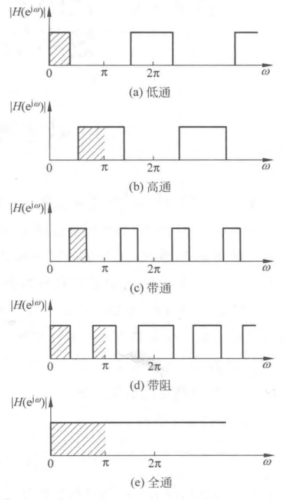

alias:: 数字滤波器, DF

- ^^数字滤波器^^（DF）的基本功能与模拟滤波器（AF）一样， 都是用来 $“$ 滤波 $”$ 的， 它将[[信号]]中某些频率（[[频段]]）的信号加以放大， 而将另外一些频率（频段）的信号加以抑制。也就是通过某种运算（变换）得到或增强所需信号， 滤除不需要的信号或[[噪声]]、[[干扰]]。
  当然还可以有其他一些作用， 例如自适应信号处理、参数估计、信号压缩、信号重建等。
- 数字滤波器可对[[数字信号]]进行处理， 如果在输入端接入[[模-数转换器]]， 它还可对[[模拟信号]]进行处理。数字滤波器的输出可以是数字信号， 也可以是模拟信号， 这只需在输出端接入[[数-模转换器]]。
- ## [[数字滤波器应用分类]]
- ### 数字滤波器的表示方法
	- [[线性差分方程]]
	  logseq.order-list-type:: number
	  $$y(n)=\sum_{i=1}^{N} a_{i} y(n-i)+\sum_{i=0}^{M} b_{i} x(n-i) \tag{1}$$
	  即它的滤波作用的基本构成是数值运算的部件： [[加法器]]、[[常数乘法器]]、[[延迟器]]。
		- >而模拟滤波器的基本部件则是电感器、电容器、电阻器及有源器件。
	- [[系统函数]]
	  logseq.order-list-type:: number
	  将 $a_{0}$ 归一化为 $a_{0}=1$ ， 则有
	  $$H(z)=\frac{Y(z)}{X(z)}=\frac{\sum_{i=0}^{M} b_{i} z^{-i}}{1-\sum_{i=1}^{N} a_{i} z^{-i}}=\frac{B(z)}{A(z)} \tag{2}$$
	  即用 $z^{-1} ($ 或 $\left.z\right)$ 的有理分式表示系统函数。
	- [[单位抽样响应]] ${h}({n})$ 
	  logseq.order-list-type:: number
	  $$h(n)=\mathcal{L}^{-1}[H(z)]=\mathcal{L}^{-1}\left[\frac{B(z)}{A(z)}\right] \tag{3}$$
	- [[线性信号流图]]。
	  logseq.order-list-type:: number
- ## 数字滤波器的类型
	- ### 按[[冲激响应]]分类
	  logseq.order-list-type:: number
		- [[无限冲激响应]] (IIR) 数字滤波器。其系统函数用 $(2)$ 式表示， 它是一个 $z^{-1}$ 有理分式， 从 $(1)$ 式看出， 它包括有输出到输入的反馈网络结构。由 $(2)$ 式看出， 此系统分母多项式 $A(z)$ 决定了[[反馈网络]]， 同时确定了有限 $z$ 平面的[[极点]]， 而分子多项式 $B(z)$ 决定了[[正馈网络]]， 同时确定了有限 $z$ 平面的[[零点]]。
		  logseq.order-list-type:: number
		- [[有限冲激响应]] (FIR) 数字滤波器。其系统函数可表示为 $z^{-1}$ 的多项式， 即 $(2)$ 式中的 $a_{i}=0$ ， 可写成
		  logseq.order-list-type:: number
		  $$H(z)=\sum_{n=0}^{N-1} h(n) z^{-n}$$
		  其中 $h(n)$ 是系统的单位冲激响应， 显然 $h(i)= b_{i}$（当 $a_{i}=0$ 时）， $H(z)$ 在有限 $z$ 平面只有零点，如果是[[因果系统]]， 则全部极点在 $z=0$ 处，系统不存在反馈网络。
		- 两种滤波器的运算结构是不同的， 其设计方法也是不同的。
	- ### 按滤波器[[幅度响应]]分类
	  logseq.order-list-type:: number
		- 有[[低通]]、[[高通]]、[[带通]]、[[带阻]]、[[全通]]等滤波器的理想幅度响应，图 $1$ 为各种数字滤波器的[[理想幅度频率响应]]。
		  {:height 855, :width 481}
		- 按照[[奈奎斯特采样定理]]， 信号最高频率 $f_{h}$ 只能限于 $f_{h}<\frac{f_{s}}{2}$ （ $f_{s}$ 为 采样频率 ）， 即 $\omega_{h}<\pi$ 。
		  与[[模拟滤波器]]不同， 数字滤波器[[频率响应]]是以 $2 \pi$ 为周期的周期函数。
		- > 所有高频在 $\pi$ 附近, 低频在 $0$ 和 $\pi$ 附近。
		- >这些理想的幅度响应特性， 即 $“$ 突变 $”$ 型幅度响应会造成无限长的非因果的单位冲激响应是不可实现的，只能用可实现的实际滤波来逼近它。
	- ### 按[[相位响应]]分类
	  logseq.order-list-type:: number
	  有[[线性相位]]的、[[非线性相位]]的数字滤波器， 如果要求严格的线性相位， 则必须用 [[FIR]] 线性相位滤波器。
	- ### 按特殊要求分类
	  logseq.order-list-type:: number
	  可以有[[最小相位滞后滤波器]]、[[梳状滤波器]]、[[陷波器]]、[[全通滤波器]]、[[谐振器]]， 甚至[[波形产生器]]等。采用零极点的适当配置方法， 可以得到这些滤波器。
- ## [[数字滤波器的实现]]
- ## [[数字滤波器的技术指标]]