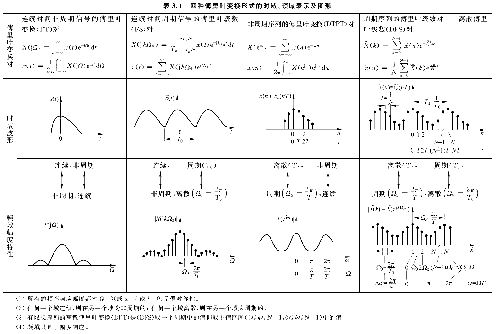

alias:: DFS, 离散傅里叶级数, 离散时间傅里叶级数, DTFS

- 离散傅里叶级数（Discrete Fourier Series，DFS）是对离散时间周期信号进行频域分析的一种数学工具。它用于将离散时间周期信号表示为不同频率的正弦和余弦函数的加权和，这些正弦和余弦函数的频率是信号周期的整数倍。DFS在信号处理、通信系统设计、图像处理等领域有广泛应用。
- ### 基本概念
  对于一个周期为 \(N\) 的离散时间信号 \(x[n]\)，其可以表示为一系列复指数函数的和。信号的周期性意味着 \(x[n] = x[n + mN]\)，对于所有整数 \(m\) 和 \(n\) 成立。
- ### DFS的数学表达
  离散傅里叶级数的分析方程（将时域信号转换为频域系数）和合成方程（从频域系数重构时域信号）分别定义如下：
- **分析方程**（从时域到频域）:
  $$X[k] = \sum_{n=0}^{N-1} x[n] \cdot e^{-j \frac{2\pi}{N} kn}$$
  其中，\(X[k]\) 是信号在频率索引 \(k\) 的DFS系数。
- **合成方程**（从频域到时域）:
  $$x[n] = \frac{1}{N} \sum_{k=0}^{N-1} X[k] \cdot e^{j \frac{2\pi}{N} kn}$$
  这里，\(n = 0, 1, \ldots, N-1\)，且 \(k\) 也取自同样的范围。
- ### 物理意义
	- **频率成分**：\(X[k]\) 表示原信号在频率 \(f_k = \frac{k}{N} \cdot f_s\) 处的复振幅，其中 \(f_s\) 是信号的采样频率。\(X[k]\) 的模（或绝对值）表示该频率成分的幅度，而其相角（或相位）表示相应的相位信息。
	- **能量分布**：DFS系数的平方提供了信号在各个频率成分上的能量分布。
- ### 应用
	- **频谱分析**：通过计算信号的DFS系数，可以分析其频谱特性，包括确定信号中存在的频率成分及其幅度和相位。
	- **信号处理**：在信号滤波、调制解调、声音和图像压缩等应用中，对信号进行频域分析和处理是非常重要的。
	- **系统分析**：在通信和控制系统设计中，利用DFS分析可以帮助设计者理解系统对不同频率成分的响应，从而设计更优的系统。
- ### 总结
  
  离散傅里叶级数提供了一种将离散时间周期信号分解为其频域成分的方法。它不仅能揭示信号的频谱特性，还能用于信号的合成和重构，是数字信号处理中的一个基本且强大的工具。
- {:height 461, :width 670}
-